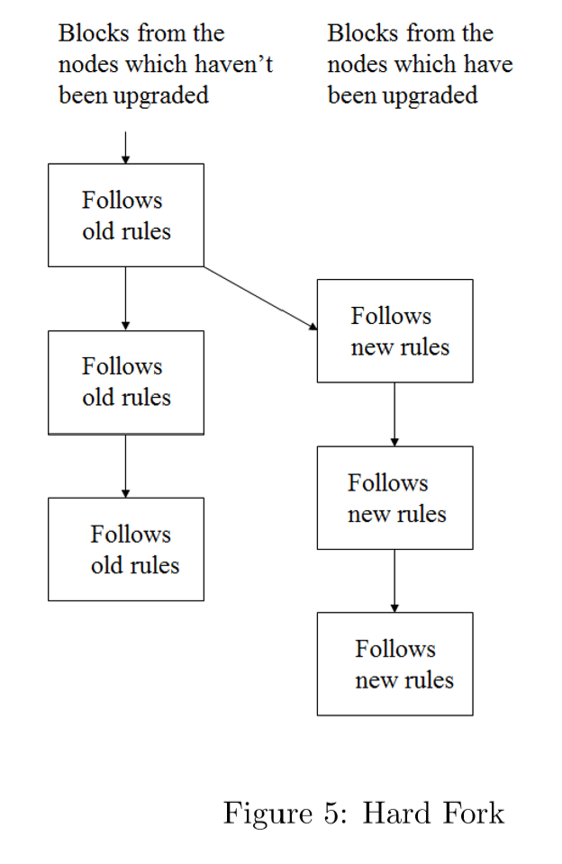

# Outline

## A Survey of Blockchain Security Issues and Challenges - IJNS 2017

Created by : Mr Dk.

2020 / 02 / 12 13:58

Ningbo, Zhejiang, China

---

## Abstract

虽然区块链技术带给我们很多可信的、方便的服务，其背后的安全问题也是一个需要被关注的重要话题。

---

## 2. The Concept of Blockchain

区块链技术包含六个核心要素：

* 去中心化 (decentralized) - 数据被分布式地记录、存储、更新
* 透明 (transparent) - 对每个结点来说，数据记录是透明的
* 开放 (open source) - 大部分区块链系统对任意一方都是开放的
* 自治 (autonomy) - 基于共识算法，区块链上的每个结点都能安全地传输、更新数据
* 不可篡改 (immutable) - 记录将被永久保留，除非有人能同时控制 51% 的结点
* 匿名 (anonymity) - 数据传输只需要知道对方的公钥

### 2.1 How Blockchain Works

1. Sending node 记录新的数据，并广播到整个网络中
2. Receiving node 收到数据后进行检验，如果信息正确，就保存到 block 中
3. 所有 receiving node 对 block 执行 _PoW_ 或 _PoS_ 算法
4. 执行共识算法后，网络中的每个结点都会把 block 追加到区块链中

### 2.2 The Structure of Blockchain

* Main data - 取决于区块链应用，比如交集记录、事务记录、IoT 数据记录等
* Hash - 区块链使用 _Merkle tree function_ 产生 block 中所有记录的 final hash (Merkle tree root)
* Timestamp
* Other information
  * Signature
  * Nonce

### 2.3 How to Get Consensus

共识算法是使区块链上的所有结点都能对同一则消息达成共识的机制，保证被加到链上的 block 是同一个，并且是正确的。

### 2.4 Proof of Work (PoW)

_PoW_ 是一块满足特定条件的数据，很难 (耗时) 产生，但很容易被别人检验。_PoW_ 是一个具有随机性且概率很低的过程。在合法的 _PoW_ 产生之前，需要经历大量的尝试和错误。比特币就是其应用之一。

计算 _PoW_ 的过程被称为挖矿。每个 block 都有一个叫做 _nonce_ 的随机数。通过改变这个值，_PoW_ 需要找到一个使这个 block header 的 hash 小于等于 _difficulty target_ 的 nonce。这个难度目标决定了结点在找到满足条件的 nonce 之前需要花的时间。

矿工需要在覆盖 block 中所有数据的前提下完成 _PoW_，使网络中的所有结点都能接收这个 block。难点在于要限制新的 block 被产生的时间间隔为每 10 min。_PoW_ 无法预测网络中哪台主机能够生成下一个 block。

### 2.5 Proof of Stake (PoS)

_PoS_ 不需要大量的计算功耗。通过两个方面保护了网络：

1. 执行一次攻击很昂贵
2. 攻击后得到的受益很少 - 攻击者需要拥有大多数的 bitcoin 才能发动攻击

### 2.6 Type of Blockchain

* Public
* Consortium
* Private

---

## 3. Application of Blockchain Technologies

### 3.1 Digital Currency: Bitcoin

使用公钥地址收发比特币。交易确认的过程需要其它结点的算力来达成共识。

### 3.2 Smart Contract: Ethereum

Smart Contract 是控制用户数字资产的数字合约，将会被计算机系统自动执行。

### 3.3 Hyperledger

### 3.4 Other Applications

---

## 4. Security Issues and Challenges

### 4.1 The Majority Attack (51% Attacks)

在 _PoW_ 中，成功挖到一个 block 的概率取决于矿工的 checking hash 的工作量。基于这种机制，为了能够挖到更多的 block，矿工通常会聚集到一起，成为矿池 - 一个聚集计算资源的地方。一旦矿池聚集了 51% 的算力，就能够控制区块链，导致安全问题。

理论上，攻击者可以创建一条修改了交易记录的支链，并与现有的主链开始赛跑。哪条链在同样的时间内变得更长，哪条链就可以成为主链。由于攻击者拥有了全网 51% 的算力，因此将以更快的速度使支链的长度超过主链，从而替代原主链成为新主链，而主链上的交易记录就由攻击者操控了。

### 4.2 Fork Problems

当软件升级时，结点的去中心化问题。当新版本的区块链软件发布后，结点的共识规则也改变了。因此，区块链网络中的结点可以被分为旧结点 (未更新软件的结点) 和新结点 (已更新软件的结点)，从而有以下四种情况：

1. 新结点认同旧结点挖到的 block
2. 新结点不认同旧结点挖到的 block
3. 旧结点认同新结点挖到的 block
4. 旧结点不认同新结点挖到的 block

#### 4.2.1 Hard Fork

系统更新到了新版本后，与之前的版本不兼容 - 因此，旧结点不认同新结点挖到的 block，原来的一条链分成了两条。虽然新结点的总算力高于旧结点，但旧结点会一直维持旧链。因此，必须要求所有结点更新到新版本的共识机制，不更新的结点将无法正常工作。

#### 4.2.2 Soft Fork

系统更新到了新的版本，共识机制与旧版本不兼容，新结点不认同旧结点挖到的 block。由于新结点的总算力高于旧结点，旧结点挖到的 block 将永远不会被新结点接受。但新结点和旧结点依旧可以在同一条链上继续工作。

> 旧结点挖到 block 以后，所有旧结点会把这个 block 加到链上；新结点挖到 block 以后，所有结点都会把 block 加到链上。那么在旧结点就会形成分叉 - 新链和旧链。由于新结点的算力高，那么新链的长度将会增长更快，因此旧结点就会把旧链给抛弃，从而也工作在新链上。

因此当 soft fork 发生时，不需要所有的结点同时升级到新版本，可以逐步升级。与 hard fork 不同，soft fork 只会有一条链。

### 4.3 Scale of Blockchain

随着区块链的增长，数据量将会变得越来越大。__Simplified Payment Verification (SPV)__ 是一个支付确认技术，只需要使用 block header，从而大大减小了用户存储。

### 4.4 Time Confirmation of Blockchain Data

交易确认的延时问题。

### 4.5 Current Regulations Problems

政府法律法规问题。

### 4.6 Integrated Cost Problem

集成区块链技术的成本问题。

---

## Summary

年度水文。真的水。上 _baidu_ 查资料也比看这篇文章懂得多。🙄

---

