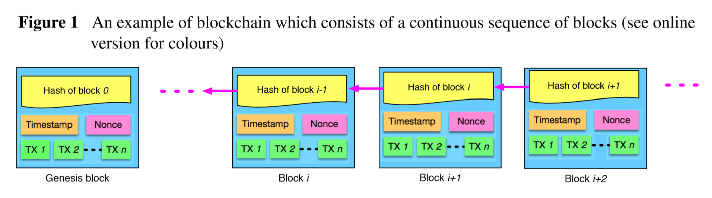
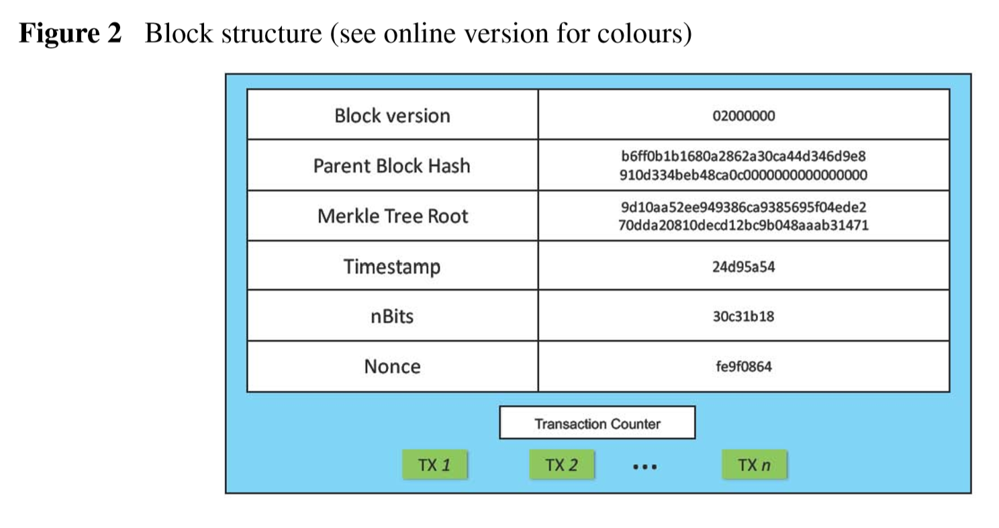
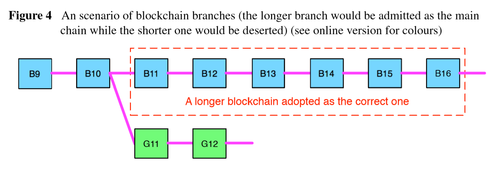

# Outline

## Blockchain Challenges and Opportunities: A Survey - IJWGS 2018

Created by : Mr Dk.

2020 / 02 / 11 17:10

Ningbo, Zhejiang, China

---

## Abstract

本文是对区块链技术的综述：

* 区块链的分类
* 典型的区块链共识算法
* 回顾了区块链的应用
* 讨论了一些技术挑战和解决方式
* 区块链的未来发展方向

---

## 1. Introduction

区块链是比特币的核心机制。在比特币中，区块链被视为一个公开的分布式账本，所有被提交的交易记录都存在链上的一个区块中。新块不断追加在链的最后，使链不断增长。

区块链特性：

* 去中心化 (decentralization)
* 不可篡改 (persistency)
* 匿名 (anonymity)
* 可溯源 (auditability)

区块链由密码学的技术和分布式共识算法作为核心。

除了数字货币以外，区块链还可以用于其它很多场合：

* 数字资产、汇款、在线支付
* 下一代交互系统
  * 只能合约
  * 公共服务
  * IoT
  * 信誉系统
  * 安全服务

区块链还面对着许多技术挑战：

__灵活性__ ：比特币的 block size 被限制为 1MB，每 10 min 挖出一个新区块。因此比特币网络的速度被限制于每秒 7 个交易，无法完成高频交易。然而，较大的区块又会导致中心化的问题。Block size 和安全的折衷是一个重大挑战。

__Selfish mining strategy__ ：有些矿工可以将挖到的块藏起来。

__隐私泄露__ ：虽然交易使用公私钥进行，但是用户的 IP 地址可以被追踪。

__共识算法中的问题__ ：_PoW_ 算法浪费了大量电能，_PoS_ 中会出现富的人越来越富的问题。

---

## 2. Blockchain Architecture

区块链是区块的序列，区块中包含交易记录的列表。每个 block 通过一个 hash 值作为引用，指向前一个 block。第一个 block 被称为 _genesis_ block。

### 2.1 Block

一个 block 包含 _block header_ 和 _block body_ 两部分。

Block header 包含：

* Block version - 指示区块认证遵循的规则
* Parent block hash - 指向前一个 block 的引用
* Merkle tree root hash - 区块中所有交易记录的 hash
* Timestamp - Unix 时间戳
* nBits - 目前的 hash 目标
* Nonce

Block body 包含交易记录的条数和每条交易记录。一个 block 可以容纳的最大交易数取决于 block size 和每条交易记录的 size。

区块链使用 __非对称加密__ 机制 (数字签名) 来验证每条记录。

### 2.2 Digital Signature

每个用户拥有一对公私钥。私钥用于签署交易记录。交易发起方首先对交易记录进行 hash，得到交易记录的数字摘要，然后使用它的私钥对这个摘要进行加密。将交易记录和这个加密后的摘要发送出去。接收方得到交易记录后，也生成一个摘要，另外用发送方的公钥对加密的摘要进行解密，然后比对两个摘要是否相同。从而验证了交易记录的来源未被篡改。区块链中用到的典型数字签名算法为椭圆曲线算法 ECDSA (Elliptic Curve Digital Signature Algorithm)。

### 2.3 Key Characteristics of Blockchain

* 去中心化
  * 传统的交易需要经过受信的第三方进行，受限于中心服务器的性能
  * 区块链的交易直接在 P2P 之间进行
* 不可篡改
  * 每个交易和区块都会被全网中的结点检验并记录
* 匿名性
  * 不会有第三方保留用户的私人信息
* 可溯源
  * 用户可以通过访问分布式网络中的任意一个结点，追踪之前的记录

### 2.4 Taxonomy of Blockchain Systems

| Property                | Public Blockchain           | Consortium Blockchain | Private Blockchain  |
| ----------------------- | --------------------------- | --------------------- | ------------------- |
| Consensus determination | all miners                  | selected set of nodes | one organization    |
| Read permission         | public                      | public / restricted   | public / restricted |
| Immutability            | nearly impossible to tamper | could be tampered     | could be tampered   |
| Efficiency              | low                         | high                  | high                |
| Centralized             | no                          | partial               | yes                 |
| Consensus process       | permission-less             | permissioned          | permissioned        |

---

## 3. Consensus Algorithms

在区块链中，如何在不被信任的结点之间达成共识，转化为 _拜占庭将军_ 问题 - 各个将军的军队互相沟通是否发起总攻，如果只有一部分将军发起攻击就会失败，将军中可能存在叛徒，会发送扰乱沟通的信息。如何在这样的环境中达成是否总攻的共识呢？

### 3.1 Approaches to Consensus

比特币网络中使用的共识策略是 _Proof of Work (PoW)_ 。在 _PoW_ 中，需要用到 __复杂的计算过程__ - 网络中的每一个结点都在计算 __不断变化的 block header 的 hash value__ - 这个 hash 必须小于等于一个给定值。我的理解是，计算 `val = hash(header)` 且需要满足计算出的 `val` 的开头几位为 `0` (也就是小于等于某个给定值)。一旦计算出的 hash 不满足条件，就要更换 block header 中的 nonce，直到条件被满足。

当一个结点找到了一个 nonce，使得计算出的 hash 满足条件，其它所有结点就要检验这个值的正确性。检验通过后，参与计算的所有交易记录都被认证了，这个 block 就被加到了所有结点的区块链副本尾部。找到 nonce 的这个结点将获得定额比特币，所有结点开始转而寻找下一个 block 的 nonce。计算 hash 的结点被称为 __矿工__，_PoW_ 的过程被称为 __挖矿__。

在去中心化的网络中，当多个结点同时发现了 nonce 时，会同时产生多个合法的 block，从而导致区块链开始分叉。然而，两个分叉的链不可能再同时产生下一个合法的 block，因此肯定会有一条分叉率先变长。在 _PoW_ 协议中，变长的那个分叉会成为主链。当大约 6 个 block 被生成后，这个链可以被认为是可信的了。比特币的 block 大约每 10 min 生成一个 。(可以根据参数来设定难度 - 如果前一个 block 的平均挖矿时间高于 10 min，则难度下降；如果平均挖矿时间低于 10 min，则难度提升)

_Proof of Stake (PoS)_ 是可以替代 _PoW_ 的节能共识策略。_PoW_ 是在一个无限的空间中寻找 nonce，而 _PoS_ 需要参与者证明货币数量的所有权。人们相信拥有更多货币的人更不可能攻击网络。_PoS_ 节省了能量，更有效。然而不幸的是，由于挖矿代价接近于 0，更容易遭受攻击。

为了结合 _PoW_ 和 _PoS_ 的优势，提出了 _Proof of Activity_ - 一个被挖出的 block 需要被另外 N 个矿工签名后才能成为合法 block。

_Practical Byzantine Fault Tolerance (PBFT)_ 的共识算法可以容忍 1/3 的恶意结点的情况。每一轮中产生一个新的 block。在每一轮中，会根据一些规则选择出一个 _primary_ 并负责处理交易。每一轮的过程分为三步：

* Pre-prepared
* Prepared
* Commit

只有收到 2/3 以上结点的投票，才能够进入下一阶段

......

### 3.2 Consensus Algorithms Comparison

* Node identity management - 是否需要每个结点表明身份 (商业模式或公共模式)
* Energy saving - 算法设计时，对于搜索空间的限制
* Tolerated power of the adversary - 通常来说 51% 的 hash 算力是控制网络的阈值

### 3.3 Advances on Consensus Algorithms

有效、安全、方便

---

## 4. Applications of Blockchain

### 4.1 Finance

* Financial services
* Enterprise transformation
* P2P financial market
* Risk management

### 4.2 IoT

* E-business
* Safety and privacy

### 4.3 Public and Social Services

* Land registration
* Energy saving
* Education
* Free-speech right

### 4.4 Reputation System

* Academics
* Web community

### 4.5 Security and Privacy

* Security enhancement
* Privacy protection

---

## 5. Challenges and Recent Advances

### 5.1 Scalability

随着交易记录的数量与日俱增，区块链变得越来越沉重。所有的交易记录都需要被验证、存储。此外，受限于 block size 和 block 产生间隔这两个原始的规定，比特币等区块链应用无法满足处理实时交易记录的要求。同时，由于 block 的容量很小，矿工可能偏向于手续费较高的交易而把小的交易给延迟了。

有两类思路用于解决灵活性的问题：

* Storage optimization of blockchain
  * 结点不需要存储所有的交易记录来检测一个交易记录是否合法
* Redesigning blockchain

### 5.2 Privacy Leakage

每个公钥对应的交易信息和余额都是公开可见的；比特币交易记录可以被用于揭露用户信息；用户使用的 IP 地址也有可能泄露。

### 5.3 Selfish Mining

具有超过 51% 算力的结点可以颠覆区块链，颠覆已经发生的交易。在自私的挖矿策略中，矿工保留已经挖出的 block 不广播，这样的 branch 将被保留直到满足一定的条件。当这条 private branch 比现在的 public branch 长时，会被所有的矿工接受。那么在这之前诚实矿工在一条没用的 branch 上白耗力气，而自私矿工在 private branch 上挖矿，且没有任何竞争者。

---

## 6. Possible Future Directions

### 6.1 Blockchain Testing

### 6.2 Stop the Tendency to Centralization

区块链被设计为一个去中心化的系统，而矿工有在矿池中聚集、中心化的趋势。目前，比特币网络中的前五大矿池拥有 51% 的 hash 算力。研究表明，超过 25% 算力的矿池比公平分配的收益更大，因此矿工会被吸引到矿池中去，从而使矿池超过 51% 算力。

### 6.3 Big Data Analytics

区块链可用于存储重要数据，并保证其不被篡改。因为它是分布式的、安全的。区块链上的交易记录可被用于大数据分析。

### 6.4 Smart Contract

### 6.5 Artificial Intelligence

---

