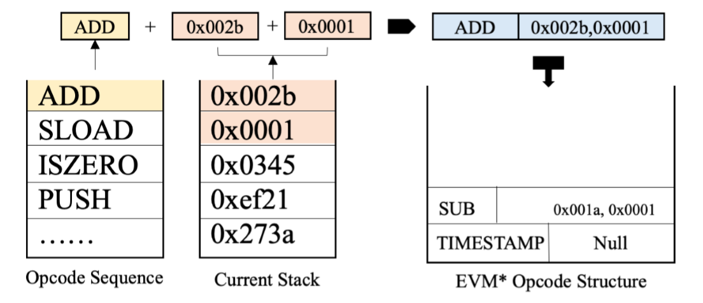

# Outline

## Security Reinforcement for Ethereum Virtual Machine

Created by : Mr Dk.

2020 / 02 / 23 21:34

Ningbo, Zhejiang, China

---

## Abstract

以太坊智能合约对于安全问题很敏感：

1. Smart contract 在部署后是不能被轻易修改的
2. Smart contract 与支付直接相关
3. Smart contract 对于开发者来说是一个新的领域

本文中提出对 EVM 进行加固，在 EVM 运行的实时，检测安全威胁。一旦发现威胁，就立刻停止可能发生危险的交易记录。

本文的特点是，在运行时捕获威胁并中断执行。

作者在两个常用的 EVM 上实现了该系统。被加固后的 EVM 能够检测出 100 个 smart contract 中其它测试工具漏报的所有威胁，并伴有 34% 以下的运行时开销。

---

## 1. Introduction

目前，社区对以太坊虚拟机平台的安全性很关注。很多研究人员使用传动的测试技术 - fuzzing 或符号执行 - 来提升 smart contract 的鲁棒性。这些工具通过对大量的交易记录进行仿真，从而发现 contract 中的漏洞。

然而，在实际中，已有的工具很难发现 smart contract 中较深路径中的 bug。

在本文作者提出的方案中，不是在 smart contract 层面进行检测，而是在 EVM 层面实现检测机制，从而能够实时发现并中断危险交易的进行。加固 EVM 包含三步：

1. 监控 EVM 执行
   * 详细定义了危险操作的规则和检测策略
2. 操作码结构维护
   * 维护一个数据结构，存储与检测策略相关的感兴趣的操作码和参数
3. EVM 注解
   * 将监控策略、中断机制、操作码维护插入到 EVM 源代码中

主要需要解决两个挑战：

1. 准确定义检测策略
2. 保证监控的开销是可容忍的
3. 对不同的 EVM 实现和不同的威胁类型都具有一定灵活性

本文选用了两种 EVM 实现：

* _js-evm_ - JavaScript
* _FISCO-BCOS-evm_ - C++

定义了四种较为常见的监控策略：

* Integer overflow
* Timestamp error
* Delegatedcall to untrusted callee
* Send with insufficient gas

并在检测到不安全的操作时抛出异常。

分析了 100 个真实的 smart contract，对比了原始 EVM 和加固后的 EVM\*。没有任何一个危险操作会被原始 EVM 叫停，而所有的危险操作都成功被 EVM\* 中断。在加入四种监控策略后，EVM\* 比原始 EVM 满了 33.52%，是可容忍的开销。

本文的主要贡献：

1. 实时加固 EVM 的框架
2. 在两个常见的 EVM 实现上进行了加固
3. 评估有效性

## 2. Related Work

### 2.1 Smart Contract Validation

Fuzzing - 在私有区块链上仿真大量的交易，smart contract 上的每个函数以不同的顺序、不同的输入被调用，并定义响应的 bug 规则从而进行检测。

符号执行、静态分析。

### 2.2 EVM Validation

差异性 fuzzing - 对比不同 EVM 实现对于同样的 smart contract 是否会有不同的执行结果。

### 2.3 Main Difference

本文的工作位于 EVM 层面。已有工具不能检测的正确性，可能会产生漏报或误报。此外，即使能够汇报威胁，由于 smart contract 的不可更改性，因此无法改变已经部署的 contract。而本文的工作使得在 EVM 运行的实时能对危险交易进行检测，在发现危险时，能够立即停止 smart contract 的执行。

## 3. Motivating Example

示意：

```solidity
if (input == hash(condition)) {
  balance[players[i]] += 2000;
  balance[msg.sender] -= 2000;
}
```

EVM\* 能够检测出条件分支内的 integer overflow 异常 - 在 EVM 中，`uint` 类型是 256 位的 - 如果在 `+= 2000` 之后超出了能表示的最大值，就会发生溢出，巨额财产就没了。

为什么符号执行或 fuzzing 无法检测出这个问题？因为进入分支的条件是，输入正好等于一个 hash：

* 对于符号执行来说，找到一个 hash 等于特定值的 seed 的难度相当于挖矿...
* 对于 fuzzing 来说，产生的输入也有极大的概率不进入该分支，从而无法发现其中的威胁

而 EVM\* 能够在运行时将 `ADD` 和 `SUB` 两个操作码提前加入到感兴趣的操作码集合中，并根据监控策略进行判断。如果 `ADD` 和 `SUB` 操作将会引发 overflow，EVM\* 将会立即停止危险的交易。

## 4. Reinforcement Methodology EVM\*

EVM\* 的三个核心组件：

1. Monitoring strategy component

   * 定义一个操作码序列是否是危险的 - 实际上是定义一种检测规则
   * 开发者可以根据想要支持的检测自己定义规则
2. Opcode-structure maintenance component

   * 初始化、记录并分析运行时的决策
3. EVM instrumentation component
   * 将上两个组件插入到 EVM 的代码中

EVM\* 的输入 - 智能合约字节码 + 交易数据。

### 4.1 Monitoring Strategy

#### 4.1.1 Overflow Bug

变量超出最大值后，将会回到从 0 开始，从而导致财产的丢失，或者循环永远不停止 (DoS)。

检测机制：

* 对 `ADD` `SUB` `MUL` `ADDMOD` `MULMOD` `EXP` 这些操作码进行记录
* 正数 + 正数 = 负数
* 负数 + 负数 = 正数
* 正数 - 负数 = 负数
* 负数 - 正数 = 正数
* 正数 × 正数 = 负数
* 负数 × 负数 = 负数

#### 4.1.2 Timestamp Bug

区块链时间戳被用于随机数生成，而矿工在一定允许范围内是可以任意设定时间戳的。因此，矿工可能通过控制时间戳来控制随机数的生成，从而来达成一定的目的。

检测机制：

* `call()` 中的数额大于 0 (即试图进行转账)
* 出现了 `TIMESTAMP` 操作码

#### 4.1.3 Delegatecall to Untrusted Callee

在调用者的上下文中执行被调用者的代码。可能会导致被调用者使用调用者的用于存储金额的变量。

检测策略：

* `DELEGATECALL` 的参数是否来自于 root call (即函数的输入参数)

#### 4.1.4 Send with Insufficient Gas

`send()` 操作会导致被调用者的 fallback 函数被调用，且该函数的 gas limit 被固定为 2300。如果消耗的 gas 超过了 2300，将会产生 out-of-gas 异常。如果异常没有被检验，那么恶意的发送方将会保留本应发送出去的 ether。

检测策略：

* Gas limit 为 2300 的 `CALL` 操作码出现
* 发生 Out-of-gas 异常

### 4.2 Opcode-Structure Maintenance

Opcode-structure 是一个用户定义的结构，用于记录感兴趣的 (即检测规则需要用到的) 操作码，以及相关的运行时信息 (操作数)。在每个 `call()` 进程中，这样的一个结构会被初始化。在每执行每一条操作码之前，该结构都会被更新并分析。如果操作码序列被认为是危险的 (即违反了上述检测策略)，那么将会中断执行。

具体这个结构可以是栈、队列等形式。在本文中，使用的是栈 - 因为 EVM 本身也是一个基于栈的操作方式。如下图所示，将感兴趣的操作码和相应的操作数记录到栈中：



### 4.3 EVM Instrumentation

上面的四条检测策略，每个策略都被实现为一个返回值为 `boolean` 的函数。中断机制也被封装为一个能够停止 contract 执行的函数。Opcode-structure 的初始化过程应该插入到 `CALL` 操作码之前。

在 `CALL` 操作码之前，初始化一个新的 Opcode-structure 栈。如果发现了感兴趣的操作码，就将其压入栈中，并分别调用每个检测策略函数进行危险性分析。如果评估认为是危险的，那么执行将会被中断。

#### 4.3.1 Instrumentation on _js-evm_

在 JavaScript 实现的 EVM 中的检测策略函数实现方式：

* Integer Overflow
  * 将结果转换为字符串，通过比较字符串的长度，判断是否发生溢出
* Timestamp Dependency
  * 将目前 `call()` 中的所有操作码转换为字符串，检查是否出现了 `TIMESTAMP`
  * 然后检测转账是否与时间戳存在依赖
* Delegatecall to Untrusted Callee
  * 检测是否存在 `DELEGATECALL`
  * 检测 delegatecall 的输入是否是函数输入参数的一部分
* Send with Insufficient Gas
  * 检测 out-of-gas 异常是否发生，且异常发生时 gas 是使用量是否为 2300 单位

#### 4.3.2 Instrumentation on _FISCO-BCOS-evm_

这个 EVM 是由 C++ 实现的。除了 integer overflow 以外，所有检测代码逻辑相同。在 C++ 的 EVM 中，数值是由 `integer` 来表示的。作者分别使用一个 512-bit 的 integer 和一个 256-bit 的 integer 来存放结果，并比较这两个数一不一样。如果不一样，就说明发生了溢出。

## 5. Evaluation

### 5.1 Data and Environment Setup

借用了 fuzzing 框架，对原始 EVM 和 EVM\* 进行了对比测试。并记录了在相同时间内执行交易记录的数量，用于评估时间开销。

### 5.2 Effectiveness of the Reinforced EVM

原始 EVM 只能检测出 80% 的威胁，剩下 20% 在运行时没有被阻止；而 EVM\* 阻止了所有危险交易记录的继续执行。

### 5.3 Time Overhead of the Reinforced EVM\*

删除 EVM\* 中的中断机制，只保留检测机制。这样，EVM\* 就算遇到危险交易记录也不会停止执行。在原始 EVM 和 EVM\* 运行了相同长度的时间后，比较它们执行交集记录的数量。

在加入四种检测策略之后，EVM\* 比原始 EVM 慢了 33.52%。主要的时间开销来自 Opcode-structure 的维护，以及每当遇到新的感兴趣的操作码以后，对每个检测策略函数的遍历调用。

### 5.4 Threats to Validity and Discussion

检测策略需要被详细地设计，不然会产生误报或漏报。另外，监控机制对时间开销有重要的影响 - 需要控制。

如果检测策略的个数变多，对时间开销的影响不会很大。因为主要的开销主要来自于 EVM 注解和操作码的采集，而不是约束检查。

不同的 EVM 实现有着相同的功能和结构，所以本文中的方法也可以拓展到其它 EVM 平台上。

---

## Summary

我觉得本文的工作挺有意义的。对 EVM 的加固解决了以太坊智能合约不可被修改的问题，从而使 EVM 能够在运行时直接叫停危险交易记录的执行。这比单单通过静态分析来寻找漏洞有意义得多。对于其它的软件系统 (如 Linux kernel)，通过静态分析找到的漏洞可以在下一个版本中被修复，而智能合约不行。因此，在运行时进行检测并抛出异常在 smart contract 的场景中是很实用的。

---

