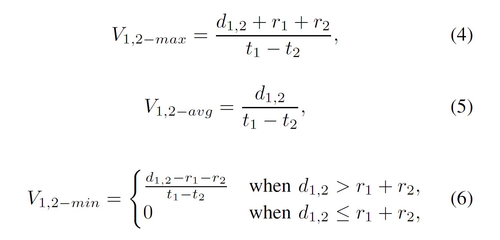

# Outline

## FBS-Radar: Uncovering Fake Base Stations at Scale in the WildT - NDSS 2017

Created by : Mr Dk.

2018 / 12 / 18 11:36

Nanjing, Jiangsu, China

---

### Instroduction

_Base stations_ - 基站 - 现代蜂窝网络的重要基础设施

它们将用户的蜂窝终端连接到 _WAN_ 中

* 转发语音流
* 短消息服务
* _IP_ 数据包

假基站 - _GSM (2G)_ 网络协议的漏洞——没有要求设备认证基站

支持 _2G/3G/4G_ 的设备会默认连接信号强度最高的那一个

攻击者可以架设高信号强度的 _2G_ 基站

使 _3G/4G_ 手机退化到 _GSM_ 模式

虽然 _GSM_ 正在逐步淘汰 但完全淡出市场还需要多年

假基站攻击用户的方式：__利用伪造的号码发送短信__

* 移动运营商的官方号码
* 政府机构的号码
* 公共服务的号码
* 银行的号码

短信中的内容包含：

* 垃圾广告
* 钓鱼链接
* ...

公安部和移动运营商已经采取的对策：

* 在城市内布设静态或移动的传感器，扫描信号异常高的基站
  * 昂贵的基础设施成本
  * 只覆盖了有限的地理位置
* 鼓励用户举报
  * 用户自己没有能力分辨假基站

_FBS-Radar_ - 集成在百度手机卫士中，目标：

* 检测尽可能多的假基站
* 自动过滤垃圾或诈骗短信
* 向执法部门提供假基站的地理位置
* 在客户端使用尽可能少的资源，最小化地采集敏感数据，不需要 _root_ 权限

局限：

* 无法获知具体的检测率，因此无法计算 _recall_
* 无法检测出不发送短信的假基站

---

### Background And Related Work

#### Operating Principles of a Typical FBS

##### Hardware and Software

* _GSM_ 无线收发器
  * 能够模仿 _基站 - 手机_ 的功能
* _Engineering Laptop_
  * 控制无线收发器
  * 调整信号频率、强度
  * 设定基站 _ID_
  * 伪造发送者号码
* _Engineering Cellphone_
  * 检测附近的合法基站
  * 记录合法基站的参数

##### Communication Process

打断用户与合法基站的已有连接：

* 假基站需要使用一个不同的 _LAC_ 代码
  * 使用户认为进入了一个新的基站的覆盖范围
* 将假基站的信号强度调节得足够高

#### Spam and Fraud Messages Sent by FBSes

* _Spam_ - 包含广告
* _Fraud_ - 恶意欺骗用户

#### State-of-the-Art Detection Approches

使用假基站信号强度极高的特点，已有的三种检测方法：

* 静态电子围墙 - 布设联网的蜂窝信号传感器
  * 基础设施成本高
* 基站信号检测车 - 在主要街道上巡逻
  * 随机性高，覆盖地区小
  * 攻击者可在接近主要干道时关闭假基站
* 活跃用户报告
  * 用户没有辨认假基站的能力

#### Other Related Work

在可扩展性和通用性方面不如 _FSB-Radar_

---

### Threat Model

目标：

* 检测出假基站发出的短信
* 检测出假基站的地理位置

假设：

* 攻击者使用假基站发送垃圾和诈骗短信
* 假基站会伪造身份和号码
* 假基站可随时开关及改变位置

---

### Data Collection

_FBS-Radar_ 架构

三个功能部件：

* 内容无关的分析
* 内容分析
* _SVM_ 机器学习集群

四个数据部件：

* 授权号码列表
* 基站位置数据库
* _Wi-Fi_ 位置数据库
* 消息日志

#### User Reports

处理步骤：

* 先被功能部件处理
* 再被数据部件加入额外的元数据
* 最终存储在消息日志集群中

客户端将用户汇报以 _JSON_ 的格式发送，包含内容：

* 收到短信的时间戳
* 设备目前连接到的基站的信号强度和 _ID_
* 两个之间连接的基站的信号强度和 _ID_，及测量时的时间戳
* 短信发送者的号码，以及短信内容
* 设备连接及感知到的 _Wi-Fi AP_ 的 _MAC_ 地址

#### Authoritative Phone Number List

公安部和主要运营商的授权号码，每月更新，_1446_ 个电话号码

#### BS-location Database

由移动网络运营商提供，每星期更新

使用合法的基站 _ID_ 查询，返回结果：

* 经度
* 纬度
* 信号覆盖半径
* 该 _ID_ 在数据库中是否存在

可用于粗略估算信号覆盖范围

理论上基站定位经度可达 _0.1_ 米，但实际上可能达到 _10_ 米

#### WiFi-location Database

由百度维护的全国 _Wi-Fi_ 位置数据库，每天更新

使用 _MAC_ 地址查询，返回结果：

* 经度
* 纬度
* 该 _MAC_ 地址在数据库中是否存在

_Wi-Fi_ 定位精度没有基站定位高

#### Message Logs

---

### Identifying FBS Messages

共使用五种方法识别假基站发出的短信

#### Signal Strength Examination

首先研究所有 _Message Logs_ 中的信号强度分布

_95%_ 的信号强度位于 _-113dBm_ 和 _-51dBm_ 中间

如果用户正好站在基站下方

用户可以收到的最大信号强度是 _-40dBm_

_0.23%_ 的疑似信息的信号强度高于 _-40dBm_，将这部分信息归为 _Set-1_

_-40dBm_ 是一个很保守的阈值，_false negatives_ 较高（即很多假基站没有被检测出来）

#### BS ID Syntax Checking

基站的 _ID_ 是全球唯一的身份

`BS ID = MCC + MNC + LAC + CID`

在所有 _Message Logs_ 中判定基站 _ID_ 的合法性

_0.15%_ 的疑似信息使用了不合法的基站 _ID_，将这部分信息归为 _Set-2_

#### Message Content Mining

使用自动化的文本分类技术，决定短信的功能：

* 合法
* 垃圾
* 诈骗

使用 _SVM_ 的方法进行，步骤：

* 招募了五名专家，各自独立地为 _200000_ 疑似消息打标签

  * _> 94%_ 的标签一致
  * 对于不一致的标签，采用多数投票的方法
  * 随机选出 _160000_ 作为训练集，剩下的作为测试集

* 词语切分

  * 使用经典的汉语词语切分工具，将短信切分为独立的词语
  * 移除没有用的停止语

* 特征提取

  * 每一条短信由几个词语（特征）表示
  * 总体特征集过大 - 选用最易区分的前 _10000_ 个特征
  * 特征降维 _CHI_

* 特征向量量化

  * 将特征词语向量 `< word1, word2, ..., wordn >` 转化为正整数向量 `< N1, N2, ..., Nn >`
  * 将短信功能量化：`< F, N1 : w1, N2 : w2, ..., Nn : wn >`，`w` 为对应特征的权重

* 训练 _SVM_ 模型

  * 手工配置 _SVM_ 的核心参数

* 测试集预处理

  * 词语切分、移除停止词语、量化

* 测试集的 _SVM_ 分类

  * 衡量指标：_precision_ 和 _recall_
  * _10-fold_ 交叉验证
  * 随机产生 _10_ 对不同的训练集和测试集，产生 _10_ 个不同的模型
  * _8-core_ 服务器花费 _20-25_ 分钟完成分类
  * _SVM_ 的 _precision_ 为 _98%_，_recall_ 为 _91%_
  * 对 _Message Logs_ 中的所有短信进行分类后
    * _93.53%_ 为合法短信
    * _6%_ 为垃圾短信
    * _0.47%_ 为诈骗短信
    * 只考虑假基站使用 __授权号码__ 发送的短信
    * _0.16%_ 的疑似短信使用授权号码发送，并被分类为诈骗，将这部分信息归为 _Set-3_

* _BS-WiFi Location Analysis_

  * 将 _Message Logs_ 中的基站位置与数据库中的真实基站位置进行比对，如果不匹配，则可能是假基站伪造了基站 _ID_，将这部分信息归为 _Set-4_
  * 使用 _Wi-Fi_ 定位用户的位置，从数据库中得到基站的位置
  * `D(BS - WiFi) > r * x`，`x` 是一个缩放比例（实际中基站的覆盖范围可能会更大或更小）
  * 当 `x` 大于 `5.0` 时，_Set-4_ 变得较为稳定，因此是一个较为安全、保守的阈值
  * _Set-4_ 包含了至少 _4.1%_ 的疑似信息

* _BS-Handover Speed Estimation_

  * 假设用户目前连接的基站是 _BS1_，之前连接的两个基站为 _BS2_、_BS3_

  * 如果 _BS1_ 和 _BS2_ 之间的切换速度高于阈值，则 _BS1_ 和 _BS2_ 中的一个是假基站

  * 通过估算 _BS2_ 和 _BS3_ 的切换速度，进一步判断 _BS1_ 和 _BS2_ 哪一个是假基站

  * 由于不知道用户的速度，只能使用三个估计的切换速度：

    

  * 阈值

    * 中国高铁最高运营时速：_350 km/h_ （较为保守）
    * 中国高速最高限速：_150 km/h_

  * 使用 `Vmax` 和 `150 km/h` 能够检测出最多数量的短信，同时也有高 _false positives_

  * 使用 `Vmin` 和 `350 km/h` 能够检测出最少数量的短信，但 _false positives_ 几乎为 _0_

  * 最终采用最保守的组合，检测出 _0.39%_ 的疑似信息，归入 _Set-5_

* _Perform Summary_

  * `Set-All = Set-1 ∪ Set-2 ∪ Set-3 ∪ Set-4 ∪ Set-5`
  * 至少 _4.7%_ 的疑似信息是假基站发送的，且精度很高，因为选择的阈值很保守
  * 检测出的假基站密度和人口密度呈正相关
  * _Set-3_ 被其余四个集合的覆盖率 _> 98%_，暗示不需要分析短信内容即可进行判别
    * 用于保护用户隐私，在新版本中已不需要用户上传短信内容
  * _Set-1_ 和 _Set-4_ 的相交率很低
    * _Set-1_ 是信号异常高的集合，因此通常在户外，没有 _Set-4_ 中的 _Wi-Fi_ 连接
  * _Set-2_ 和 _Set-4_、_Set-5_ 没有交集
    * _Set-2_ 是不合法的基站 _ID_，在数据库中无法查到结果

---

### Deployment Experience

#### False Positive Analysis

由于无从得知假基站的判断结果，_FBS-Radar_ 的做法是：

* 将检测出的假基站短信放入一个隔离文件夹中
* 用户可以从隔离文件夹中恢复合法的短信
* 一旦用户恢复了一条合法短信，则被认为是 _FBS-Radar_ 的一次判断错误

结果显示，_FBS-Radar_ 的 _false positive rate_ 只有 _0.05%_

其中大部分是由 _Set-4_ 中产生 - _WiFi-location Database_ 的不准确性和不完备性

#### System Overhead

用户端只需要维护 __授权号码列表__，大约 _40KB_ 左右

云端由于不再需要对短信内容进行 _SVM_ 分类，开销进一步减小

---

### Localizing Fake Base Stations

分为两步：

* 根据 _Wi-Fi AP_ 信息定位用户设备
* 根据受影响的用户设备定位假基站

#### Localizing User Devices based on the Wi-Fi Information

根据用户汇报信息中，附近的 _Wi-Fi AP_ 信息，可以得到这些 _AP_ 的位置

对这些 _AP_ 的位置进行聚类，选择样本个数最多的 _cluster_，该 _cluster_ 的中心即为用户设备位置

* 如果 _cluster_ 中只有一个样本，则忽略这种情况
* _k-means_ 中的 _k_ 不固定 - 使用最佳的 _k_

#### Localizing FBSes based on User Device Locations

对在一定时间窗口内，其影响的设备的位置进行聚类

每一个 _cluster_ 的中心都是假基站的估计位置

* 时间窗口 - 假基站会移动或变换 _ID_
* 根据实验，时间窗口被定位 _14s_，衡量指标：所有受影响用户的平均偏差距离
* 定位能够在一秒左右的时间里完成

#### Aiding Law Enforcement

保证用户隐私，与运营商之间的合作数据被加密

#### Limitation

缺乏将看似分布式的攻击归结到一个物理攻击设备的能力

---

### Conclusion

---

### Summary

_FBS-Radar_ 的使用人数多，通过众包的方式，提供了较多的数据

不需要 _root_ 权限，跨 _Android_ 和 _iOS_ 平台使用，且用户端开销小

根据分析，得出不需要分析短信内容的结论，不需要泄露用户隐私，使得加入的用户数量更多

在实用中已经帮助公安打掉了不少假基站

在理论上和实践上都做得很好

这篇顶会论文是企业发的 还是厉害的

---

