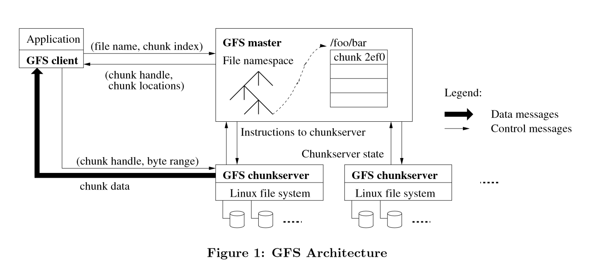

# Outline

## The Google File System

Created by : Mr Dk.

2019 / 10 / 28 21:55

Nanjing, Jiangsu, China

---

## 1. Introduction

GFS 用于满足 Google 日渐增长的数据处理需求

GFS 与之前的很多分布式文件系统有着相同的目标：

* 性能
* 可扩展性
* 可靠性
* 可用性

但 GFS 的设计，更多来源于 Google 的应用工作过程和技术环境

1. 组件故障是一个经常发生的事件，而不是偶尔发生
   * 文件系统由成百上千的商品级机器组成
     * 应用程序 bug
     * OS bug
     * 人为错误
     * 磁盘内存、网络、电源损坏
   * 系统应当经常性地监控、错误检测、容错、自动恢复
2. 文件通常较大
   * GB 级的文件很常见
3. 大部分文件的修改操作是追加操作，而不是对已有的数据进行覆盖
   * 一旦写入，文件通常只被用于读，并且通常是顺序读
   * 追加操作成为 __性能优化__ 和 __原子性保证__ 的重点
4. 应用 + 文件系统 API 能够提升灵活性

---

## 2. Design Overview

### 2.1 Assumptions

* 系统由低成本的机器组成，经常故障
* 系统存储了适当的大文件
  * 小文件也要支持，但不对它们进行优化
* 工作过程中主要包含两种类型的 __读__ ：
  * large streaming read - 比如读取某个文件中的一段连续区域
  * small random read - 在任意偏移处读取少量 kB
* 工作过程中包含大量连续的追加操作
  * 一旦写入，文件很少被修改
  * 在文件任意位置的随机写入可以被支持，但不需要特别有效
* 系统必须有效实现使多个 client 能够并发对同一个文件进行追加操作
  * 实现最小同步开销的原子操作
* 持久的带宽比低延时更重要
  * 很少有应用需要严格的响应时间需求

### 2.2 Interface

GFS 提供自己的文件系统接口

没有根据 POSIX 实现标准 API

文件被分层地组织在目录下

由 __路径__ 唯一识别

支持常用操作:

* create
* delete
* open
* close
* read
* write

此外，还有 snapshot 和 record append 操作

* snapshot 以低开销创建文件或目录树的拷贝
* record append 使多个 client 能并发追加一个相同的文件，并保证原子性

### 2.3 Architecture

GFS 集群包含：

* 一个 master
* 多个 chunkservers
* 被多个 clients 访问

其中每一个都是普通的 Linux 机器，运行一个用户级的服务进程

文件被分为固定大小的 chunks

* 每个 chunk 被分配了一个只读、全局唯一的 64-bit chunk handle
* 由 master 在 chunk 创建时分配

Chunkserver 在本地磁盘上存储 chunks

当需要读写时，由 chunk handle 和 byte range 指定范围

为了可靠性，每个 chunk 在多台 chunkserver 上有副本

* 默认三个副本

Master 维护所有的文件系统 metadata

* 命名空间
* 存取控制信息
* 文件到 chunk 的映射
* chunk 的位置

也进行一些系统级的活动

* chunk 租约管理
* 垃圾回收
* chunk 的迁移

Master 周期性地用 HeartBeat 与 chunkserver 进行通信

* 下发指令
* 采集 chunkserver 的状态

GFS 的 client 端代码实现了文件系统 API

代表应用与 master 和 chunkserver 进行通信，读写数据

* 与 master 进行通信，进行 metadata 的操作
* 与 chunkserver 直接进行数据通信

Client 和 chunkserver 都不缓存文件数据

* 有些文件太大了
* Chunk 作为本地文件存储，所以 Linux 的高速缓冲已经能够将经常使用的 chunk 缓存在内存中

### 2.4 Single Master

Master 简化了 GFS 的设计

* 能够使用全局 knowledge 来做出 chunk 的放置和副本的决定

必须最小化其在读写中的参与，使其不会变为瓶颈

Client 永远不会通过 master 读写文件数据

* client 向 master 询问，应该联系哪一个 chunkserver
* client 将信息短时缓存，并直接与 chunkserver 进行联系

1. client 将文件名和字节偏移翻译为 chunk 索引，并向 master 发送请求
2. master 返回 chunk handle 和各副本的位置
3. client 将这些信息缓存
4. client 向某一个副本发送请求 (最有可能是最近的那一个)
5. 请求指定了 chunk handle 和 chunk 中的 byte range
6. 之后的读写不再需要与 master 进行通信，直到缓存的信息过期，或文件被重新打开

### 2.5 Chunk Size

这是一个核心设计参数 - 64MB

每个 chunk 副本以明文 Linux 文件的形式存放在 chunkserver 上

一个较大的 chunk size 有着如下优势：

* 减少了 client 与 master 通信的次数
  * 对同一个 chunk 的读写只需要一次与 master 的通信
  * 这个减少对系统整体来说很重要，因为应用经常读写大文件
* client 更有可能对一个给定的 chunk 进行操作
  * 可以与 chunkserver 维持一个长 TCP 连接，降低网络开销
* 减少了 master 上 metadata 的数量
  * 这样就可以把 metadata 放在内存里

同时，较大的 chunk size 也有劣势：

* 小文件可能只占用了几个或一个 chunk
  * 如果很多 client 都访问这个文件，这个 chunk 很容易成为 hot spot
  * 比如，一个可执行文件上传到了 GFS，上百台服务器都要启动这个可执行文件

### 2.6 Metadata

Master 储存三种类型的 metadata：

* 文件和 chunk 的命名空间
* 文件到 chunk 的映射
* 每个 chunk 副本的位置

其中，前两种会以操作日志的方式持久化在 master 的本地硬盘上

并备份到远程机器

Master 不持久化存储 chunk 信息

* 当 master 启动时，或当新的 chunkserver 加入时，master 询问每个 chunkserver

#### 2.6.1 In-Memory Data Structures

由于 metadata 全部被存储在内存中

因此 master 的操作很快

* 因此 master 能够轻松高效地在后台周期性扫描全局状态
  * 完成 GC、重新备份等工作
  * 当 chunkserver 宕机时
  * 负载均衡

系统容量限制于 master 的内存容量

* 对于每个 chunk 来说，master 只维护 < 64B 的 metadata
* 或者扩容内存，也没啥成本

#### 2.6.2 Chunk Locations

Master 不会持久保存哪个 chunkserver 保存了哪些 chunk 的记录

* master 会在启动时轮询所有的 chunkserver
* master 通过 HeartBeat 保持自身是最新的

为什么要这么做？

* master 和 chunkserver 的周期性通信很简单
* 消除了两者之间的同步问题
  * chunkserver 离开或加入集群、改名、宕机、重启等
  * 在集群中，这种事情很常见

#### 2.6.3 Operation Log

包含了 metadata 重要改变的历史记录

* 不仅作为 metadata 的持久化记录
* 还作为一个逻辑时间线定义了并发操作的顺序

由于很重要，需要被可靠地存放

因此，log 被备份在多台远程机器上

对于 client 的操作，只有将对应的 log 记录到本地和远程的磁盘上后才会 response

Master 通过重放 operation log 来恢复文件系统状态

* 当 log 增长到一定数量时，master 会创建检查点
* 可以从最近的检查点开始恢复，只重放检查点之后的 log 即可
* 加速了恢复速度，提升了可用性

创建检查点的过程是在另一个线程中

* 完成后，会同时写入本地磁盘和远程磁盘

### 2.7 Consistency Model

#### 2.7.1 Guarantees by GFS

文件命名空间的修改 (文件创建等) 是原子的

* 由 master 负责唯一处理
* 命名空间锁保证了原子性和正确性

文件区域在数据变化后的状态

取决于数据变化的类型、成功与否、是否并发

* consistent
  * client 不管从哪个副本都能得到一样的数据
* defined
  * client 能够看到它做的操作

并发成功的数据修改使得数据 undefined 但是 consistent

* 数据是一致的，但可能无法体现任意的一次修改

失败的修改使得文件不一致

数据修改操作可以是 __write__ 或 __record appends__

* 写操作使得数据被写入应用指定的文件位置
* 追加操作使数据至少一次原子地追加在文件后

> ？？？？？？在说些什么呢

GFS 保证数据修改后的确定性：

* 对 chunk 的所有副本以相同的顺序应用改变
* 用 chunk 版本号来检测无效的副本 (错过了数据修改)

无效副本的位置不再会被 master 通知给 client

之后会被当做垃圾回收

GFS 通过握手识别宕机的 chunkserver

通过校验检测数据损坏

* 一旦发现问题，数据会尽快从合法的副本修复

Chunk 只有在 GFS 能做出反应的时间内，所有的副本都损坏时，才会发生不可逆的丢失

* 此时应用不会收到损坏的数据，而是明确的错误

#### 2.7.2 Implications for Applications

在实际中，所有的应用使用的都是追加操作，而不是 overwrite

---

## 3. System Interactions

最小化 master 对所有操作的参与

如何实现数据修改、原子地追加、snapshot

### 3.1 Leases and Mutation Order

Mutation 指的是改变 chunk 的 metadata 或内容的操作

比如写入操作或追加操作

每个 mutation 会在 chunk 的所有副本上进行

使用 lease 来维持一致的 mutation 顺序

Master 会想某一个副本授予租约，这个副本被称为 _primary_

Primary 选择一个串行顺序的 mutation

* 因此，mutation 的全局顺序由 master 授予租约的顺序决定
* 也由 primary 给租约赋予的顺序决定

租约机制的设计初衷是最小化 master 的管理开销

1. Client 向 master 询问持有 lease 的 chunk，以及其它副本的位置
2. Master 回复 primary 的身份，以及其它副本的位置
3. Client 将数据推送到所有副本
4. 当所有副本确认收到数据后，client 向 primary 发送写请求
5. Primary 向所有的副本转发写请求，每个副本根据相同的串行顺序应用操作
6. 所有副本向 primary 回复操作完成
7. Primary 向 client 回复完成
    * 任何副本发生的任何错误都会汇报给 client
    * 请求被视为是错误的，修改过的区域目前处于不一致状态
    * Client 代码通过重试的方式处理错误

如果应用的写操作较大，或跨越了 chunk 的边界

GFS 的 client 会分解为多个写操作

### 3.2 Data Flow

解耦了数据流和控制流

目标是完全利用每台机器的网络带宽

* 避免网络瓶颈 - 数据以线性方式在一个 chunkserver 链上推送
    * 每个 chunkserver 将数据推送到最近的还没有接收数据的 chunkserver 上
    * 距离可以从 IP 地址上估计
* 最小化延时 - 在 TCP 管道上传输数据
    * chunkserver 一收到数据，就可以开始立刻转发数据了
    * 全双工网络，发送数据的同时不会降低接收速率

### 3.3 Atomic Record Appends

GFS 提供一个原子的追加操作 - record append

传统的写操作由 client 指定写入的 offset

* 向同一个区域并发写入不是串行化的

然而对于 record append，client 只指定数据

GFS 至少一次原子地追加这些数据

这个特性用得很多

* 不同机器上的 client 并发地对同一个文件 append

工作流程：

1. Client 将要追加的数据推送到所有副本
2. 向 primary 发送请求
3. Primary 检查 append 操作后是否超过 64MB
4. 如果是，则会将 chunk 增长至 64MB，告诉副本也做一样的事，告诉 client 操作需要在下一个 chunk 重试
5. 如果不是，则在所有副本后追加，并向 client 汇报成功

如果 record append 的任何副本操作失败

Client 会对操作进行重试

因此 GFS 不能保证所有副本在字节上完全相同

* 只能保证数据至少被原子地写入过一次

### 3.4 Snapshot

快照操作能够接近瞬时地拷贝文件或目录树

同时最小化对正在进行的 mutation 的中断

能够快速对巨大的数据集进行拷贝

GFS 使用了标准的 copy-on-write 技术实现快照

当 master 收到 snapshot 的请求

* 首先收回对被拷贝的文件或目录任何发出的租约
* 确保了随后的写操作需要向 master 询问租约持有者
* 这使得能够在写操作之前完成拷贝

Master 复制要拷贝的文件或目录的 metadata

新创建的快照文件和原文件指向相同的 chunk

当 client 第一次试图写该 chunk 时

会向 master 发送请求询问租约持有者

Master 发现 chunk 的引用计数大于 1

会返回给 client 一个新的 chunk handle

之后 master 通知所有拥有原 chunk 副本的 chunkserver 创建新的 chunk

这样数据可以在本地被拷贝

可以看到，这个过程对 client 实际上是透明的

---

## 4. Master Operation

Master 执行所有的命名空间操作

并管理整个系统中的 chunk 副本

### 4.1 Namespace Management and Locking

很多 master 操作耗时很久

与大部分的文件系统不同

GFS 的每个目录没有专门的数据结构，记录目录下有哪些文件

也不支持软硬链接等别名

GFS 使用一个查找表从逻辑上来表示命名空间

* 完整路径名到 metadata 的映射
* 使用了前缀压缩，这个表能够高效地放置在内存中

命名空间中的每个结点 (不管是文件还是目录) 都有一个读-写锁

每个 master 操作之前，都需要获得一系列的锁

如果操作 `/d1/d2/.../dn/leaf`

* 需要获得 `/d1`, `/d1/d2`, ..., `/d1/d2/.../dn` 的读锁
* 还需要获得 `/d1/d2/.../dn/leaf` 的读锁或写锁

两个 master 会因为锁的争用而被串行化

由于没有目录的概念，文件创建不需要获取父目录的写锁

这种锁机制的好处是 __允许同一个目录下的并发操作__

由于命名空间中的结点很多

读-写锁对象是懒分配的，且一旦没有被使用就会被删除

### 4.2 Replica Placement

GFS 集群部署在不同机架的服务器上

不同机架上的服务器通信可能会通过一台或多台交换机

Chunk 放置策略有两个目的：

* 最大化数据可靠性和可用性
* 最大化网络带宽利用率

把副本放到不同的机器上是不够的

还要将副本放到不同的机架上

确保整个机架断电掉线后还有副本能用

这也意味着通信，尤其是读操作，可以利用多个机架的带宽

### 4.3 Creation, Re-replication, Rebalancing

当 master 创建一个新的 chunk 时

需要选择在哪里存放空的副本

考虑这几个因素：

* 应当放到磁盘占用率低于平均的 chunkserver 上
* 限制每个 chunkserver 上最近一段时间创建的 chunk
    * 因为创建带来的是大量的写入操作
* 还需要使副本分布在不同机架上

只要某个 chunk 的可用副本数量低于用户指定的目标

Master 就会马上重新备份 chunk

出现这种情况的原因很多：

* 一个 chunkserver 挂了
* 副本损坏
* 磁盘损坏
* 用户指定的目标提高了

每个要被重新备份的 chunk 都有优先级：

* 距离备份目标有多远 (丢失了 2 个副本的 chunk 优先级比丢失了 1 个的高)
* 先备份 live 文件的 chunk，而不是最近被删除的文件
* 优先备份阻塞 client 前进的 chunk

Master 选择优先级最高的 chunk

并命令 chunkserver 直接从已存在的合法副本克隆

新副本的存放位置与创建 chunk 的目标一样

* 负载均衡、跨机架等

为了防止克隆操作影响和 client 的通信

* Master 限制活跃的克隆操作的个数
* 每个 chunkserver 限制用于克隆操作的带宽

Master 周期性地均衡副本负载

* 检查目前的副本分布
* 将副本移动到更好的磁盘位置上

通过这个过程，master 还可以逐渐填充新的 chunkserver

此外，master 还需要决定移除哪一个副本

* 倾向于移除低于平均空闲空间的 chunkserver 上的副本

### 4.4 Garbage Collection

文件删除后，GFS 不会立刻回收可用的物理空间

#### 4.4.1 Mechanism

Master 会立刻记录删除到 log 中

但不会立刻回收资源

文件会被重命名为一个隐藏名称 (名称中包含了删除时刻的时间戳)

在 master 的日常扫描中

会删除存在超过三天的隐藏文件

在这之前，文件依旧可以被撤销删除，或被访问

当隐藏文件被删除时，内存中的 metadata 被删除

此外，在扫描中，master 还会识别孤儿 chunks (无法被任何文件访问到)

并删除这些 chunk 的 metadata

在 chunkserver 向 master 汇报的心跳包中

会汇报 chunkserver 上包含的所有 chunk

Master 会回复 metadata 已经不存在的 chunk 给 chunkserver

Chunkserver 可以自由删除这些 chunk

#### 4.4.2 Discussion

任何 master 不知道的副本就是垃圾

Chunk 的创建可能在一些 chunkserver 上是成功的

但是有些不一定成功，因此会留下一些 master 不知道的副本

副本删除的 message 可能会被丢失

并且 master 也需要记录哪些需要重传

将空间的回收操作视为 master 的后台任务

* 只会在 master 较为空闲时进行

主要的缺陷是

对于频繁创建和删除临时文件的应用来说

由于延迟删除，空间会越来越紧张

### 4.5 Stale Replica Detection

如果 chunkserver 错过了对 chunk 进行修改

Chunk 副本将会变为无效

对于每一个 chunk

Master 维护一个 _chunk version number_ 来区分无效的副本

当 master 向 chunk 下放租约时

会将 version number 增加，并通知所有最新的副本

Master 和所有这些副本都会持久记录新的版本号

如果一个副本不可用，那么版本号就不会更新

当 chunkserver 重启并汇报所有的 chunk 及其版本时

如果 master 发现有比自己记录的版本更高的 chunk

Master 就知道在下放租约时发生了错误，从而选用更高的版本

Master 会在日常的垃圾回收中移除无效副本

---

## 5. Fault Tolerance and Diagnosis

设计系统时的最大挑战 - 处理频繁的组件出错

* 无法完全信任机器
* 无法完全信任硬盘

### 5.1 High Availability

如何维持整个系统的高可用性？

#### 5.1.1 Fast Recovery

Master 和 chunkserver 都需要能够在几秒内启动并恢复它们的状态

无论它们是怎样终结的

并不区分正常终结和异常终结

#### 5.1.2 Chunk Replication

之前说过，chunk 被备份在不同机架的多台服务器上

默认备份数量为 3

#### 5.1.3 Master Replication

为了保证可靠，master 的操作日志和检查点被备份在多台机器上

一次状态的修改，只有当操作日志被记录到本地和所有远程备份的磁盘上之后

才被视为是被提交的

当 master 挂掉时

GFS 外的监控基础设施会使用备份操作日志启动新的 master 进程

Client 只使用 master 的 DNS 别名

Shadow master 会读取 master 操作日志的副本

并对其数据结构应用与 primary 相同的操作

### 5.2 Data Integrity

每个 chunkserver 使用校验和来检测数据损坏

硬盘损坏经常会导致数据损坏

* 在 chunkserver 之前对比副本来检测损坏时不实际的
* 每个 chunkserver 必须独立地通过维护校验和来验证完整性

一个 chunk 被划分为 64KB 的 block

* 每个 block 有一个 32-bit 的校验和
* 校验和保存在内存中，也会被持久地记录在日志中

对于读操作，chunkserver 在返回数据之前

验证读取范围内的 block 的校验和

* 因此 chunkserver 不会将损坏扩散到其它机器上

如果某个 block 的校验和不匹配，chunkserver 返回错误，并报告 master

* 请求者因而会对其它副本进行请求
* master 会从其它副本拷贝 chunk
* 当新的副本拷贝到位后，master 会命令 chunkserver 删除原副本

校验和对读操作的性能几乎没有影响：

* 只需要对相对少量的额外数据做校验就够了
* GFS client 会试图对齐校验和块边界，进一步减少开销
* 校验和的查找和比较不需要 I/O 的参与

对于对 chunk 的追加操作，校验和的计算被深度优化

* 只增量式地更新最后部分的 checksum block
* 为新的 checksum block 计算校验和

相比之下，如果写操作是 overwrite 类型的

那么就需要读取并验证 overwritten 的第一个到最后一个 block

然后进行写入，和新的校验和的计算

必须先验证，不然原有的损坏将被隐藏

在空闲时，chunkserver 可以扫描并验证不活跃的 chunk

* 这能够检测到很少被读取的 chunk 中的损坏
* 一旦损坏被检测到，master 就可以立刻创建新的未损坏副本，删除损坏的副本

这可以防止损坏副本欺骗 master，使其以为自己已经有了足够数量的合法副本

### 5.3 Diagnostic Tools

能够重建整个交互历史，并诊断问题

---

## Summary

后面就不看了

觉得 Google 很牛批

早在 2003 年就有了很多超前的思维

并提出了这么多具有创造性的 solution

真的是一家很有情怀的公司呢

另外觉得这种系统真的很复杂

最重要的点在于

所有的事情都是系统自动完成的

不需要人为干预

所以实现的逻辑还挺复杂的

---

