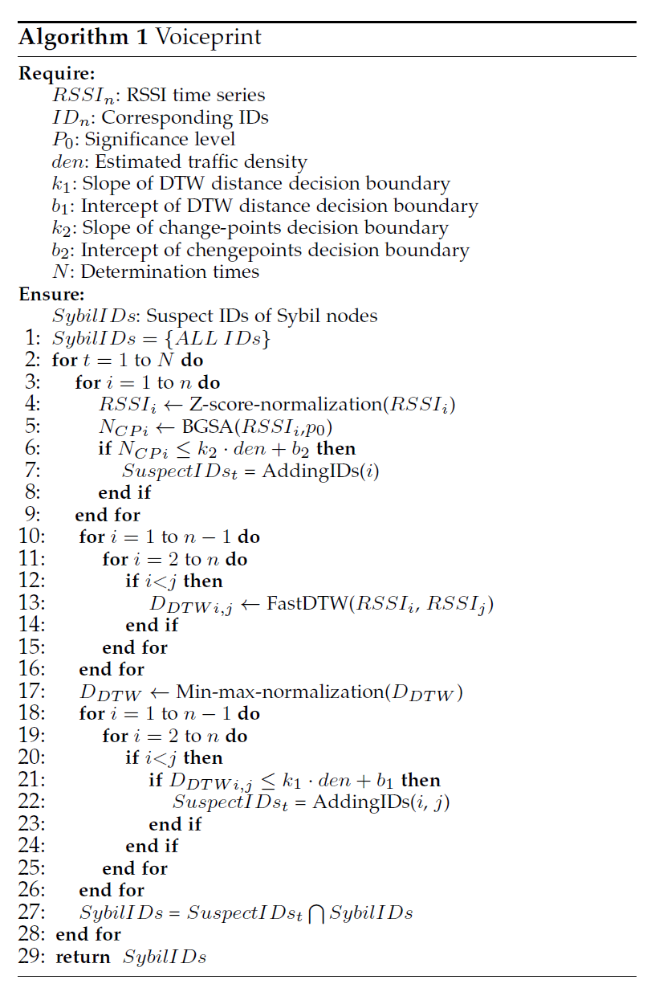

# Outline

## Multi-channel based Sybil Attack Detection in Vehicular Ad Hoc Networks using RSSI - TMC 2018

Created by : Mr Dk.

2018 / 12 / 10 21:06

Nanjing, Jiangsu, China

---

### Introduction

_Vehicular Ad Hoc Networks (VANETs)_ 是智能交通系统（_Intelligent Transportation System_）的重要组成部分

* _Accident avoidance_
* _Traffic monitoring_
* _Transport efficiency_

_VANET_ 类型

* _Vehicle-to-vehicle, V2V_ - a vehicle directly communicate with neighboring vehicles
* _Vehicle-to-infrastructure, V2I_ - a vehicle communicate with roadside infrastructures

联邦通信委员会 _FCC_ 在 1999 年发布了 _VANET_ 工作于 _5.9GHz_ 的短程专用通信协议 _DSRC_

其中定义了两种通信设备：

* _On Board Unit (OBU)_ - 安装在车辆上
* _Road Side Unit (RSU)_ - 部署在路边

通信消息：

* _Safety-related messages_ - 由 _OBU_ 使用 _Control Channel (CCH)_ 周期性广播，提供车辆运动信息
* _Non-safety messages_ - 使用 _Service Channel (SCH)_ 发送，提供导航、娱乐等信息

_VANET_ 的主要目的：

* 提升道路安全性
* 提高交通效率

__VANET 会遭受无线网络中存在的所有类型的攻击__

_Sybil Attack - 女巫攻击_

在 _VANET_ 中，许多应用要求车辆需要与邻近车辆进行合作

这就要求车辆从邻近的合法车辆中获取足够的可信信息

女巫攻击 - 产生多个假的身份，创建多个不可信的虚拟结点

在女巫攻击中，攻击者被称为 _Malicious node (恶意结点)_

攻击者产生的虚拟结点被称为 _Sybil node (女巫结点)_

* 可能会在一个通畅的道路上营造很拥挤的假象
* 令多个女巫结点对车辆或者 _RSU_ 发送无用信息，实行 _DoS_ 攻击
* 使看起来无关的多路径路由汇聚到恶意结点，实行黑洞攻击

文本主要贡献:

* 女巫攻击检测方法不依赖任何无线传播模型，可适用于不同道路环境
* 每个结点的检测都是独立的，不需要周围结点的配合
* 算法完全分布式、去中心化，不需要 _RSU_ 的参与
* 将检测转移至 _SCH_ 上，缩短了观测时间并降低了误报率
* 利用 _Bernaola Galvn Segmentation Algorithm (BGSA)_ 检测 _RSSI_ 时间序列的突变，从而识别进行 __功率控制__ 的不合法结点

---

### Related Work

已经存在多种方法检测 __恶意结点__ 和 __女巫结点__

检测方法的主要目标：确保每一个物理结点都绑定了一个合法的唯一身份

检测方法可被分为三类：

#### Resource Testing Based Methods

假设每一个物理结点 __资源受限__

如果一个恶意结点伪造了多个女巫结点，且资源受限

那么它不可能同时通过对应的测试

* 如果假设不成立呢？

#### Trusted Certification Based Methods

使所有结点之间能够建立可信的连接关系

* 证书认证
* _PKI_
* 数字签名
* 加密算法

存在的问题：

* 在初期的 _VANET_ 中不易实现
* _VANET_ 具有高动态变化的网络拓扑
* 加密算法的高复杂性

#### Position Verification Based Methods

使用一些物理测量指标：

* _Received Signal Strength Indicator (RSSI)_
* _Angle of Arrival (AoA)_
* _Time Difference of Arrival (TDoA)_

恶意结点不易伪造或修改 __硬件__ 或 __物理环境__

已有的方法需要与周围结点进行合作 - 问题在于，如何确定周围结点的 __可信性__ 与 __合法性__

女巫结点可以伪造假的 _RSSI_ 来扰乱检测

基于 _RSSI_ 的方法与基于证书的方法相比，较为轻量，且经常实施在去中心化的场景中

* 更适用于 _VANET_ 快速变化的动态拓扑

基于 _RSSI_ 的女巫攻击检测目前还存在的一些问题：

* 严重依赖信号传播模型，仅适用于静态或低移动性的网络，而 _VANET_ 的以下特性不适合这种检测方法：
  * 快速改变的网络拓扑
  * 无线介质的不规则性
  * 复杂的道路环境
* 需要邻居结点的合作
* 基于证书和基础设施的认证在 _VANET_ 发展初期很难实现
* 无法识别在女巫攻击期间故意操纵传输功率的不合法结点

---

### Measurement And Observations

#### Observation 1

>_VANET_ 的信道质量会随时间改变；因此使用预定义的信号传播模型会导致位置估计或数值统计偏差很大。

#### Observation 2

> 由于复杂的因素，在不同的地点信道质量都不相同；因此对于一个预定义的信号传播模型，需要对不同的场景设定不同的参数；然而，让车辆动态感知环境并确定最优参数很难。

#### Observation 3

> 恶意结点和女巫结点的 _RSSI_ 时间序列有着非常相似的模式；恶意结点和合法结点虽然靠得很近，但 _RSSI_ 时间序列依然会有一些不一样。

#### Observation 4

> 在女巫攻击期间操纵传输功率的恶意结点的 _RSSI_ 时间序列的平均值会有很多剧烈的变化；因此 _RSSI_ 数值的突然改变暗示着传输者正在操控功率控制

---

### Sybil Attack Detection Using Vehicular Voiceprint

#### Attack Model and Assumptions

##### Assumption 1

* 恶意结点只会创建新的身份，而不是盗用其它结点的身份
* 在网络中不会同时存在相同的身份

##### Assumption 2

* 每个车辆只有一个发射器
* 在 _CCH_ 上每秒广播 10 个包，在 _SCH_ 上每秒广播 100 个包

##### Assumption 3

* 每个正常结点可以使用不同的初始传输功率，但在通信过程中不会改变功率
* 恶意结点可任意改变自身或伪造的女巫结点的传输功率

##### Assumption 4

* 假设 _VANET_ 中没有与基础设施的通信

#### Similarity Measures for Time Series

_RSSI_ 时间序列 - 随时间推移而成功接收采集的数据点序列

基本检测原理：

* 由于女巫结点的 _RSSI_ 时间序列有着非常相似的模式
* 因此可以通过衡量两个 _RSSI_ 时间序列的 __相似度__ 来检测女巫攻击

距离度量指标：_Dynamic Time Warping (DTW)_

* 使用动态规划的技术，在时域上寻找最佳匹配
* 对于每一对 _RSSI_ 时间序列，_DTW_ 计算最小累积代价
* 最终，_DTW_ 的衡量指标为总计累积代价
* 优化 _DTW_ 算法的时间复杂度

欧式距离局限：

* 不能处理不等长的时间序列
* 由于丢包，采集到的 _RSSI_ 时间序列长度不太可能相同

#### Change-points Detection for Time Series

由于操纵功率控制的恶意结点的 _RSSI_ 时间序列均值会出现突变

将时间序列分割为多个平均值不同的段，在相邻的段之间最大化平均值的差异

#### Proposed Detection Methodology

##### Collection

在原先的方法中，从 _CCH_ 上采集 _RSSI_ 数值

* 根据 _IEEE 802.11p_ 标准，_safety message_ 的频率被定义为 _10 Hz_
* 采集到指定数量的 _RSSI_ 耗时太久
* 改为在 _SCH_ 中短时内获取大量 _RSSI_

##### Comparison

* 如果恶意结点故意升高或降低不同女巫结点的初始化功率，会使女巫结点和恶意结点之间的 _RSSI_ 时间序列相似性遭到破坏
  * 使用数据预处理
  * 使 _99.7%_ 的数据归一化到 _(-1, 1)_，而 _RSSI_ 时间序列的形状和结构不会被破坏

预处理后，计算每两个 _RSSI_ 时间序列之间的 _DTW_

计算完毕后，使用数据后处理，将 _DTW_ 归一化到 _[0, 1]_

##### Confirmation

初步结果：

_DTW_ 在低车辆密度的条件下能够轻易区分出女巫结点，但在高车辆密度的条件下表现不佳

原因分析：

1. 高车辆密度的条件下，车辆间的平均空间减小，恶意结点和附近合法结点的 _RSSI_ 时间序列很相似
2. 强烈的信道干扰导致很多数据包丢失，导致不相似度的提高

不能使用常数阈值——阈值应该是车辆密度的函数

采用 _Linear Discriminant Analysis (LDA)_ 来决定阈值，参数由训练得出

为了降低误报率，在进行多轮检测之后才决定某个怀疑结点是否是女巫结点

算法大致流程：

* 对 _RSSI_ 时间序列进行预处理
* 对 _change point_ 进行判断，判断结点是否操纵功率控制，并加入疑似结点
* 计算所有 _RSSI_ 时间序列之间的 _DTW_
* 进行后处理，将 _DTW_ 归一化
* 判断两个 _RSSI_ 的时间序列之间的 _DTW_ 是否低于阈值，并加入疑似结点
* 将检测迭代 _N_ 次，_N_ 次都出现在疑似列表中的结点被判断为是女巫结点

---

### Simulation Evaluation

#### Metrics

* _Detection rate (DR)_
* _False positive rate (FPR)_

_N_ 个结点执行 _K_ 轮检测后得到平均 _DR_ 和平均 _FPR_

#### Threshold

在不同的交通密度下进行仿真，得到 _change-points_ 和 _DTW_，作为训练数据

---

### Conclusion

通过在 _SCH_ 上进行检测的方式

* 缩短了检测时间
* 降低了误报率

对 _Voiceprint_ 进行了多 _change-points_ 检测方式的扩展

* 能够识别操纵功率控制的恶意结点

---

### Summary

看了几篇论文后发现

数值分析的部分经常看不懂

这一项是我最薄弱的环节吧

因为总是牵扯到机器学习。。。。。。

我他妈好讨厌机器学习。。。。。。

---

