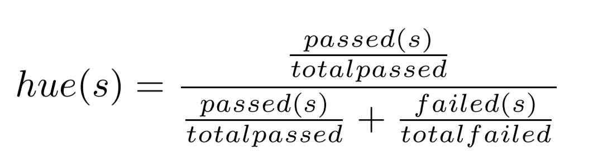
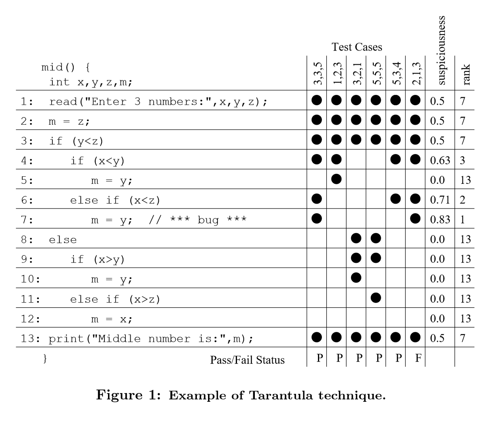

# Outline

## Empirical Evaluation of the Tarantula Automatic Fault-Localization Technique

Created by : Mr Dk.

2020 / 03 / 18 18:36

Ningbo, Zhejiang, China

---

## Abstract

调试软件是一个很耗时、很耗人力的工作。因此，增强寻找代码中缺陷位置的能力，能够显著减少调试软件的成本。目前，软件开发者使用 test case 来进行人工的缺陷定位 - 选择一个执行失败的 test case，在软件中不断加 break point，直到找到异常状态发生的位置。很多 research 在研究能够自动化地进行缺陷定位。

本文研究了已有的四种自动化缺陷定位和本文提出的一种定位的原理，并评估了它们的效果。结果显示本文提出的 _Tarantula_ 在效果和性能上都比另外四种定位方法更好。

## Fault-Localization Techniques Studied

### Tarantula

输入：

* 每一个 test case 的 pass / fail 情况
* 每一个 test case 执行到的 entity (statements / branches / methods)
* 被测试的程序 source code

直观原理：主要被失败的 test case 执行到的 entity 比主要被通过的 test case 执行到的 entity 更可能包含缺陷。但是也允许一些缺陷代码偶尔被通过的 test case 执行到。这种放宽的条件可能会更加有效。

_Tarantula_ 为每一个 statement 计算了一个色彩值 (实际上就是缺陷疑似度，只不过用颜色来表示更形象些)，高度疑似的为红色 (危险)，不太可能有缺陷的为绿色 (安全)，不太确定的为黄色。这个色彩值的计算公式为：

其中，`s` 代表某个 statement，`passed(s)` 表示所有 pass 的 test case 中，执行到 `s` 的个数；`failed(s)` 表示所有 fail 的 test case 中，执行到 `s` 的个数；`totalpassed` 和 `totalfailed` 分别代表所有 pass / fail 的 test case 个数。

这个 hue 位于 0 到 1 之间，代表了 statement `s` 的疑似度，越靠近 0 疑似度越高。当然，也可以用 1 减去这个 hue 来作为疑似度。这样数值越高，疑似度越高。

对 test case 能够覆盖到的程序中的 entity 计算疑似度，并进行排序。疑似度越高的 entity，被程序员检查的优先级越高。

以上图为例。黑点是每个 test case 的 coverage。对每行 statement 的疑似度进行计算，并进行排名，疑似度越高排名越靠前。其中，如果有并列疑似值，那么排名将统一为并列排名的最靠后值 (比如 `1,2,3` 后有四个并列值，那么它们的排名将会是 `7,7,7,7`)。

### Set Union and Set Intersection

计算一个 pass test case 和一个 fail test case 之间的 coverage 差异。从 fail test case 的 coverage 中，删掉 pass test case 的 coverage，剩下的就是缺陷所在的 entity。主要分为两类：

* Set-union - __某一个__ fail test case 的 coverage，减去 __所有__ pass test case 的 coverage 的 __并集__
* Set-intersection - __某一个__ fail test case 的 coverage，减去 __所有__ pass test case 的 coverage 的 __交集__

剩下的 entity 集合，就是缺陷位置可能性最高的集合，即程序员最开始进行缺陷搜索的集合。这个方法有精确性的问题，通常得到的这个 coverage 集合是个空集，也有可能缺陷代码不在这个集合中。如果这种情况发生，就需要有一个排名机制，来指引程序员在剩下的代码中搜索缺陷的优先级。该怎么进行排名呢？

_SDG-ranking (System Dependence Graph)_ - 从初始 entity 集合开始，以前向或后向为方向，进行广度优先搜索。所有距离初始集合距离相同的 entity 被赋予并列的 rank，赋予方式与上一种方法类似。

这种方法经常表现很差，因为经常会把带有缺陷的 entity 给减掉了，剩下的 entity 集合中都是不带缺陷的。说白了，就是不允许缺陷代码能够被 pass test case 和 fail test case 同时执行到。而 _tarantula_ 则允许缺陷代码被 pass test case 和 fail test case 同时执行到，因为效果会更好。

### Nearest Neighbor

解决了上一个方法中提到的问题。这种方法选择性地使用 __一个__ pass test case，在某个 fail test case 的 coverage 中，删除这一个 pass test case 的 coverage，从而得到与上一种方法类似的初始 entity 集合，之后的搜寻首先从这个集合开始。如果这个集合为空，或不存在缺陷代码，那么也使用 _SDG-ranking_ 的方式扩大搜索范围。

这个方法的核心问题在于，应该选择哪一个 pass test case 呢？这种方法选择的是 coverage 与那个 fail test case 最接近的 pass test case。再更具体一点，coverage 的接近又被分为两类：

1. binary distance - 执行过的 statement
2. permutation distance - 对每一个 statement 或 basic block 维护一个计数器，记录被执行的次数，然后进行排序 (然后咋计算距离没有看懂 😥)

在选中任意一个 fail test case 之后，选出最相似的 pass test case，作差集后，得到初始 entity 集合。

### Cause Transitions

对于内存状态进行二分搜索。对于一个 fail test case 和 pass test case，交换部分内存状态并继续运行，直到识别到缺陷位置。

> ?

## Empirical Study

唯一的自变量是缺陷定位技术，对比以下五种：

1. Set union
2. Set intersection
3. Nearest neighbor
4. Cause transitions
5. Tarantula

评估目标是有效性和效率。评估对象为 _Siemens suite_ 的数据集。

---

