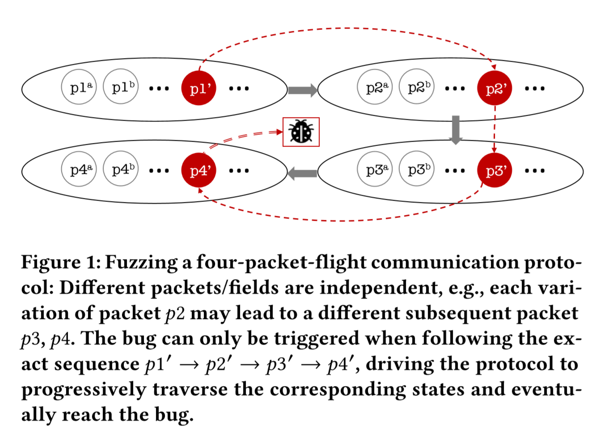
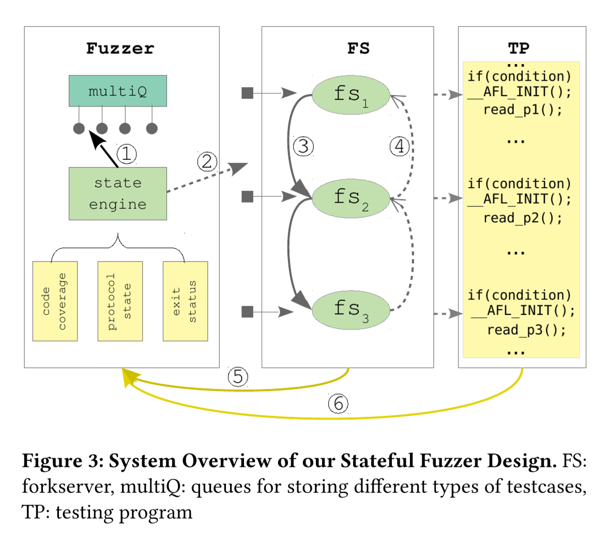

# Outline

## Exploring Effective Fuzzing Strategies to Analyze Communication Protocols - FEAST 2019

Created by : Mr Dk.

2019 / 10 / 06 20:23

Nanjing, Jiangsu, China

---

## 1. Introduction

网络协议中的威胁，使成千上万的联网设备暴露在危险中

如何开发一套自动的、可扩展的自动化技术，检测较大代码量中的漏洞呢？

已有的 fuzzer 可被分为三类：

* white box
* black box
* grey box

White box 或 block box fuzzer 通常是通信链的一部分

* 模仿成客户端 / 服务器
* 作为 MITM 的代理
* 产生 / 截获多个网络实体中的包，进行突变 / 重放
* 白盒 / 黑盒的区别在于被测试的协议是否已知

而 grey box fuzzer 需要一个与协议相关的测试程序 (Testing Program, TP)

* 该程序用于执行协议
* 只需向程序输入报文
* 因此该 fuzzer 位于通信链之外

### 局限性：

* Black box / white box - "blind" fuzzing，没有利用一些有效的程序执行信息
* Block box - 不准确的协议逆向工程
* Grey box - 需要一个构造完整的 TP，且默认只分析收到的第一个报文

### 对协议进行 fuzzing 的挑战：

1. 协议通常经过状态机实现，状态转移由协议事件驱动；而 fuzzing 是无状态的，因此无法将 fuzzing 驱动到感兴趣的方向上，并进行持续 fuzzing
2. 通用程序在启动时接收输入，执行状态只依赖于输入；而协议中有着多轮信息交换，且信息间可能存在依赖；只对一个报文进行 fuzzing 会使 code coverage 受到限制；而对报文整体进行变异会导致报文不合法

### 一个例子：

四种报文为握手的过程

报文之间有一定的关联，比如 `p1` 的回应是 `p2`

假设有一个 bug 只能由 `p1' → p2' → p3' → p4'` 触发

* 只 fuzz `p1` 并不一定总能得到 `p2'`，以及后面的 `p3'`、`p4'`
* 对 `p1` 进行不断的变异，也只能得到 `p1` 的各种变种
* 如果给定一个随机的 `p1`，fuzzer 从 `p2` 开始 fuzzing，bug 也无法被触发

Fuzzer 需要有能力使协议的执行从 `p1'` 进入 `p2` 状态

并保持在 `p2` 状态中进行连续的 fuzzing

### 本文提出的思路

协议 fuzzer 是有状态的

为了最大化 code coverage 和 fuzzing 的深度

需要能够 __识别__ 不同的协议状态，并在不同的状态间 __切换__

同时维护执行的一致性

本文提出了一种逐步推进的带有状态的 fuzzer，包含：

* A stateful fuzzer
  * 在 TP 执行的过程中构造多个 fuzzing status
  * 为不同的 fuzzing status 识别对应的 fuzzing 目标
  * 决定何时：
    * 复制协议状态
    * 前进 (进入下一个 fuzzing status)
    * 后退 (回退到前一个执行状态)
* An instrumented testing program (TP)

在 fuzzing 过程中可以多次前进或后退，识别 fuzzing 的甜区

直到 fuzzer 无法再找到感兴趣的测试用例

本文的主要贡献：

1. A novel framework for stateful protocol fuzzing
2. Flexible power schedules
3. Fuzzing the _OpenSSL_ library for experiment

---

## 2. Background

### AFL

AFL 每次选中一个测试用例

将输入文件映射到内存的缓冲区中

每个测试用例会经过不同的变异策略，进行很多轮的变异

在每一轮的变异后，修改过的缓冲区将被写入文件中，作为 TP 的输入

Fuzzer 会向 TP 发送执行信号，并等待执行结束

采集 code coverage 或 exit status 等信息

AFL 使用编译时的 instrumentation 来追踪基本块的转移

每个基本块都会被分配一个唯一的 ID

两个 ID 组成的 pair (edge) 能够表示控制流转移

AFL 将边的出现情况存放在 64KB 的内存中

每次执行时，TP 会更新这块共享内存；fuzzer 会收到信息

如果新的 edge 出现，fuzzer 会认为这个输入有效

* 该输入将会被重新加入队列，进行进一步的变异
* 因为从直观上，这种输入能够覆盖更多的代码

### Forkserver

为了加速 fuzzing 的过程

AFL 采用 forkserver 避免重复的程序初始化

* 如果没有 forkserver，fuzzer 需要对于每个输入调用 `execve()`
* TP 将会重复进行库初始化、动态链接等，这些进程将会占用很大一部分时间
* 然而，整个程序只有在读取输入的部分之后才会对 code coverage 产生影响，重复的程序初始化是冗余的

因此，AFL 只会调用 `execve()` 一次

Fuzzer 首先调用 `fork()` 来生成 forkserver

Forkserver 调用 `execve()` 来执行 TP，直到 `__AFL_INIT()` 函数

在该函数中，TP 进入了一个 `while` 死循环

* 每当 fuzzer 完成了一次变异，会向 forkserver 发送 forking 信号
* 克隆一份 TP 来执行变异后的输入

简单讲，forkserver 可以保证从程序初始化结束后复制自身状态

---

## 3. System Design

Stateful fuzzer + Instrumented TP

Fuzzer 包含一个数组的队列，和一个多状态的 forkserver

* 每个队列保存属于相同 fuzzing 状态的测试用例
* Forkserver 会在合适的位置复制自身，成为新的 TP 进程

### 3.1 Testing Program

__协议实现__ 和普通的 __单状态程序__ 的区别：

* 协议中包含多个报文作为输入
* 而单状态程序只有一个输入

`__AFL_INIT()` 被用于标记 fork point 的位置

在实际中，协议状态机是用 `while` 循环实现的

本文条件化地在不同位置多次初始化 forkserver

### 3.2 State-aware Fuzzer

状态引擎会基于 TP 的执行状态，将 forking 信息和 fuzzing state 信息传递到 forkserver

* 在 TP 执行后采集协议状态和 code coverage

状态引擎的核心：`multiQ` 数据结构，以及操作该数据结构的函数：

* `constructQ`
* `storeQ`
* `destroyQ`
* `switchQ`

每个 `multiQ` 结构保存相同类型的队列 entry 以及全局变量

设计多个 fuzzing queue 的原因是

* 每个阶段 (状态) 的报文的格式都不相同

这样，每个队列中的 entry，可以在恰当的位置被 TP 读取

每次 TP 执行完成后，fuzzer 分析协议状态、TP exit status 和 code coverage

如果发现了新的协议状态

* 调用 Q-相关的函数，创建 / 销毁现在的 Q
* 转移到新状态的 Q
* 同时，发送新的状态信息到 forkserver

状态引擎可以根据灵活的策略，根据协议标准，前进或后退状态

### 3.3 Coordination

使用变量 `TPstate` 来追踪协议状态的变化

首先对 `p1` 进行 fuzzing

变异后的 `p1` 格式错误，无法通过格式检查，服务器返回错误信息

当 `p1` 变异至 `p1'` 时，格式正确，触发了新的状态 (`TPstate` 发生了变化)

Fuzzer 决定在接下来的变异中开始基于 `p1'` 变异 `p2`

状态引擎向 forkserver 发送信号，转移到下一个状态

总结，在多个执行点开始 fuzzing，执行点记录了之前程序的状态

---

## 4. Implementation

基于 AFL

TP 使用如下方式进行 instrumentation：

1. 程序中的多个位置被选为 forking points
2. 除了 code coverage 和 exit status，TP 还会和 fuzzer 中的 state engine 分享更多信息 (比如 TPstate)
3. 记录 fuzzing 过程中的报文，用于追踪最后的威胁

### Search Policy

DFS-like searching policy

* 当发现了新的状态，就进入新的状态继续 fuzzing
* 当没有有效的测试用例能够被生成时，回退到前一个状态

当 `TPstate` 满足特定的条件 (比如报文数量增多) 时，前进，fuzz 下一个状态

* 报文数量增多暗示了当前被测试的报文触发了新的协议状态
* 当 `TPstate` 达到最大值时会存在问题

另外提出了一个 profile-based 前进策略

Fuzzing 过程被分为 profiling 和 testing 两部分

* profiling 阶段
  * 每个报文被 fuzz 固定长度的时间
  * 获得每个报文 code coverage 和 fuzzing queue 的总体情况
  * 计算每个状态的前进概率 - code coverage 较高或 queue 较长的状态会被分配更高的概率
* testing 阶段
  * 基于 profiling 阶段获得的概率，进行随机前进

周期性地根据 code coverage 更新概率

相反，code coverage 较高或 queue 较长的状态会有较低的回退概率

此外，还设定了两个阈值：

* `max_Q_cycles` - fuzzing 不能操作这个次数
* `max_Q_entries` - 队列不能超过这个长度

避免浪费过多的资源

---

## 5. Evaluation

### 5.1 Environment Setup

使用执行过程中出现的报文数量作为 `TPstate` 的值

* 每当 `TPstate` 发生变化时，就认为新的状态被触发

### 5.2 Effect of Single-packet Fuzzing

Non-stateful fuzzing 的局限

从握手时靠后的状态开始 fuzzing，coverage 很低

在 fuzzing 6h 之后，coverage 的增长率很低

而 stateful fuzzing 能取得较高的 coverage

* 只 fuzzing 单独的报文，code coverage 受限
* Fuzzing 不同的报文，可以触发唯一的 coverage

体现了 stateful fuzzing 的意义，以及 fuzzing 不同报文的有效性

### 5.3 Progression and Regression Polices

状态的前进与后退，基于 __协议状态变化__ 和 __概率__

---

## Summary

原理大致讲明白了

但是文章没有贴合实际协议的例子

所以读着还是有点飘

---

