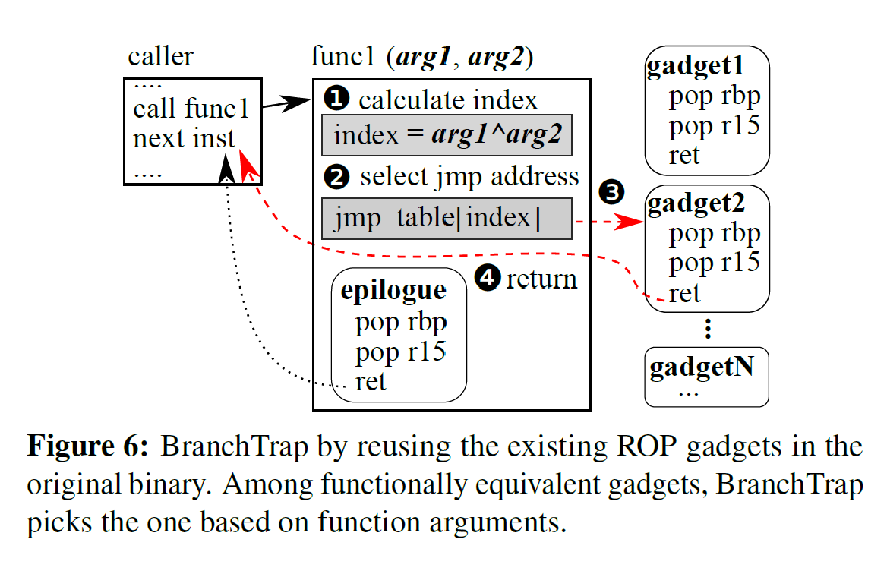

# Outline

## Fuzzification: Anti-Fuzzing Techniques - USENIX Security 2019

Created by : Mr Dk.

2019 / 09 / 24 22:38

Nanjing, Jiangsu, China

---

## 1. Introduction

Fuzzing - 不断产生随机输入，测试程序

等待 bug 出现的行为：crashing / hanging

而先进的 fuzzing 技术也可以被攻击者使用

用于发现 _zero-day vulnerabilities_

Fuzzing 能够比其它技术 (逆向工程等) 发现 4.83 倍更多的 bug

因此，开发者可能需要反 fuzzing 技术来阻碍攻击者的 fuzzing 行为

本文提出了 FUZZIFICATION，有效阻碍攻击者通过 fuzzing 寻找漏洞

* 攻击者依旧能够发现 bug，但需要更多的资源 (CPU / memory / time)

这样，开发者或受信任的第三方能够先于攻击者发现 bug，防止 bug 的滥用

有效的反 fuzzing 技术应当有以下三个特征：

1. 有效阻碍 - 在固定的时间内，使 fuzzing 找到更少的 bug
2. 被保护的程序在正常使用时不能受性能影响
3. 保护代码不能被轻易识别或移除

目前没有任何机制能同时满足这三个特征

本文使用了三种技术对 fuzzing 进行反制：

* SpeedBump
* BranchTrap
* AntiHybrid

并对 LAVA-M 数据集和 9 个真实的应用进行了测试

大幅降低了 fuzzing 的性能

本文的主要贡献：

* 新的研究方向 - 反 fuzzing
* 提出了三种技术，减慢了 fuzzing 的执行，隐藏了路径覆盖
* 在流行的 fuzzer 上对这些技术进行了测试

项目地址：https://github.com/sslab-gatech/fuzzification

---

## 2. Background and Problem

### 2.1 Fuzzing Techniques

Fuzzer 产生输入的原则：

* random mutation
* format-based generation

用这些输入运行程序，检查执行是否出现了例外行为

与人为分析相比，fuzzing 可以以更高量级的次数测试程序

最大化发现 bug 的几率

#### 2.1.1 Fuzzing with Fast Execution

提升 fuzzing 效率的最直接方法 - 使每次的执行更快：

1. 定制系统和硬件
2. 并行 fuzzing

#### 2.1.2 Fuzzing with Coverage-guidance

基于 coverage 的 fuzzing 需要采集每次执行的 coverage

这种方法基于两个经验主义的观察结果：

1. 更高的路径覆盖意味着更高的概率触发 bug
2. 对触发新路径的输入进行变异，有更大几率触发新的路径

大部分 fuzzer 都是由 coverage 进行指引的

只不过对 coverage 的表示方法不一样

##### Coverage Representation

大部分 fuzzer 使用 basic blocks 或 branches 来表示 code coverage

表示方式的选择，是 __准确率__ 和 __性能__ 的折衷

* Coverage 的粒度越细，性能上的开销越高

##### Coverage Collection

如果源代码可获得，fuzzer 可以在编译阶段对程序进行注解

或在运行时动态记录 coverage

* 通常会用到一些硬件特性的支持

Fuzzer 通常会维护自己的数据结构，储存 coverage 信息

* 数据结构的大小也是准确率和性能的折衷

#### 2.1.3 Fuzzing with Hybrid Approoaches

Fuzzer 无法分辨不同类型的输入字节

因此把时间浪费在对不太重要的字节进行变异上

不能影响任何控制流

__Taint analysis__ 用于判断输入中的哪个字节用于决定分支条件

### 2.2 FUZZIFICATION Problem

开发者希望 bug 只暴露给自己，或受信任方

而不是恶意的用户

FUZZIFICATION 的工作流：

开发者将代码编译为两个版本：

* Protected binary
* Normal binary

开发者将保护版本公开发布

因此攻击者只能对保护版本的 binary 进行 fuzzing

然而，由于保护机制，他们无法快速找到 bug

同时，开发者将普通版本发布给受信任方进行 fuzzing

在相同的时间内，受信任方能够先于攻击者找到 bug

从而，开发者能够在攻击者滥用 bug 之前修复它

#### 2.2.1 Threat Model

攻击者尝试使用最先进的 fuzzing 技术试图找到软件中的 bug

但他们获得的软件是保护版本的

#### 2.2.2 Design Goals and Choices

同时满足四个目标：

* Effective - 有效减少 protected binary 中的 bug 的发现量
* Generic - 对大部分的 fuzzer 都适用
* Efficient - 对正常程序的执行不能有过多开销
* Robust - 攻击者无法分析并移除保护机制

一些现有方法的问题：

* Packing/obfuscation - 反制逆向工程，但会带来较大的性能开销，影响正常用户的使用
* Bug injection - 注入随机代码，触发非泄露的 crashes，导致额外的记录开销，可能影响用户的使用
* Fuzzer identification - 检测 fuzzer 进程，并根据 fuzzer 改变其执行行为 - 可被轻易绕过
* Emulator bugs - 触发动态注解工具的 bug，从而打断 fuzzing - 需要对 fuzzer 比较熟悉，不通用

### 2.3 Design Overview

* SpeedBump
  * 向 cold path 注入细粒度的 delay primitives
    * 即，fuzzer 经常触碰，但程序正常运行很少触碰到的路径
* BranchTrap
  * 伪造一些对输入较为敏感的分支
  * 引导 coverage-guided fuzzer 在这种没意义的路径上浪费时间
  * 故意制造路径碰撞，消耗 coverage 的存储空间
* AntiHybrid
  * 将显式数据流转换为隐式，防止污点分析的数据流追踪
  * 插入大量的假符号，引发符号执行的路径爆炸

输入：

* 程序源代码
* 常用的测试用例
* 开销预算

输出：保护版本的 binary

1. 编译 normal binary
   * 并用测试用例运行 normal binary，并采集 basic block 的访问频率
   * 频率信息说明了在正常执行中，哪些路径不经常被访问
2. 基于这些信息，应用 FUZZIFICATION 的三个技术，产生 protected binary
3. 测量 protected binary 的开销
   * 如果超出了性能开销预算，重新执行上一步，减少对程序的 slow down
   * 如果远低于预算，则增加性能开销
4. 产生了最终的 protected binary

---

## 3. SpeedBump: Amplifying Delay in Fuzzing

拖慢 fuzzing 的执行，最小化对正常执行的影响

观察到的现象：

* Fuzzer 经常执行到错误处理代码中，而正常执行的时候很少
* 在这种 cold path 中注入延迟，显著影响了 fuzzing 性能，但不影响用户正常使用

首先通过 normal version 的执行识别 cold paths

向 cold paths 中注入延迟

本文的工具自动决定注入延迟的路径数量，和延迟的时长

使 protected binary 在用户定义的开销成本以下

Block block frequency profiling

1. 注解目标程序，记录执行时访问的基本块
2. 使用用户提供的测试用例，运行 binary，收集每个输入执行到的基本块
3. 分析采集的信息，识别在合法输入下，最少或从未被执行的基本块，作为 cold paths

不需要覆盖 100% 的合法路径，只需要覆盖经常使用的功能即可

Configurable delay injection

重复执行以下两步，决定注入延迟的代码块，和延迟的时间长度

* 从 30ms 的延时开始，对 3% 最少被执行的基本块插入延时
* 测量产生的 binary 的开销，如果没有超过用户指定的开销，就注入更多的 delay

五个可配置的选项：

* MAX_OVERHEAD - 用户可以定义性能开销成本
* DELAY_LENGTH - 指定了延迟的时间单位
* INCLUDE_INCORRECT - 是否向错误处理的代码块中注入延迟 (enable by default)
* INCLUDE_NON_EXEC / NON_EXEC_RATIO - 指定了是否向从未被执行过的代码块注入延时

### 3.1 Analysis-resistant Delay Primitives

攻击者可能使用程序分析来识别并移除简单的延迟 - 比如调用 `sleep()`

本文使用了 robustness 较好的延迟方法，引入了算术操作

基于 CSmith - 产生随机且 bug-free 的代码段

* 产生一个函数，输入一些参数，进行算术运算，返回特定类型的值
* 本文对 CSmith 进行了修改，产生的代码对原代码具有数据依赖和控制依赖
  * 将原代码中的一些数据作为参数，传入产生的代码中
  * 产生引用？
  * 使用返回值，对原代码中的全局变量进行修改

例子：

```c
// Predefined global variables
int32_t GLOBAL_VAR1 = 1, GLOBAL_VAR2 = 2;
// Randomly generated code
int32_t * func(int32_t p6) {
    int32_t *l0[1000];
    GLOBAL_VAR1 = 0x4507L; // affect global var
    int32_t *l1 = &g8[1][0];
    for (int i = 0; i < 1000; i++)
        l0[i] = p6;
    (*g7) = func2(g6++);
    (*g5) |= ~(!func3(**g4 = ~0UL));
    return l1; // affect global var
}
// Inject above function for delay
int32_t PASS_VAR = 20;
GLOBAL_VAR2 = func(PASS_VAR);
```

* 引入了原代码和注入代码的数据流依赖
* 改变了程序状态，但不影响原始程序
* 虽然程序是随机生成的，但通过数据流和控制流与原程序紧耦合

因此，程序分析难以移除注入的代码

反复运行 CSmith，直到产生代码产生的延时时间足够

#### Safety of delay primitives

需要保证产生的代码中没有 bug

* 首先使用 CSmith 默认的安全检查
* FUZZIFICATION 的检查

指针分析、显式初始化、math wrapper 防止整型溢出等

用固定的输入运行程序 10 遍，如果发生错误，就丢弃

#### Fuzzers aware of error-handling blocks

有些 fuzzer 能够识别出错误处理的 code blocks

并把这些 block 排除在 coverage 运算之外，避免重复执行

而所幸 SpeedBump 注解的不仅包含错误处理代码，还包含较少执行的功能模块

并向开发者提供选项，可以选择是否将错误处理代码包含在 cold paths 中

从而使 FUZZIFICATION 能够标注执行次数较少的功能模块，最大化其有效性

---

## 4. BranchTrap: Blocking Coverage Feedback

插入大量对细微输入变化很敏感的条件分支语句

使 coverage-guided fuzzer 将资源浪费在没有意义的路径上

目标 - 误导或阻塞 coverage 反馈

### 4.1 Fabricating Fake Paths on User Input

伪造大量的 __条件分支__ 和 __非直接跳转__

并将其注入到原始程序中

* 条件分支依赖于输入
* 非直接跳转基于用户输入计算跳转目标

因此，在输入发生细微变化时，程序将会走不同的执行路径

* 当触发伪造的条件分支时，fuzzer 会给予该输入更高的变异优先级
* 导致了更多伪造路径的出现
* 从而使 fuzzer 继续浪费其资源

设计原则：

* 伪造 __足够数量__ 的路径
  * 受输入的影响，提供不同的 coverage
* 注入的新路径对程序的正常执行引入最小化的开销
* 对于用户输入应当是确定性的 - 相同的输入应当经过相同的路径
  * 一些 fuzzer 会舍弃非确定性的路径
* 不能被攻击者轻易识别并移除

#### 4.1.1 BranchTrap with CFG Distortion

根据用户的输入，对注入分支的返回地址进行多样化处理

严重扭曲程序的控制流

1. 首先，采集程序汇编中的函数结语
2. 指令序列相同的函数结束语被分组到一个跳转表中
3. 重写汇编，程序在跳转表中查找等价的结束语，跳转从而实现原本的函数返回

保证了与原程序经历了相同操作

例子：



1. 首先计算所有参数的异或值，用于寻址跳转表
2. 在跳转表中得到具体的返回地址
3. 控制流转移
4. 返回到原来的返回地址

基于 Return-oriented programming (ROP) 的 BranchTrap 有三个好处：

* Effective
  * 随着用户输入的变化，控制流会发生改变；同时，BranchTrap 也保证了相同的输入可以获得相同的控制流，使 fuzzer 不会过滤这些路径
* Low overhead - 轻量级的操作 (XOR, jump) (低于 1%)
* Robust
  * 提升了攻击者识别 binary 的复杂度

### 4.2 Saturating Fuzzing State

阻止 fuzzer 对于 code coverage 的学习过程

前一个方法主要使 fuzzer 将时间浪费在没有意义的输入上

这个方法主要是为了阻止 fuzzer 寻找真实的有意义路径

BranchTrap 在程序中插入大量分支

利用每个 fuzzer 的 coverage 表示方式，将新的发现掩盖

在较少访问的基本块中插入大量 (10K - 100K) 的确定性分支

一旦 fuzzer 进入到这种分支中，coverage 表将会迅速被填满

* 大部分新发现的路径将会被视为 visited
* Fuzzer 丢弃这些输入

显著提升了 bitmap 碰撞

一个更为饱和的 bitmap 将会导致更少的路径被发现

### 4.3 Design Factors of BranchTrap

产生的伪造路径数量是可以配置的

注入的分支数量也是可以配置的

为了防止较高的 binary 尺寸开销

* 只向最少被执行到的一至两个 basic block 中注入分支
* 只要 fuzzer 到达这些分支，bitmap 就会被填满

---

## 5. AntiHybrid: Thwarting Hybrid Fuzzers

混合 fuzzing 技术，利用了以下两种技术来提升 fuzzing 效率：

* 符号执行
  * 擅长解决复杂的条件分支问题，使 fuzzer 绕开较难变异出结果的分支
* 动态污点分析
  * 寻找与分支条件相关的输入字节

这两种技术都需要消耗大量的资源 - CPU、内存

因此局限于 fuzzing 简单的程序

符号执行局限于路径爆炸的问题

DTA 局限于无法追踪隐式的数据依赖

### Introducing Implicit Data-flow Dependencies

将原程序中的显式数据依赖转变为隐式

从而阻碍污点分析

FUZZIFICATION 首先识别 __条件分支__ 和 __信息汇聚点__

根据变量类型，注入数据流转换代码

例子：

```c
char input[] = ...; // user input
int value; = ...; // user input

// user implicit data-flow to copy input to antistr
// original code: if (!strcmp(input, "condition!")) { ... }
char antistr[strlen(input)];
for (int i = 0; i < strlen(input); i++) {
    int ch = 0, temp = 0, temp2 = 0;
    for (int j = 0; j < 8; j++) {
        temp = input[i];
        temp2 = temp & (1 << j);
        if (temp2 != 0)
            ch |= 1 << j;
    }
    antistr[i] = ch;
}
if (!strcmp(antistr, "condition!")) { ... }
```

将原来数组中的值替换为新值

> ？

### Exploding Path Constraints

反制符号链接

注入多个代码块，故意触发路径爆炸

将所有的比较指令替换为比较 hash 值

* 给定 hash 值，符号执行无法推断原操作数

由于 hash 函数通常会带来不可避免的开销

* 使用了轻量级的 CRC 以减轻性能开销

```c
// exploding path contraints
// original code: if (value == 12345)
if (CRC_LOOP(value) == OUTPUT_CRC) { ... }
```

由于复杂的运算，符号执行引擎将会发生超时错误

---

## 6. Evaluation

Target Applications

* LAVA-M 数据集
* 9 个现实生活中的应用程序

五种配置：

* Original (no protection)
* SpeedBump
* BranchTrap
* AntiHybrid
* 三种技术的组合 (full protection)

Evaluation Metric

用两个机制衡量 FUZZIFICATION 的有效性：

* 真实路径的 code coverage (除去注入的 code)
* Unique crashes

### 6.1 Reducing Code Coverage

#### 6.1.1 Impact on Normal Fuzzers

减少了 real path 的发现概率

FUZZIFICATION 能够自动根据性能开销成本调整保护程序

因此对于每个程序的保护效果不相同

三种技术的保护效果：

* SpeedBump > BranchTrap > AntiHybrid

测量了 __程序大小__ 和 __执行速度__ 的开销

* 满足了用户指定的开销成本
* 相对较高的空间开销
  * 主要来自于 BranchTrap 中注入的大量 branch，用于填充 bitmap
  * 对于较小的程序来说，开销占比很大；但对于大程序来说，是微不足道的
  * 且 BranchTrap 是可配置的，用户可以认为调小开销成本

#### 6.1.2 Impact on Hybrid Fuzzers

OJBK

### 6.2 Hindering Bug Finding

Unique crashes 的数量

#### 6.2.1 Impact on Real-world Applications

少发现 93% 的 bug

如果指定一个固定的 crash-discovery rate

Fuzzing 需要多付出 40 倍的努力才能找到 bug

由于 fuzzing 过程时间越长，发现 crash 的概率越低

所以 40 倍只是一个保守估计

#### 6.2.2 Impact on LAVA-M Dataset

该数据集与普通程序相比较小

如果对 1% 的 cold path 注入 1ms 的延时

程序将会被拖慢 40 倍

* 因此，将比例调整为 0.1%
* 将延时时间调整为 10μs - 100μs

### 6.3 Anti-fuzzing on Realistic Applications

使用了六个程序，包含：

* GUI
* 依赖于十多个库

对于每个被保护的应用，首先使用多个输入认为运行多次

保证 FUZZIFICATION 不影响程序的原始功能

* 5.4% 的 code size 开销
* 0.73% 的运行时开销

### 6.4 Evaluating Best-effort Countermeasures

机制能否被攻击者反制

1. 攻击者可能搜索特定的代码模式，识别注入的保护代码
   * 检查了被重复使用的用户保护的代码片段
   * AntiHybrid 的 hash 算法代码或数据流重建代码会被识别
   * SpeedBump 和 BranchTrap 中的代码没有特定的模式，因为是随机生成的
2. 控制流分析可以识别程序中的未用代码，并移除之
   * FUZZIFUCATION 注入的代码与源代码交叉引用，因此无法被移除
3. 数据流分析能够识别数据依赖
   * 在全局变量、参数、注入函数返回值之间的依赖总是存在
   * 人为分析较为困难

---

## 7. Discussion and Future Work

针对 FUZZIFICATION 的对策

### Complementing Attack Mitigation System

为攻击者带来巨大的代价

使开发者能够先于攻击者发现 bug

### Best-effort Protection against Adversarial Analysis

这种保护机制只能提供尽力而为的保护

如果攻击者的计算能力足够强，还是可以发现 bug 的

### Trade-off Performance for Security

FUZZIFICATION 以轻微的开销为代价，提升了软件的安全

* 程序大小增加
* 执行速度减慢

### Delay Primitive on Different H/W Environments

目前系统中的延时，对于不同硬件配置的机器，带来的延时效果不一样

或许可以通过监控一小部分指令的执行，测量 CPU 的性能

自动调整延时的时间配置

---

## Summary

出发点很新

大家都在 fuzzing 的时候他们已经开始 anti-fuzzing 了

显然他们对各种 fuzzing 技术很熟

对于各个 fuzzer 的特性和不足也了解得很清楚

这样才能够有针对性地设计 anti-fuzzing 的策略

---

