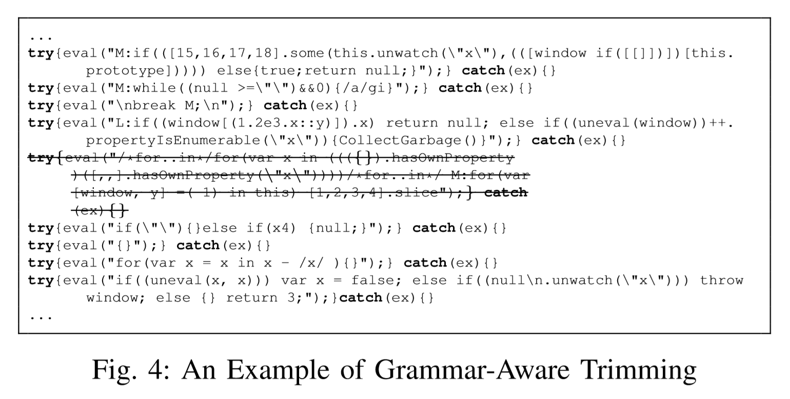

# Outline

## Superion: Grammar-Aware Greybox Fuzzing - ICSE 2019

Created by : Mr Dk.

2019 / 11 / 09 20:15

Nanjing, Jiangsu, China

---

## 1. Introduction

AFL 的 fuzzing 过程可被分为五个步骤

* 一个测试输入从队列中被选出
* 测试输入被剪枝到最小尺寸 - 不改变程序的测量行为
* 被修剪后的输入变异为新的输入
* 程序执行变异后的新输入
* 若输入触发新的 coverage，则更新该输入到队列中

挑战：

* 有效地 fuzz __紧凑的非结构化输入__ (比如图像)
* 无法 fuzz 结构化的输入 (XML, JavaScript)

这些程序通常按过程处理输入，比如：

* 语法转换
* 语义检查
* 应用执行

从一方面来说，AFL 中的输入修剪策略是与语法无关的

* 因此队列中的大部分输入无法被有效修剪并 __保持语法正确__
* Fuzzing 被卡在语法检查阶段
* 限制了 fuzzer 找到更深的 bug

另一方面，AFL 的变异策略也是语法无关的

* 变异后的输入大部分无法通过语法检查

综上，AFL 对于处理结构化的数据受到限制

本文提出了 grammar-aware coverage-guided  greybox fuzzing

输入：

* 目标程序
* 测试输入的语法说明 (公开可得)

基于语法，将测试输入转化为 __抽象语法树 (AST)__

使用一种 grammar-aware 修剪策略

* 有效修剪输入，同时保证输入结构合法
* 通过迭代地移除 AST 的子树，并观察 coverage 差别实现

另外，提出了两种 grammar-aware 变异策略

* 加强了 AFL 中基于字典的变异策略，使输入能快速通过语法检查
* 提出了基于 AST 的变异策略，将自身 AST 中的子树替换为别的子树

为了评估，在 XML 引擎和 JavaScript 引擎上做了测试

* 提升了 code coverage
* 提升了 line coverage
* 提升了 bug-finding capability

Grammar-aware 修剪策略有效修剪输入，并保持其语法正确性

Grammar-aware 变异策略有效产生了能够触发新 coverage 的测试输入

---

## 2. Our Approach

需要测试输入的上下文无关语法

### A. Grammar-Aware Trimming Strategy

AFL 内置的修剪策略是语法 grammar-blind 的

* 将输入划分为 `len/n` 字节的块
* 试图移除每一个块
* 如果移除每个块后，coverage 不变，这个块就被修剪

这个策略对于非结构化的数据很有效

但对结构化的数据效果很差

使 AFL 卡死在程序的语法检查阶段

例子：

语法合法性已经被毁坏了

Grammar-aware 修剪策略的算法：

1. 根据语法 G，将测试输入转化为 AST
2. 如果转化过程发生错误，就使用 AFL 内置的修剪策略 (而不是直接扔掉)
3. 尝试从 AST 上修剪子树
4. 如果修剪后的 coverage 发生变化，则该子树不能被修剪
5. 否则，修剪子树，并重复上述过程，直到没有子树可以被修剪

只有当基于 AST 的修剪策略无效时，才转为使用 AFL 的内置修剪策略

* 这是因为非法的语法有时候也有用

例子：

### B. Grammar-Aware Mutation Strategies

AFL 默认的变异策略：

* 粒度过细
* Grammar-blind

所以提出两种新的变异策略

#### 1) Enhanced Dictionary-Based Mutation

字典 - 一系列基本的语法记号 (比如保留关键字)

* 可以人为给出
* 可以由 AFL 自动识别

AFL 的做法：

* 每个记号被插入到每两个要被变异的字节之间
* 或覆盖与记号相同长度的字节序列
* 这样的变异方式能够产生合乎语法的测试输入，但大部分输入的结构都被破坏

加强版的算法：

记号通常都是只包含字母或数字的结构化输入

* 通过对输入进行迭代
    * 检测当前字节和下一个字节是否都是字母或都是数字
    * 确定了记号的边界
* 在每一个边界处尝试插入记号
    * 避免了在连续的字母或数字中间插入记号
    * 显著减少了插入次数
    * 减少了对合法记号的破坏

不仅维护了变异后输入的合法性

还减少了变异后输入的数量

例子：

#### 2) Tree-Based Mutation

利用语法知识，来设计一个基于树的变异策略

AST 将输入表示为带有属性的对象

算法输入一个待变异的输入、语法、以及队列中任选的一个随机输入

1. 首先，将待变异输入转化为 AST 形式
    * 如果转化出现错误，则该输入不合乎语法
    * 不再进行基于树的变异
2. 遍历 AST，将所有的子树保存在集合 S 中
3. 将任选的随机输入也转化为 AST，并保存所有的子树到 S
4. 对于待变异输入的每个子树，用 S 中的每一个子树替换，产生新的变异输入

返回的集合可能会非常大 (子树数量的积)

因此提出了几个启发式方法，降低变异后输入的数量

* Heuristic 1: 限制测试输入的大小
    * 不处理 10000B 以上的输入
    * 一个较大的输入通常需要更多次变异
* Heuristic 2: 限制变异的次数
    * 如果子树的数量超过了 10000，则从中随机选择 10000 个子树
    * 保持每个测试输入的变异次数低于 10000
* Heuristic 3: 限制子树的大小
    * 限制子树的最大大小为 200B
    * 200B 已经足够用于表示一些复杂的声明

例子：

---

## 3. Evaluation

### A. Evaluation Setup

目标语言：

* XML
* JavaScript

相比之下，XML 属于弱结构化

而 JavaScript 包含了 98 个符号，属于强结构化

从 Internet 上下载了大量的 XML 和 JavaScript 样本

用 _afl-cmin_ 将具有独立 coverage 的输入过滤出来

使整体的输入集合较小

目标程序：

* libplist - 开源的 XML 引擎
* WebKit, Jerryscript, ChakraCore - 开源的 JavaScript 引擎

被广泛用于不同 OS 的浏览器中

Fuzz 了三个月

### B. Discovered Bugs and Vulnerabilities (RQ1)

寻找 bug 的能力如何？

找到了 31 个 bug

* 21 个新 bug
* 10 个 CVE
* 并获得了很多金钱回报

与 AFL 进行比较：

* 在 31 个 bug 中，AFL 只发现了其中的 6 个

基本上所有的 bug 都是由基于树的变异方式触发的

### C. Code Coverage (RQ2)

Code coverage 如何？

* 提升了 16.7% 的 line coverage
* 提升了 8.8% 的 function coverage

因为 grammar-awareness 使 fuzzing 前进到了应用执行阶段

### D. Effectiveness of Grammar-Aware Trimming (RQ3)

Grammar-aware 剪枝的效果如何？

* 剪枝比例 - 从测试输入中剪掉的字节数
* 语法合法性比例 - 在剪枝后合乎语法的输入比例

从结果来看，虽然 Superion 的剪枝比例相对低一些

但这种剪枝策略使得语义合法的输入比例达到 100%

有利于之后的变异

### E. Effectiveness of Grammar-Aware Mutation (RQ4)

Grammar-aware 变异的效果如何？

与 AFL 内嵌的变异策略进行了比较

* bit flips
* byte flips
* arithmetics
* value overwrite (interesting values)
* havoc (上述四种随机)
* splice (拼接两个随机输入，并应用 havoc)

基于字典的变异策略：

* ui (插入用户提供的符号)
* uo (用用户提供的符号覆盖)
* ai (插入自动提取的符号)
* ao (用自动提取的符号覆盖)

基于树的变异策略：

* tree

结果表明

Grammar-aware 变异策略与 AFL 相比

在产生触发新的 coverage 的效果上更高

但是，所有变异策略都需要被改进

### F. Performance Overhead (RQ5)

Superion 的性能开销主要体现在哪？

Fuzzing 过程处理输入的包含三个步骤：

* Parsing (转换)
* Mutation (变异)
* Execution (执行)

Parsing 的时间包括打开文件、转换、遍历文件的时间

* 通常与输入文件的大小呈线性关系
* 是一次性的

此外，主要的性能开销主要在基于树的变异过程上

但是考虑到提升了 bug-finding capability 和 code coverage

这种开销可以接受

### H. Discussion

没有在标准数据集上评估

因为数据集中的大部分程序都是处理非结构化输入的

---

