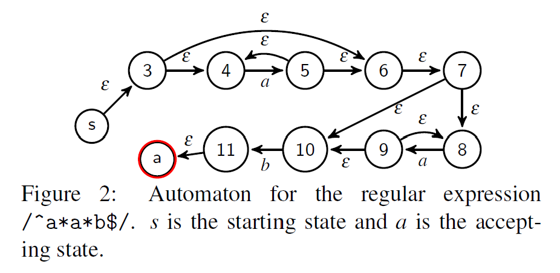
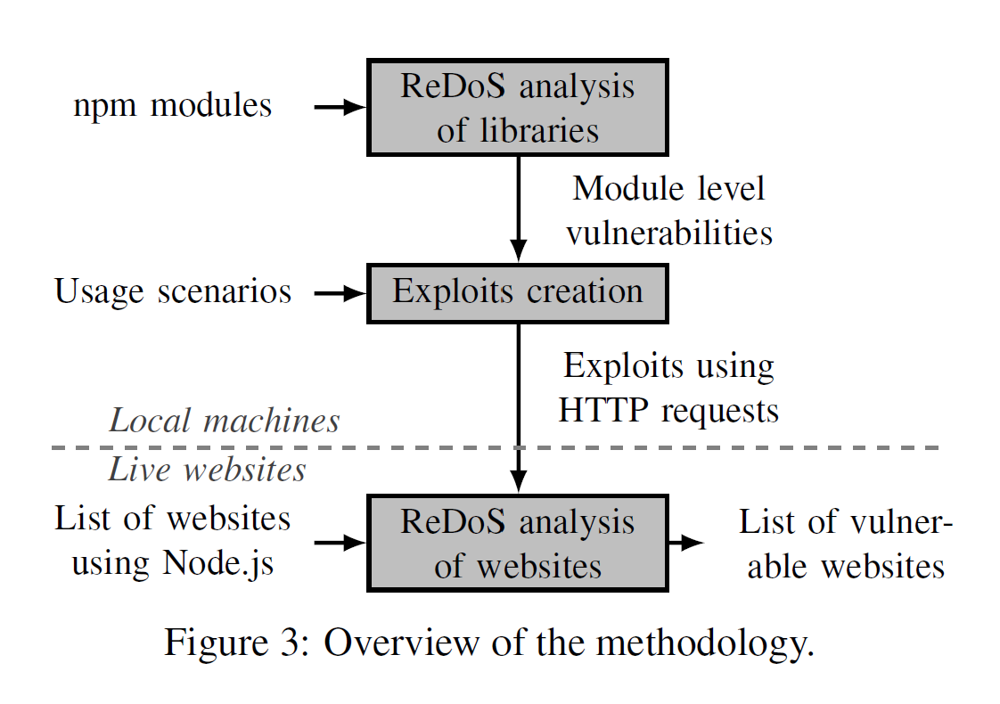

# Outline

## Freezing the Web: A Study of ReDoS Vulnerabilities in JavaScript-based Web Servers - USENIX Security 2018

Created by : Mr Dk.

2019 / 09 / 14 11:05

Nanjing, Jiangsu, China

---

## Introduction

正则表达式在各类软件中被广泛采用

由于正则表达式很容易出错，使攻击者能够绕过检查

因此开发者对于正则表达式的正确性较为敏感

然而忽视了另一方面：性能

* 即字符串匹配正则表达式的时间

使用一个精心制作的输入字符串

匹配一个次优的正则表达式需要花费几分钟甚至几小时

如果一个服务器的实现，容易遭受这种攻击

攻击者可利用难以匹配的字符串攻击服务器

即所谓 _regular expression denial of service, ReDoS_

这是一种 __算法复杂度攻击__

* 利用的是算法的最坏复杂度
* 对于正则表达式，最坏复杂度远高于平均复杂度

由于当前 JavaScript 在应用程序的服务端越来越流行

然而，JavaScript 的单线程特性导致服务器程序很容易被 ReDoS 攻击

在实际中，为了避免阻塞线程导致服务器没有响应

* 开发者会试图将较长的计算任务分为较小的事件
* 从而通过异步的方式处理

然而，在目前的 JavaScript 引擎中

使用正则表达式匹配字符串无法被简单地切分为多个计算任务

因此，单一一个请求就能有效阻塞主线程

使 Web Server 无法响应任何请求

本文是第一篇对大量网站的 ReDoS 情况进行分析的文章

回答了以下几个问题：

* ReDoS 在基于 JavaScript 的服务端的影响有多广泛
* ReDoS 对 Web 服务器的响应时间有什么影响
* 哪一种威胁是最普遍的
* 更流行的网站中，是否更少受到 ReDoS 的影响
* 现有的防御机制效果如何

回答这个问题需要解决两个方法学挑战：

1. 如何在没有服务端源代码的条件下，识别可能遭受 ReDoS 攻击的威胁
2. 如何在不真正对网站进行攻击的条件下，分析网站是否存在漏洞

使用这些方法，本文识别出 339 个网站，至少存在一个 ReDoS 威胁

已有工作提出过一些 ReDoS 的检测方法：

* 非 JavaScript
* AST-level 分析 - false positives & false negatives

本文的主要贡献：

* 分析已部署服务器漏洞的新方法
  1. 假设服务器的内部实现如何使用存在 ReDoS 隐患的库
  2. 在不攻击服务器的前提下，测试攻击是否可行
* 第一个对于基于 JavaScript 的 Web 服务器的 ReDoS 威胁的完整分析，在分析的 2846 个网站中，12% 存在威胁
* 经验主义的证据得出，ReDoS 是一个真实且广泛的威胁
* Benchmark

---

## Background

### Regular Expression Matching

__正则表达式__ 用于检测一个给定的字符序列是否匹配一个 pattern

大部分的实现方法：将正则表达式转换为一个 __自动机 (Automaton)__

通过基于 __回溯 (back-tracing)__ 的搜索方法

从初始状态，到达接收状态，消费字符串

### Regular Expression Denial of Service (ReDoS)

基于回溯的搜索方法，将会导致大量数目的回溯

ReDoS 利用了这一特性

对于正则表达式 `/^a*a*b$/`，和待匹配字符串 `aaa`

自动机如图所示：

* 每个字符 `a` 都可以在两处被匹配
* 由于待匹配字符串中没有任何 `b`，因此一定会在匹配到最后时失败

在得出不匹配的结论之前，算法尝试了匹配 `a` 的所有可能的路径

在这个表达式中，实际上已经达到了 __超线性__ 的复杂度

* 在这个例子中，达到了输入长度的二次复杂度 (?)
* 更有甚者，可以达到指数复杂度 - `/^(a*)*b$/`

### Server-side JavaScript

JavaScript 由于 Node.js 平台而变得流行

Node.js 提供了一个单线程、基于事件的执行模型，使用异步的 I/O 调用

在 Node.js 中，主线程运行一个 event loop (事件循环)

* 事件循环负责处理网络、I/O、定时器触发的时间

因此，一个较为漫长的运算，比如匹配正则表达式

会拖慢其它的请求

与多线程的 Web 服务器 Apache 相比

单线程是导致 JavaScript 存在问题的原因

对于一个需要匹配一个小时的正则表达式

* 为了完全阻塞 Apache 服务器，需要上百个请求，阻塞所有的线程
* 相比之下，只需要一个请求就可以阻塞 Node 服务器

---

## Methodology

问题：

1. 这些威胁的广泛程度如何？
2. 攻击者是否可以利用这些漏洞影响网站的可用性？
3. 目前的解决方案能够做到什么程度？

为了回答这些问题，我们的方法必须解决两个挑战：

1. 技术挑战 - 网站的源代码不可获得，如何获知网站存在哪些威胁？
2. 道德顾虑 - 如何在不对网站进行可感知的攻击的前提下，验证这些威胁潜在的影响？

实验在 __本地机器__ 和 __在线网页__ 上进行

为解决第一个挑战：

首先，通过 Node.js 的包管理工具 NPM

分析比较流行的 JavaScript 库

找到可以被 HTTP 请求利用的威胁

然后假设服务器实现中可能会如何使用这些库，并建立场景

为解决第二个挑战：

使用一种技术，测试一个网站是否存在威胁

但避免阻塞服务器可被感知的时间

* 比如，从较小的 HTTP payload 开始，缓慢增大 payload
* Payload 大到可以自信地声称，如果使用更大的 payload，将能够导致网站阻塞

为了决定到底向运行中的网站发送多大的 payload

* 本文作者在本地服务器上，使用可能受威胁的库，运行试验

### Identifying Websites with Server-side JavaScript

首先收集最受欢迎的 1000000 个网站

这里面很多网站的服务端都没有使用 JavaScript

本文作者选择了运行在基于 JavaScript 最受欢迎的 Web 服务器框架 - _Express_ 上的网站

* 向这 1000000 个网站发送 HTTP 请求
* 查看响应头 `X-Powered-By` 是否为 `Express`
* 框架默认会设置该值

总共找到了 2846 个符合条件的站点

* 由于 headers 可能因为安全原因被过滤
* 或者有不使用 Express 框架的网站存在

本文 __低估__ 了 ReDoS 的影响

本文还统计了流行程度排名每 100000 个网站中，使用 Express 的所占比例

结论：Express 更容易被更流行的网页使用

### Finding ReDoS Vulnerabilities in Libraries

本文提出的方法，针对流行的 npm 模块中，之前未知的 ReDoS 威胁

将这样的正则表达式视为威胁：

* 随着输入规模的线性递增
* 表达式的匹配时间呈超线性递增

首先，下载 10000 个最流行的模块

* 遍历 JavaScript 代码的 AST，提取其中所有的正则表达式
* 共提取出 324791 个正则表达式

过滤掉其中 __没有重复__ 的正则表达式 (不会遭受算法复杂度攻击)

* 还剩下 138123 个正则表达式

半自动化地寻找可能存在问题的正则表达式

* 重复的否定组之后跟随一个字符
* 比如 `/ab[^=]+=/`

对于这些可能会被利用的正则表达式

作者手动检查了正则表达式被使用的上下文场景

找出可能通过 HTTP 请求到达的正则表达式

专注于这样的模块：

* Express 框架包含的模块
* 扩展 Express 框架的中间件模块
* 处理 HTTP 请求的模块

本文的其中一位作者，只用了一些天

就在广泛使用的 npm 包中找到了 25 个威胁

### Creating Exploits

假设服务端的应用如何使用这些 npm 模块

安装了全新的 Express，并使用这些模块实现了一个样例 Web app

* 比如，对于用于转换每个 HTTP 请求 user agent 的模块，就创建一个对应的应用

创建 HTTP 请求，使用户控制的数据能够到达受威胁的正则表达式

使精心制作的输入能够引起较长的匹配时间

* 使匹配时的回溯尽可能地多

Express.js 默认的最大 HTTP 请求头长度为 81750 个字符

如果输入能够引起 5 秒以上的匹配时间

那么认为这个威胁是可以被利用的

此外，还比较了相同长度的字符串之间的比较：

* 精心制作的输入
* 随机字符串

测量了两种时间：

* matching time - 正则表达式匹配的时间
* response time - 完整的 HTTP 请求时间
  * HTTP 转换、序列化
  * DNS 解析
  * 路由
  * HTTP 重传

### ReDoS Analysis of Websites

基于找出的一种威胁利用方法

测量有多少个网站会受到这种方法的威胁

主要的挑战在于：

* 要得到有意义的结论
* 同时不能对正在运行的网站进行攻击

解决这个挑战的方式：

* 利用递增的输入尺寸触发 HTTP 请求
* 既使用别有用意的输入，又使用随机输入
* 测量 response time

基于本地测试实验中的结果：

* 选择输入尺寸的原则是，不会将服务器阻塞 2 s 以上

如果精心制作的输入的 response time 比随机输入增长快

就将网站中的威胁视为是可被利用的

由于 response time 包含了很多因素

* 如何从统计学上决定 response time 确实更大呢？

利用了一种技术，早先被用于 _比较运行在虚拟机上的软件的性能_

基本思想：

* 重复地测量 response time
* 只有当在统计学上存在巨大差异，才说明 response time 确实更大

比如，对于一个给定输入

首先重复请求 `nw` 次 - warm up

* 填充网络缓存

再重复请求 `nm` 次，记录 response time

给定 `k` 对相同长度的输入 `(i(random), i(crafted))`

获得了 `k` 对 `(T(random), T(crafted))`

对于每一对输入，比较了 `T(random)` 和 `T(crafted)` 的置信区间

只有当置信区间不重叠时，才认为 response 不相同

如果 `k` 对输入的 response time 都不同

* 将 T 之间的差异量化为 T 平均值之间的差异

对于 `k` 对输入，可以得到一个体现差异的序列 `d1, ..., dk`

只有 `d1 < d2 < ... < dk` 时，才将网站中的威胁视为是可以被利用的

* 意味着精心制作的输入和随机输入之间，存在统计学上的显著差异
* 当输入尺寸增加时，这个差异会越来越大

为了防止阻塞正在运行的网站

现在本地机器上对对应的模块进行测试

选择合适的输入尺寸，使 response time 分别打到 100ms, 200ms, 500ms, 1s, 2s

通过这种方法，可以判断一个网站中的威胁是否可被利用，而不用攻击这个网站

### Analysis of Mitigation Techniques

有一些网站会拒绝 header 较大的请求

返回 `400 Bad Request` 错误

创建合法的请求，测试这个网站能接受的最长 header

---

## Results

### Vulnerabilities and Exploits

每个被检测的 npm 模块都是最新的 release

对于所有的场景，我们假设 payload 是通过特定的 HTTP header 发送的

* HTTP body
* UDP package
* Web-socket message

 以上位置也可以实现同样的效果

将各个正则表达式可能的场景运行在本地服务器上，进行实验、测试

大部分场景及其实现较为简单

比如，对于 _marked.js_

* 将 Markdown 格式转换为 HTML
* 攻击者能够利用精心制作的 Markdown 输入阻塞主循环数小时

但为了部署这种攻击，需要与服务器进行复杂的交互

* 即，需要知道网站的哪一部分会使用 Markdown 转换
* 如何构造一个输入，使其能够被转换器转换

本文想象的场景较为理想化

* 发送到主页面的单个 HTTP 请求

实际中，需要对各个网站进行深入分析 - future work

### Matching Time

测量 __输入的长度__ 对 __匹配时间__ 的影响

对于大部分可被利用的威胁来说

* 输入长度和匹配时间不是呈二次关系，就是呈指数爆炸关系
* 二次关系 - 20000-40000 字符 - 1s
* 指数关系 - 低于 1000 字符 - 1s

为了证明精心制作的输入的攻击有效性

还测量了相同长度的随机输入的匹配时间

对于 100000 字符的输入，只会导致 20ms 的时间

证明了，使用精心制作的输入，比随机输入进行暴力攻击有效得多

### Availability

匹配时间对 Web 服务器的可用性有着直接的影响

实验内容：创建了一个 Express 服务器应用

* 当访问 `/echo` 路径时，回复 "hello world"
* 当访问 `/forwarded` 路径时，对请求头调用 _forwarded_ 模块

使这个应用运行在云平台上

* 受害者 - 触发 100 次 "hello world" 请求，测量时间
* 攻击者 - 立刻发送 1000 个 ReDoS payload

从 0 到 8000 字符长度的 payload 开始，每次增加 1000 字符

使用 0 长度的 payload 是为了检测 Node.js 是否能被暴力攻击阻塞

选用 8000 作为上限是因为，Web 服务器对于 header 的接受上限是 8500 字符

对于受害者的前 25 次 echo 请求，payload 低于 4000 字符对于服务器响应时间没有显著影响

高于这个数值，延时最高可达 20s

通过增加 payload 的尺寸

攻击者可以控制屏蔽请求的数量和它们的时延

此外，对于 CPU 的时间进行了测试，发现所用的时间并不多

但几个请求共同导致服务器阻塞了 20s

* ReDoS payload 具有积累的效果
* 阻塞 event loop 一小段时间就可以导致较大程度的破坏

这个实验，使用的是受威胁程度最小的 _forwarded_ 模块

对于其它模块，50-60 个字符的输入就能使 CPU 计算时间达到很多年

### Response Time vs. Matching Time

假设：服务端计算时间的细微变化，会影响客户端的体验

为了验证这个假设

依旧使用了 _forwarded_ 模块

1000 个尺寸低于 8000 字符的 payload

最长的 payload 也不会产生 100ms 以上的匹配时间

测量了服务器的处理时间，和客户端的响应时间

* 相关性达到 0.99
* 说明网络带来的延时是相对恒定的
* 服务器处理时间是其中的主要因素

证明，测量客户端的 response time

能足够有效地替代服务端的 computation time

### Dimensioning Exploits

选择一个合适的 payload 尺寸

能够体现本文的实验与真实的 DoS 攻击之间的主要区别

目标是找到一个 payload 尺寸

* 大到足够检测一个网站是否存在可被利用的威胁
* 小到只能在一个可忽略的时间内阻塞网站

本文作者首先在本地运行服务

发送 payload 递增的请求

找到对应五个匹配时间的 payload 大小

* 100ms
* 200ms
* 500ms
* 1s
* 2s

### Vulnerable Sites

正在运行的真实网站是否会遭受 ReDoS 攻击

对于上一步得到的 payload 大小

分别构造精心制作的输入和随机输入

将这些 payload 发送到 2846 个运行 Express 服务器的真实网站上

并测量响应的时间

如果因为某些原因，对于某个特定的网站，无法发送全部的 5 个 payload

那么就认为这个网站不受威胁

总体上，有 339 个网站存在至少一个威胁

对于每个 size 的 payload 响应时间平均值和置信区间进行描点

对于未受威胁的网站，响应时间和输入 size 是线性关系

### Prevalence of Specific Vulnerabilities

每一个模块 (威胁) 中受影响的网站个数

其中，受 _fresh_ 和 _forwarded_ 影响的网站最多

* 因为它们是 Express 框架中的一部分

其余模块影响的网站个数与其流行程度有关

### Influence of Popularity

统计了受威胁的网站在 1000000 个网站中的分布情况

大致呈均匀分布

甚至存在一点点趋势，更流行的网站中有更多的威胁

### Use of Mitigation Techniques

大部分网站可以接收 10000 字符长度以下的 header，足以发动攻击

因此目前网站对于 header size 的限制是无效的

有些网站在较短的时间间隔内，拒绝为同一个用户提供重复服务

* 这是网络层面的 DoS 防护，但只有少量网站实现了它
* 但是这种防护方法无法抵御 DDoS 攻击

### Threats to Validity

本文研究的合法性建立于 response time 和 server CPU time 高度相关的基础上

---

## Discussion

### Impact of a Large-scale Attack

ReDoS 可以使攻击者用较少的资源发动攻击

本文讨论的问题在传统的多线程服务器中不太严重

* 因为匹配只会在一个服务独立用户的线程中进行

相比之下，在基于事件的系统中

匹配在 event loop 中进行

过长的匹配时间将会导致 server 的阻塞

### Defenses

HTTP 头部的长度应当被限制

* 但是当攻击输入放置在 HTTP 报文的其它位置时，依旧无法防御

更加专业的正则引擎

* 确保线性的匹配时间
* 通常这类引擎不提供较新的正则表达式特性

Node.js 的正则表达式 API 应当有一个附加可选的 timeout 参数

* 当匹配超过指定时间后，应当停止匹配
* 这种解决方法不是那么的完美，但简单易实现

### Fingerprinting Web Servers

本文的部分方法可用于预测网站使用的第三方模块

这种能力对于攻击者来说很重要：

1. 攻击者可以利用模块中的后门
2. 攻击者可以利用模块中存在的其它威胁一起，共同发动进攻
   * ReDoS + command injection attack
   * 使用 ReDoS 扫描网站使用了哪些存在威胁的模块，且不易被发现
   * 对这些网站发动 command injection attack

---

## Summary

这篇文章主要的工作量似乎在于统计分析

至于到底如何精心制作可以被攻击的正则表达式，似乎没讲

但是数据量确实是大，找到的 bug 也确实是最新 release 中的 bug

因此还是比较实用的

文章的源代码是开放的，可以读一读

---

