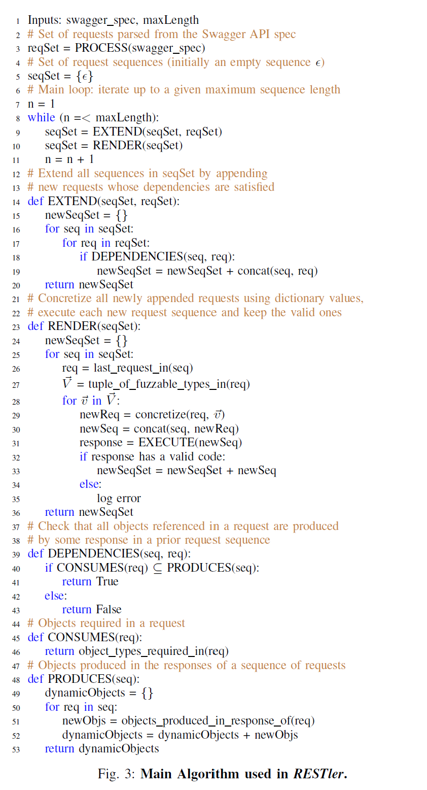
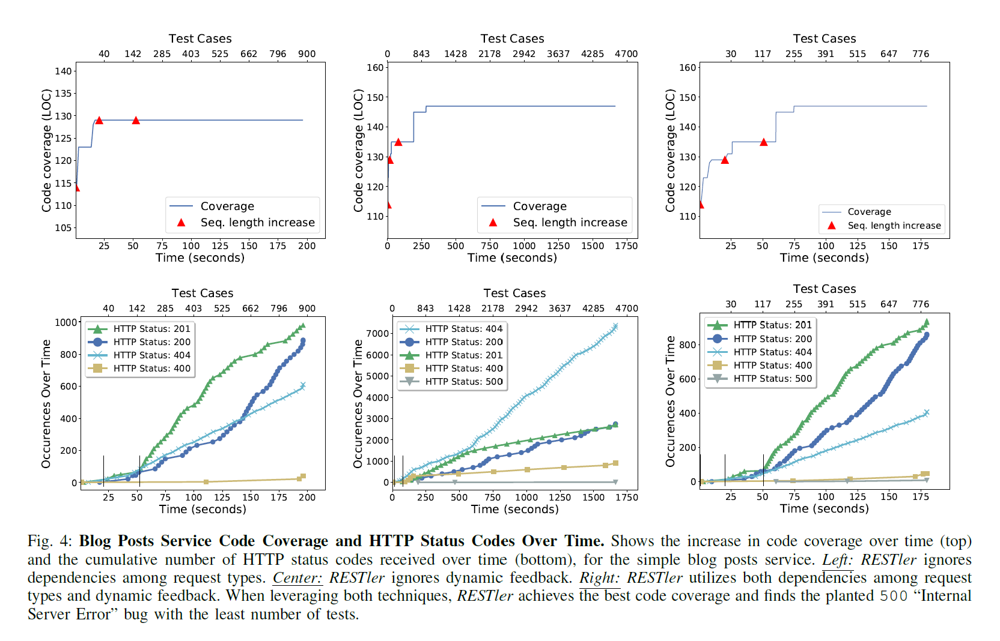
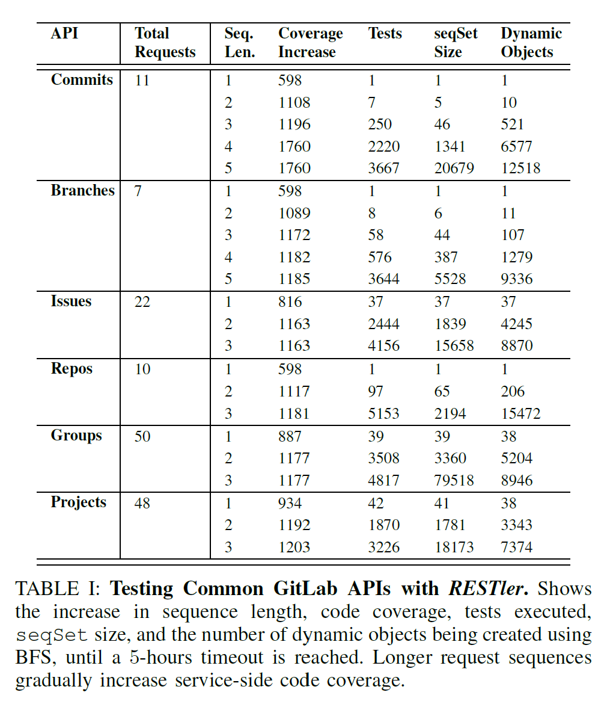
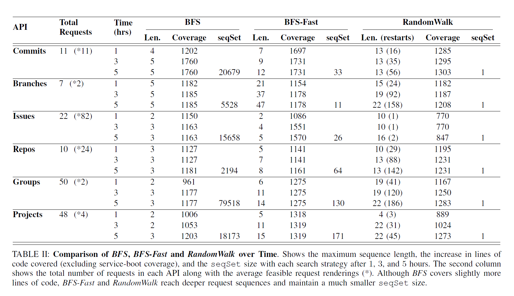

# Outline

## RESTler: Stateful REST API Fuzzing - ICSE 2019

Created by : Mr Dk.

2019 / 09 / 09 14:55

Nanjing, Jiangsu, China

---

## Introduction

云服务的几种类型：

* 软件应用 - Software-as-a-Service
* 分布式服务及数据处理 - Platform-as-a-Service
* 提供计算基础设施 - Infrastructure-as-a-Service

大部分云服务以 REST API 的形式访问

但目前少有用户自动化测试 REST API 的工具

本文介绍的 RESTler 是第一款自动化的 REST API fuzzing 工具

* 每一次的测试被定义为一个 request + response 的序列

RESTler 产生序列的方式：

1. 根据 REST API 的 Swagger 说明，推断 request 之间的依赖
   * request A 的 response 中的数据会被 request B 使用
2. 分析测试执行中的动态反馈，用于产生新的测试
   * 在 request A 之后执行 request B 被服务器拒绝，则防止产生这类测试

提供了证据，证明了这两个技术的必要性

RESTler 还实现几种 __搜索策略__

并比较了它们在 fuzzing GitLab REST API 时的效果

本文的主要贡献：

* RESTler - 第一个自动化的 REST API fuzzing 工具
* 用实验证据表明 RESTler 中的技术是必不可少的
* 讨论了在巨大的 request 序列的搜索空间中的三种搜索策略
* 关于 GitLab 的案例细节
* 使用 RESTler 关于一些微软云服务的测试

---

## Processing API Specifications

客户端程序发送消息 - request

服务返回的消息 - response

消息传输于 HTTP 协议上

__Swagger__ 标准用于描述如何通过 REST API 访问服务：

* 服务可以处理什么样的请求
* 客户端期望得到什么样的响应

> https://swagger.io/
>
> 也称为 OpenAPI 标准
>
> 目前有 2.0 标准和 3.0 标准
>
> https://swagger.io/specification/v2
>
> https://swagger.io/specification/
>
> 这篇论文中使用的是 2.0 版本
>
> 定义了 REST API 中必要参数的 JSON 格式 (或 YAML)

开源的 Swagger 工具可以自动根据 Swagger 描述文件

产生一个 web UI，使用户能够通过 web-UI 表单进行交互

API 中可以包含很多种 __请求类型__，即 request type:

* GET
* POST
* DELETE
* PUT
* ...

用于实现对应的 CRUD 操作

本文给出的例子：

> 论文中给出的是 YAML 格式
>
> 我更喜欢看 JSON，所以翻译了一下

```json
{
    "basePath": "/api",
    "swagger": "2.0",
    "definitions": {
        "Blog Post": {
            "properties": {
                "body": {
                    "type": "string"
                },
                "id": {
                    "type": "integer"
                }
            },
            "required": [
                "body"
            ],
            "type": "object"
        }
    },
    "paths": {
        "/blog/posts": {
            "post": {
                "parameters": [
                    {
                        "in": "body",
                        "name": "payload",
                        "required": true
                    }
                ],
                "schema": {
                    "ref": "/definitions/Blog Post"
                }
            }
        }
    }
}
```

大致的含义：

定义了 API 满足的 Swagger 版本为 2.0

定义了 `Blog Post` 对象，以及其中的字段类型，以及其中的必备字段

然后定义了 API 的路径 - `/api/blog/posts`

定义了 API 请求的格式为 POST

定义了 API 请求的参数

* `in` 表示请求参数位于 `body` 中 - 可以为 `query`、`header`、`path` 等
* 如果指定了参数位于 `body` 中，则外部需要指定参数类型的 `schema`
  * 这里的 `schema` 又引用了 `Blog Post` 对象
  * 代表参数是一个 `Blog Post` 对象

根据这一个 API 描述

RESTler 自动构造出用于产生测试的代码：

```python
from restler import requests
from restler import dependencies

def parse_posts(data):
    post_id = data["id"]
    dependencies.set_var(post_id)
    
request = requests.Request(
    restler_static("POST"),
    restler_static("/api/blog/posts"),
    restler_static("HTTP/1.1"),
    restler_static("{"),
    restler_static("body:"),
    restler_fuzzable("string"),
    restler_static("}"),
    "post_send": {
        "parser": parse_posts,
        "dependencies": [
            post_id.writer()
        ]
    }
)
```

其中，`request` 显然用于生成请求：

* `restler_static` - 直接将后面的字符串拼接到请求中
* `restler_fuzzable` - 从对应数据类型的 __字典__ 中选择的一个值

根据 response 的格式，一般会返回一个新的动态对象

根据对象的格式，会自动生成处理函数 - `parse_posts`

* 把其中的 `id` 取出
* 用于之后的 producer-consumer 依赖

---

## Test Generation Algorithm



从 Line-3 开始：

首先，将 Swagger 描述文件中的所有请求提取出来

```python
reqSet = PROCESS(swagger_spec)
```

`reqSet` 将包含 API 中定义的所有请求，以及请求的依赖

初始化请求序列集合 `seqSet` 为空 (Line-5)

之后的循环用于填充 `setSet` 集合：

* 当序列中的每一个请求的 return code 合法，序列才是合法的
* 合法定义为 return code 在 HTTP 200 族内
* 循环从 `n = 1` 迭代到 `n = maxLength`
  * 在每一轮迭代中，计算出长度为 `n` 的所有合法请求序列

```python
n = 1
while (n <= maxLength):
    seqSet = EXTEND(seqSet, reqSet)
    seqSet = RENDER(reqSet)
    n = n + 1
```

根据代码，计算请求序列分为 __EXTEND__ 和 __RENDER__ 两个部分：

EXTEND 负责将长度为 `n-1` 的请求序列扩展为长度为 `n` 的序列

* 通过在每个序列的最后，追加符合依赖条件的每个请求

因此，输入为上一轮迭代的请求序列集合 `seqSet`，和所有的请求 `reqSet` - 

```python
def EXTEND(seqSet, reqSet):
    newSeqSet = {}
    for seq in seqSet:
        for req in reqSet:
            if DEPENDENCIES(seq, req):
                newSeqSet = newSeqSet + concat(seq, req)
    return newSeqSet
```

其中，__DEPENDENCIES__ 用于检查指定 request 的所有依赖是否满足

* 该请求需要的每一个动态对象 - `CONSUMES(req)`
* 能够由之前的 request 对应的 response 产生 - `PRODUCES(seq)`
* 如果所有依赖都能满足，则长度为 `n` 的新请求序列被保留下来，否则被丢弃

```python
def DEPENDENCIES(seq, req):
    if CONSUMES(req) ⊆ PRODUCES(seq):
        return True
    else:
        return False
```

```python
def CONSUMES(req):
    return object_types_required_in(req)
```

```python
def PRODUCES(seq):
    dynamicObjects = {}
    for req in seq:
        newObjs = objects_produced_in_response_of(req)
        dynamicObjects = dynamicObjects + newObjs
    return dynamicObjects
```

接下来，每一个被扩展后的请求序列依次被 __RENDER__ 函数进行处理

对于每一个请求序列：

* 取得最后一个请求 (即刚被扩展进序列的请求)
* 计算请求中所有可被 fuzz 的原始数据类型
* 每个可被 fuzz 的变量被字典中对应数据类型的数据实例化

执行这个 HTTP 语法正确的请求序列

* 依次执行序列中的每一个请求
* 检测每个 request 对应的 response 是否合法
* 提取并保留每个 response 中的动态对象
* 如果合法，则该序列被保留

```python
def RENDER(seqSet):
    newSeqSet = {}
    for seq in seqSet:
        req = last_request_in(seq)
        V = tuple_of_fuzzable_types_in(req)
        for v in V:
            newReq = concretize(req, v)
            newSeq = concat(seq, newReq)
            response = EXECUTE(newSeq)
            if response has a valid code:
                newSeqSet = newSeqSet + newSeq
            else:
                log error
    return newSeqSet
```

特殊处理：

* 如果 response 包含多个动态对象
  * EXECUTE 将会记录所有对象
  * 但会按顺序提供给之后的 request
  * 即，不会尝试不同顺序的动态对象
* 如果动态对象在被传递给一个 request 之后失效
  * 检测接受到的 return code 不在 200 范围内
  * 丢弃请求序列

默认情况下，RENDER 会为每一个 request 产生所有可能的组合

对于字典较大的情况，会导致组合数量的爆炸

* 一种可选的方法是，从字典中随机选择一个值

在每一轮迭代中，EXTEND 产生了所有长度为 `n+1` 的请求序列

* 显然，算法是广度优先的 - BFS

在之后的对比实验中，还尝试了另外两种策略：

* BFS-Fast
  * 在 EXTEND 中，每个请求最多只能被加入到一个序列上
  * 会导致更小的 `newSeqSet`
  * 覆盖了所有的 request 类型，但不能保证覆盖所有合法的 request sequence
  * 能够比 BFS 深入地更快
* Random Walk
  * 在 EXTEND 中，两层循环被取消，随机产生一个满足依赖的请求序列
  * 在 seqSet 中，随机选择一个 seq
  * 在 reqSet 中，随机选择一个 req
  * 组合，直到依赖可以被满足
  * 当当前请求序列无法再被扩展时，从空的请求序列重新开始
  * 比 BFS 和 BFS-Fast 深入更快

---

## Implementation

系统模块：

* The parser and compiler module
  * 将 Swagger 说明进行转化，产生 RESTler 语法的 fuzzing 说明
* The core fuzzing runtime module
  * 实现上述算法及其变种
* The garbage collector (GC) module

### A. Using RESTler

RESTler 是一个命令行工具，输入包含：

* Swagger 说明
* 服务访问参数- IP、port、认证信息等
* 字典
* 搜索策略 (BFS / BFS-Fast / Random Walk)

在搜索过程中，RESTler 以 HTTP status code 500 作为报告 bug 的依据

### B. Current Limitations

不支持服务端重定向的 API (HTTP status code 301, 303, 307)

只能发现可以通过 HTTP 状态码表现出来的 bug

---

## Evaluation

三个问题：

1. __依赖推断__ 和 __分析动态反馈__ 是有效 fuzzing 的必需技术吗？
2. 当请求序列的长度增加时，RESTler 能否测试到更深的服务端逻辑？
3. 在不同的 API 中，三种搜索策略的比较？

### A. Experimental Setup

#### Blog Posts Service

小型的 REST API

包含五种请求类型：

* `GET` - `/posts:` - 返回所有的博文
* `POST` - `/posts:` - 推送新的博文
* `DELETE` - `/posts/id:` - 删除指定的一篇博文
* `GET` - `/posts/id:` - 返回指定的一篇博文的内容和 checksum
* `PUT` - `/posts/id:` - 更新博文内容 (需要提交新博文的内容和旧博文的 checksum)

为了表示一种想象中的 bug

* 当每次更新博文时，如果提交的 checksum 和记录的 checksum 相同，则触发未捕获异常
* 这个 bug 只会在动态对象在请求之间被传递时触发 (先取得 checksum，再提交)

#### GitLab

GitLab 的后端使用 376K 行 Ruby 代码，具体配置略

#### Fuzzing Dictionaries

* string - "sampleString", ""
* integer - "0", "1"
* boolean - "true", "false"

### B. Techniques for Effective REST API Fuzzing

1. Inferring dependencies among request types
2. Analyzing dynamic feedback

是否是 fuzzing REST API 所必须的

衡量指标：

1. 服务端 code coverage
2. 客户端可见的 HTTP status code

将产生的请求序列的长度最大值设定为 3

比较一下三种测试产生算法：

1. 忽视 request 之间的依赖，将 `id`、`checksum` 等作为 fuzz 对象随机生成，但依旧分析动态反馈
2. 忽视服务端的动态反馈，不消除搜索过程中产生的非法序列，但依旧推断 request 之间的依赖
3. 同时使用了两种技术



左、中、右三列分别对应 1、2、3

#### Code Coverage

对于 `1` 来说，随着请求序列长度的增加，coverage 也没有提升

因为从字典中实在是无法得出 request 之间的依赖

相比之下，通过推断 request 之间依赖的技术，提升了 code coverage

对于 `2` 来说，没有考虑服务端的动态反馈

对搜索空间进行剪枝，过滤非法的请求序列

因此需要花费大量的时间，产生大量的测试用例

而考虑动态反馈，只需要用少量时间、少量用例，就能得到相同的 code coverage

#### HTTP Status Code

当忽略动态反馈时，将会得到大量的 `40X` response - 大量非法的请求序列

相比之下，当考虑动态反馈时，非法 response 从 60% 下降到 20%

此外，当引入了 request 之间的依赖推断时，有着最高百分比的 `20X` 状态码

当忽略依赖推断时，没有任何 `500` 的状态码被返回

* 因为根据实验设定，`HTTP 500` 的错误只有在 request 之间传递依赖后才会触发
* 此外，当使用了动态反馈的分析，能够对搜索空间进行剪枝，从而在最少的用例下触发 bug

实验整体上证明，__依赖推断__ 和 __反馈分析__ 都是有效 fuzzing 必须的技术

### C. Deeper Service Exploration

使用 GitLab 来测试更长的请求序列是否意味着更深的服务逻辑



六组 API，BFS 搜索策略，五小时 fuzzing 时间，每个请求最多 1000 种组合

#### Code Coverage

更长的请求序列对应了更高的 code coverage

* 这不奇怪，因为有一些逻辑必须由几次请求才能完成

比如 - select a commit - 需要 project-id + commit-id

对应的 request 序列：

1. 创建一个 project
2. 使用对应的 project-id 发送 commit
3. 使用 project-id + commit-id 选择 commit

#### Tests, Sequence Sets, and Dynamic Objects

RENDER 函数执行之后，执行测试点的数量、请求序列集合的大小

如果没有动态反馈剪枝，BFS 的搜索空间将会爆炸

### D. Search Strategies



#### BFS vs BFS-fast

BFS 在 request 较多时较弱

BFS-Fast 在 request 较多时效果较好

* 因为它不会搜索所有的请求序列
* 而是在每一轮的生成中，最多附加在一个序列之后

因此 BFS-Fast 有着更少的 `seqSet`

能够更快速地深入序列

#### BFS vs Random Walk

Random Walk 策略不能保证全语法覆盖

因此在任何时候都维护着较小的 `seqSet`

由于搜索广度最小，深入更快，但有很大概率需要重头再来

总体来说，最大化 code coverage 是为了启发式地接近寻找 bug 的目标

### E. Bug Bucketization

定义 HTTP `500` 状态码为发现 bug 的标志

但多个 bug 可能是同一个 bug 的多个实例

当 bug 被发现时：

* 计算其所有未渲染请求序列的所有非空前缀
* 检查前缀是否已经被记录
* 如果匹配，则归为同一类

---

## Summary

其余部分似乎没啥用了

不太好评价这篇论文

查了一下好像是软件工程的顶级会议？

本来觉得很有意思，但想读源码却没有

感觉和信息安全四大顶会的论文相比

论文的叙述逻辑上没有那么的通顺 🤔

讲得比较抽象的地方又没有例子

Fine. 没有例子没有源码我看个奶子？

---

