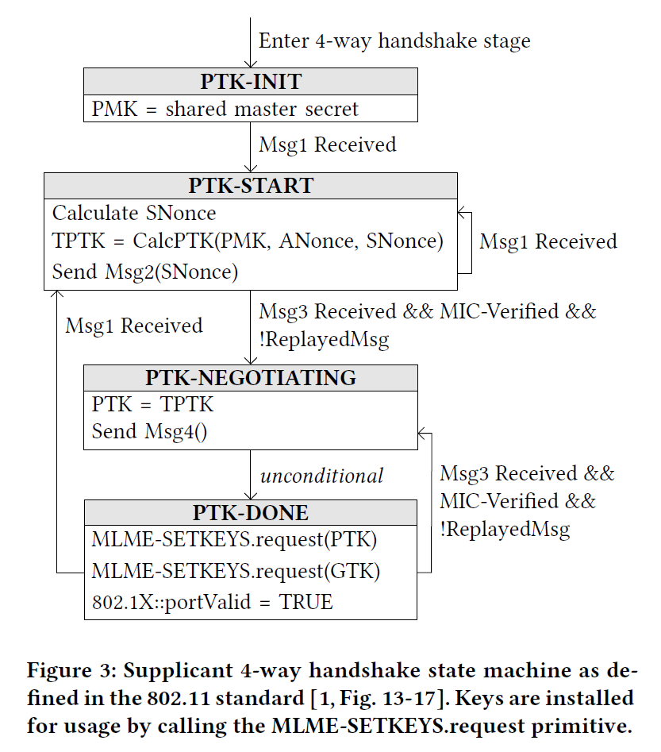
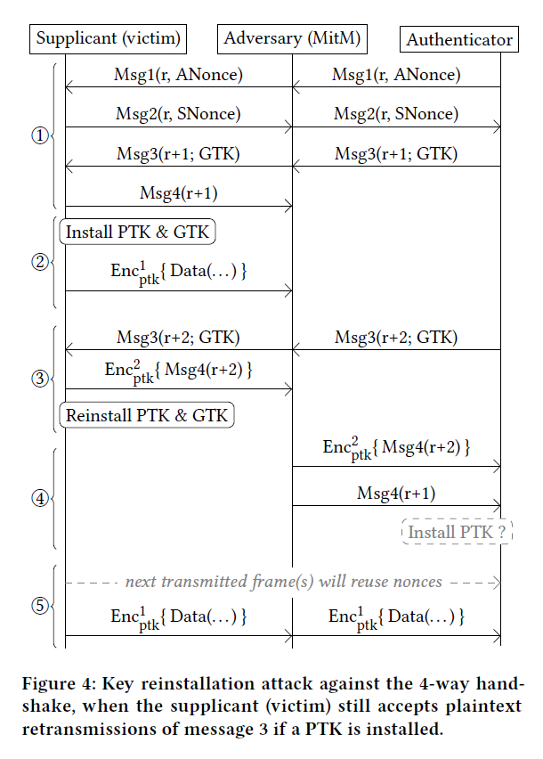
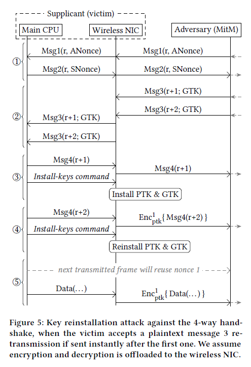
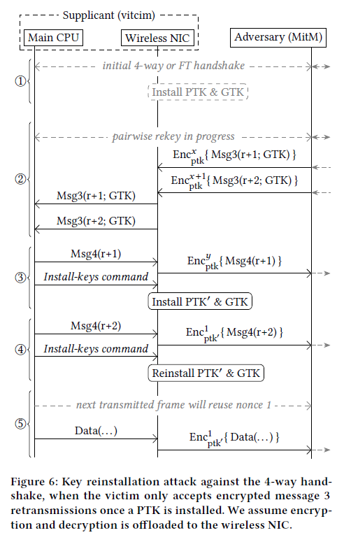
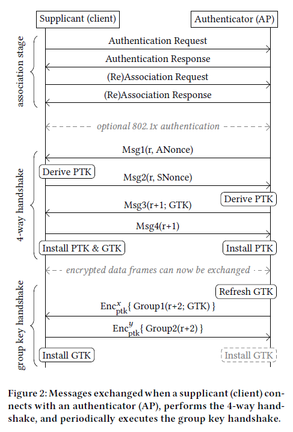
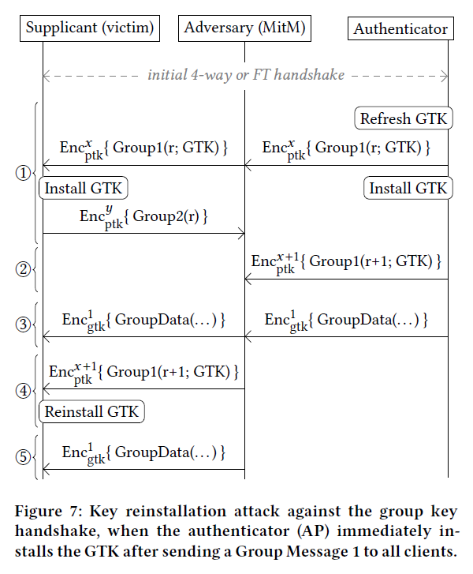
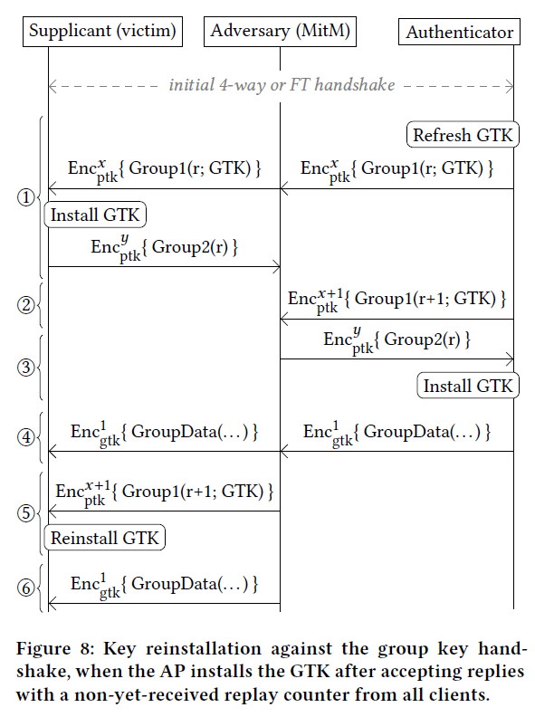

# Outline

## Key Reinstallation Attacks - Forcing Nonce Reuse in WPA2 - CCS 2017

Created by : Mr Dk.

2018 / 12 / 08 20:41

Nanjing, Jiangsu, China

---

### Abstract

目前所有的 _Wi-Fi_ 保护都是基于 _IEEE 802.11i_ 修正案中的 __四次握手__

本篇论文发现了四次握手机制中的设计缺陷

从而使 _WPA_、_WPA2_ 都会受到该攻击的影响

同时，_PeerKey handshake_、_GroupKey handshake_、_The Fast BSS Transition handshake_ 等握手方式也有类似的问题

### Background

四次握手的基本原理已经详细记录在 _notes_ 中

_KRACK_ 的基本原理是迫使客户端重新安装现有的 _PTK_

由于安装 _PTK_ 时会重置用于生成每次的会话密钥的计数器

从而使计数器的值重现，加密数据帧的密钥流也重现了

使用重复的密钥流，数据包可以被解密、伪造等

### Attacking The 4-way Handshake

#### Supplicant State Machine

* _PTK-INIT_
  * 初始化 _PMK_
  * 当接收到 _Msg1_ 时，进入 _PTK-START_
* _PTK-START_
  * 第一次连入网络 或 更新会话密钥 都会进入该状态
  * _Supplicant_ 产生一个随机的 _SNonce_，并计算暂时性的 _PTK_ （_TPTK_）
  * 使用 _Msg2_ 将 _SNonce_ 发出
* _PTK-NEGOTIATING_
  * _Authenticator_ 接收到 _SNonce_ 后发出 _Msg3_
  * _Supplicant_ 校验 _replay counter_ 和 _MIC_ 是否合法
  * 若合法，则将 _TPTK_ 正式认为是 _PTK_
  * 向 _Authenticator_ 发送 _Msg4_
* _PTK-DONE_
  * _PTK & GTK installed_
  * _Open 802.1x port_，开始收发数据帧

若 _Authenticator_ 没有收到 _Msg2_ 或 _Msg4_，那么 _Msg1_ 或 _Msg3_ 会被分别重发

* 重发时会使 _EAPOL_ 帧中的 _replay counter_ 增加

攻击切入点：

1. _AP_ 对 _Msg1_ 或 _Msg3_ 的重新传输，使客户端必须处理到来的 _Msg_，以匹配状态机
2. 客户端会在处理并回复 _Msg3_ 之后安装 _PTK_

#### The Key Reinstallation Attack

* 在 _Supplicant_ 与 _Authenticator_ 之间取得 __中间人__ 位置
* 通过阻止 _Msg4_ 到达 _Authenticator_ 的方式除法 _Msg3_ 的重传
* 使 _Supplicant_ 重新安装正在使用的 _PTK_，使 _nonce_ 复位
* 攻击者可以重放、解密、伪造

一些难点：

1. 不是所有的 _Wi-Fi_ 客户端的实现都遵循以上状态机
2. 使用不同 _MAC Address_ 的钓鱼 _AP_ 无法成为中间人 - 会话密钥的生成需要双方的 _MAC Address_
3. 一旦 _PTK_ 被安装后，部分 _Supplicant_ 只接收加密后的 _Msg3_，忽略未被加密的数据帧

#### Plaintext Retransmission of message 3

* 攻击者使用基于信道的中间人攻击，操纵握手信号
* 阻止 _Msg4_ 到达 _Authenticator_
* _Supplicant_ 在发出 _Msg4_ 后立即安装 _PTK_、_GTK_，并开始传输普通数据帧
  * 第一个数据帧使用的 _nonce_ 为 _1_
* _Authenticator_ 由于没有收到 _Msg4_ 而重发 _Msg3_
* 攻击者在等待一段时间后向 _Supplicant_ 重发 _Msg3_
  * 只能发送新截获的 _Msg3_，而不能使用旧的 _Msg3_ - 因为 _replay counter_ 已经过时
  * 等待时间决定了 _nonce_ 被重用的次数
* _Supplicant_ 重新安装 _PTK_ 和 _GTK_，并复位 _nonce_ 和 _replay counter_
* _Supplicant_ 重新传输数据时，重复使用了 _nonce_

攻击者能够通过 __解除认证攻击__ 导致客户端不断重连，从而执行新的四次握手

最后的 _Msg4_ 应能够到达 _Authenticator_ 完成认证

* 由于 _Supplicant_ 已经安装了 _PTK_，最后的 _Msg4_ 是加密的
* 而由于 _Authenticator_ 此时还没有安装 _PTK_，因此加密的 _Msg4_ 可能会被忽略
* 存在部分 _AP_ 允许接收对客户端使用过，但还没有出现在客户端回复中的 _replay counter_
  * 从而可以使用一开始阻止到达的旧的 _Msg4_ 完成双向认证

#### Encrypted Retransmission of message 3

如果 _Supplicant_ 只接收加密后的重传 _Msg3_

* 执行四次握手的实体
* 实现数据机密性协议的实体

需要使用以上两者的 __内在竞争条件__ 才可能完成攻击

##### Plaintext Msg3

* 完成 _Msg1_ 和 _Msg2_ 的交互后，暂时不发送 _Msg3_
* 等到 _AP_ 重传 _Msg3_ 时，将两条 _Msg3_ 几乎同时发送
* _NIC_ 由于此时还没有安装 _PTK_，会将两条消息都传送至 _CPU_
* _CPU_ 作为四次握手的执行机构，回复 _Msg4_ 并命令 _NIC_ 安装 _PTK_
* 由于 _CPU_ 接收明文的重传 _Msg3_，又一个 _Msg4_ 将被发送（由于此时 _NIC_ 已安装 _PTK_，该 _Msg4_ 将被加密，_nonce == 1_）
* 在发送 _Msg4_ 之后，_CPU_ 会命令 _NIC_ 重装 _PTK_，重置 _nonce_ 和 _replay counter_
* 下一个发送的数据帧将会重用 _nonce == 1_

##### Encrypted Msg3

攻击目标转移到 _PTK_ 更新的场景中 - 所有的 _rekey_ 过程都在已有的 _PTK_ 的加密保护之下

* 先进行正常的四次握手
* 等到第二次 _rekey_ 的四次握手初始化
  * 虽说四次握手的帧是被加密的，但可以通过其独特的 __长度__ 和 __目的地址__ 被检测出来
* 先不发送第一个 _Msg3_
* 等到重传的 _Msg3_ 到达时，将两条 _Msg3_ 立刻发送到 _Supplicant_
* _NIC_ 使用现有的 _PTK_ 解密两条 _Msg3_，并发送给 _CPU_
* _CPU_ 处理并回复第一条 _Msg3_，并命令 _NIC_ 安装新的 _PTK_
* _CPU_ 处理第二条 _Msg3_，由于此时 _NIC_ 已安装新的 _PTK_，_Msg4_ 将会用新的 _PTK_ 加密后发出（_nonce == 1_）
* _CPU_ 命令 _NIC_ 重新安装 _PTK_
* 下一个数据帧将使用同样的 _PTK_ 和 _nonce == 1_ 发送

攻击前提：

* _NIC_ 负责数据机密性协议的加解密工作（硬件加密）
* 软件加密（_CPU_ 负责）可能不起效果

_Rekey_ 的频率：

* 部分 _AP_ 每小时固定进行一次 _rekey_
* 客户端也可以通过发送 _EAPOL_ 帧请求 _rekey_
  * 个别品牌的路由器不验证 _rekey EAPOL frame_ 的完整性
  * 因而可能暴力 _rekey_

### Attacking the PeerKey Handshake

### Breaking the Group Key Handshake

网络会定期刷新 _group key_，确保只有最近认证的客户端拥有 _group key_

在另一种防御性更好的网络中，只要一有客户端离开网络，_group key_ 就会被刷新

新的 _group key_ 使用 _group key handshake_ 分发到各客户端，这个握手过程已被正式证明为是安全的

* 握手过程由 _AP_ 初始化，向所有客户端发送 _Msg1_
  * 如果 _AP_ 没有收到回应，则会重传
* 客户端回应 _AP_ _Msg2_

攻击过程：

* 客户端在重新安装已在使用中的 _group key_ 时，也会重置 _replay counter_
* 因此可使客户端接收两次 _nonce_ 相同的广播帧

#### Attacking Immediate Key Installation

此种情况下，_AP_ 在发送 _Msg1_ 后立刻安装 _GTK_

* _AP_ 发送 _Msg1_ 后立刻安装新的 _GTK_，_group key handshake_ 消息本身被 _PTK_ 加密
* 客户端在收到 _Msg1_ 后安装 _GTK_，并回复 _Msg2_
* 攻击者阻止 _Msg2_ 到达 _AP_
* _AP_ 重传 _Msg1_
* 等待，直到 _AP_ 向客户端传递广播帧
* 先将广播帧发送给客户端（_nonce == 1_）
* 将重传的 _Msg1_ 发送给客户端，引起 _GTK_ 重装并将 _nonce_ 复位
* 重放广播帧，客户端由于重置了 _nonce_ 而会再一次接受广播帧

#### Attacking Delayed Key Installation

此种情况下，_AP_ 在收到所有客户端的回复帧以后才安装新的 _GTK_

上一个攻击方法已经不管用 - 

- 因为 _AP_ 重发的 _Msg1_ 中使用旧的 _GTK_，而客户端已经使用新的 _GTK_ 了

* _AP_ 发送 _Msg1_
* 客户端收到 _Msg1_ 后，安装新的 _GTK_，并发送 _Msg2_
* 攻击者阻止 _Msg2_ 到达 _AP_
* _AP_ 重传 _Msg1_，_replay counter_ 增加 _1_，被攻击者截获暂不发送
* 发送旧的 _Msg2_ 到 _AP_
  * _AP_ 竟然接收 _Msg2_
  * _AP_ 会接受所有使用过的 _replay counter_ 的值
* 因此 _AP_ 安装新的 _GTK_
* 等待，直到 _AP_ 向客户端发送广播帧（_nonce == 1_）
* 向客户端发送广播帧后，再发送刚才截获的重传 _Msg1_，引起客户端重新安装 _GTK_ 并使 _nonce_ 复位
* 重放广播帧，客户端由于重置了 _nonce_ 而会再一次接受广播帧

### Attacking the 802.11R FT Handshake

### Evaluation And Discussion

#### Impact of Nonce Reuse in 802.11

_Nonce_ 重用的影响取决于使用的数据机密性协议 - _TKIP_、_CCMP_、_GCMP_

以上三种协议都使用了密钥流来加密帧

因此，重用 _nonce_ 就意味着重用了密钥流 - 可被用来解密数据包

##### TKIP

* 使用重用 _nonce_ 的方式解密一个完整的 _TKIP_ 数据包（包括 _MIC_）
* 攻击脆弱的 _Michael_ 算法：
  * 给定明文的帧和解密后的 _MIC_ 值，可以恢复出 _MIC_ 的密钥
* 由于 _TKIP_ 在两个方向上的通信使用不同的 _MIC_ 密钥
  * 攻击者能够在 __客户端 &rarr; AP__ 的方向上伪造帧（因为用于消息认证的 _MIC_ 已被攻破）

##### CCMP

存在理论上的伪造攻击方式，但不能伪造任意数量的消息

##### GCMP

* 可能被解密或重放
* 消息认证密钥可能被重现（用于双向通信的完整性检验）
  * 因而能够在两个方向上伪造帧

#### Example Attack Scenarios

* 在未加密的 _HTTP_ 连接中注入恶意数据
* 对 _NTP_ 协议进行攻击
  * 用于时间同步
  * 客户端首先初始化进程，通过监听已被认证的广播 _NTP_ 数据包同步时钟
  * 如果广播帧被重放，客户端将被永远卡在那个时间上
  * 因此使用 _group key attack_，攻击者甚至可以在受保护的网络上进行重放攻击

#### All-Zero Encryption Key Vulnerability

_wpa_supplicant 2.4 / 2.5_ 在收到重传的 _Msg3_ 后，会直接安装一个全 _0_ 的 _TK_

造成的原因是 _802.11_ 标准中的一条不直接的建议：

* 在 _TK_ 被安装之后立刻从内存中清除

影响到 _Android 6.0_，按经验估计 _Chromium_ 也存在同样的问题

#### Limitation of the Security Proofs

_KRACK_ 攻击没有违反四次握手的安全性证明

* 密钥安全性：只有 _Authenticator_ 和 _Supplicant_ 持有 _PTK_
  * _KRACK_ 并没有获得 _PTK_
* 协议安全性：攻击者通过传递数据包的形式参与到协议中
  * _KRACK_ 确实只使用了传递数据包的方式
* 密钥有序性：保证 _Supplicant_ 不会安装一个旧的 _GTK_
  * _KRACK_ 使用的是 __重新安装__ 现有 _GTK_ 的方式
* 密钥保密性：
  * _KRACK_ 并没有获得 _GTK_

#### Countermeasures

* 检查正被使用的 _key_ 是否已被安装
  * 如果已被安装，则不重置 _nonce_ 和 _replay counter_
* 在握手执行过程中，保证实现数据机密性协议的实体只安装 _key_ 一次

对策本质：

* 两次 _key_ 的安装之间必须有新的 _key_ 产生

#### Discussion

* 协议的说明书应当尽可能准确明了
* 协议被证明是安全的，它的实现不一定安全
* 数据机密性协议应当对 _nonce_ 重用提供保护

### Related Work

### Conclusion

---

### Summary

作者太牛了。。。。。。

我终于大概有点看明白了。。。。。。

我终于明白了什么叫 __顶会论文__

这个工作量...我自愧不如

他们写一篇论文得看上百篇别的资料吧

真的太厉害了 佩服佩服

---

