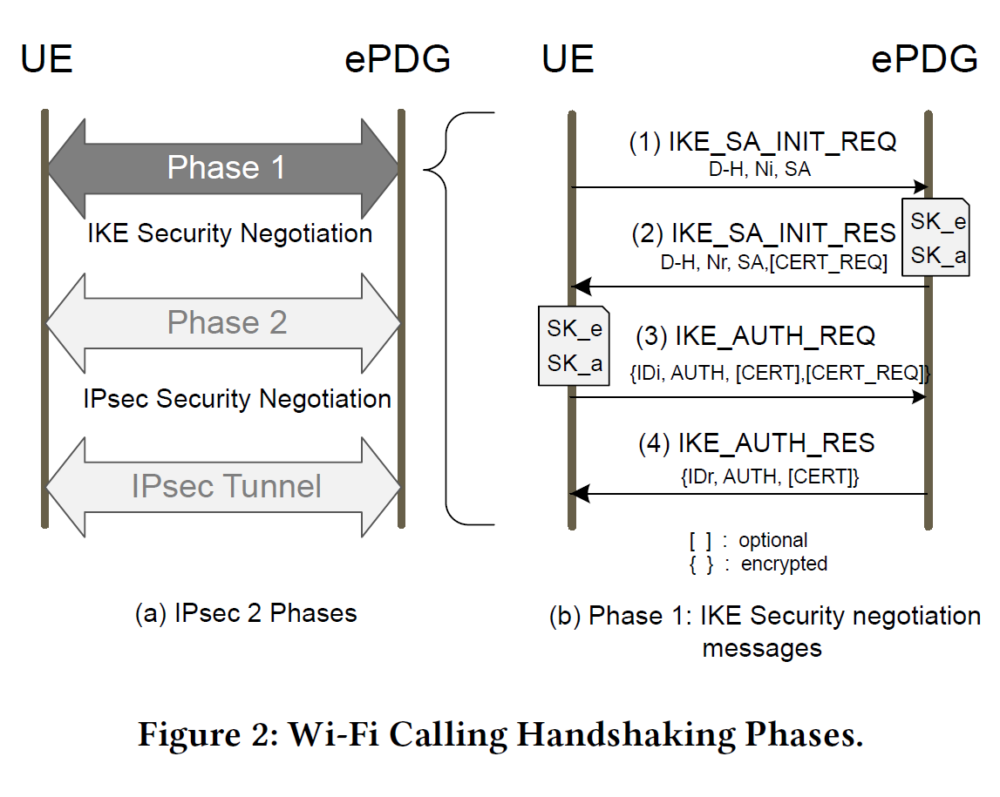

# Outline

## Wi Not Calling - Practical Privacy and Availability Attacks in Wi-Fi Calling - ACSAC 2018

Created by : Mr Dk.

2018 / 12 / 12 18:31

Nanjing, Jiangsu, China

---

### Introduction

移动通信系统的进步使其能够支持更多种形式的数据

但 __语音__ 依旧是移动网络运营商的核心竞争力

竞争的关键因素：

* 广泛的覆盖率
* 有效的承载量

_Wi-Fi Calling (Voice over Wi-Fi)_ 成为扩展覆盖率、提升承载率的解决方案

* 在信号较弱的区域，将 _Long-Term Evolution (LTE)_ 上的通信转移到 _Wi-Fi_ 上
* 不再需要使用用户的移动网络
* 不需要安装额外的应用

为了维护 _Wi-Fi Calling_ 的安全，_IETF_ 的 _IKEv2_ 和 _IPSec_ 协议被用于网络传输

* 即使使用未被保护的 _Wi-Fi_ 网络，也有强大的隐私保护保证

本文主要贡献：

* 分析了两种类型的 _Wi-Fi Calling_ 攻击
  * _IMSI_ 泄露
  * _DoS_ 攻击
* 实现和评估了以上两种攻击
* 讨论了一些折衷的解决方案

---

### Wi-Fi Calling

#### Wi-Fi Calling Architecture

主要分为以下三部分：

* _User Equipment (UE)_ - 指实际的带有无线或蜂窝接口的通信设备
  * 在 _SIM_ 卡中存储全球唯一的 _15-digit_ _International Mobile Subscriber Identity (IMSI)_
    * _Mobile Country Code, MCC, 3-digit_
    * _Mobile Network Code, MNC, 2-3-digit_
    * _Mobile Subscriber Identification Number, MSIN, 10-digit_
  * _UE_ 第一次入网时，用于被网络中 _Home Subscriber Server, HSS_ 中的用户数据库认证
* _Radio Access Network (RAN)_
  * 包含用于管理与 _UE_ 的无线信号的 _AP_
  * 帮助 _UE_ 和 _EPC_ 连接
  * 协议、规格、功能与通常的基于 _IEEE 802.11_ 的 _AP_ 相同
* _Evolved Packet Core (EPC)_
  * 是 _LTE_ 网络中的核心网络框架
  * 其中的 _Evolved Packet Data Gateway (ePDG)_ 是为了支持 _Wi-Fi Calling_ 新加入体系中的
  * _ePDG_ 的功能是 _Internet_ 和 _EPC_ 之间的网关
  * _ePDG_ 还负责 _UE_ 接入网络后的认证

#### Wi-Fi Calling Handshakes

在 _Wi-Fi Calling_ 中，_UE_ 和 _ePDG_ 必须经过两个阶段的握手，才能建立一个用于安全通信的 _IPSec tunnel_

第一阶段握手：_UE_ 与 _ePDG_ 之间的 _IKE_ 安全协商

* _IKE_ 用于双向认证，建立和维护 _Security Associations, SAs_
* _SA_ 是用于保护协商双方信息的策略与密钥的集合

第一阶段握手的详细过程：

1. _UE_ 向 _ePDG_ 发送 _IKE_SA_INIT_REQ_，包含加密材料（_D-H, Nonce_），用于建立 _IKE SA_
2. _ePDG_ 检查收到的参数，并向 _UE_ 发送 _IKE_SA_INIT_RES_
3. _UE_ 向 _ePDG_ 发送 _IKE_AUTH_REQ_，其中包含 _IMSI_，并分别由 _SK_e_ 和 _SK-a_ 加密和签名
4. 若 _ePDG_ 认证 _UE_ 合法，则发送 _IKE_AUTH_RES_ 并建立 _SA_

#### Security In Wi-Fi Calling

通过分析，论文发现了两个可能导致 _Wi-Fi Calling_ 受攻击的威胁因素：

* 缺少双向认证
* 握手时不受保护的信息交换

##### Privacy of Users

移动网络中的隐私数据包括用户的 _IMSI_、服务订阅、地理位置等

如果攻击者获得了用户的 _IMSI_

* 则可以追踪用户何时何地使用了 _Wi-Fi_ 服务
* 还可以通过一些付费网站获得用户的手机号码

_Stingray_ - 用于捕捉 _IMSI_ 的工具

* 能够在一定范围内采集用户数据
* 监听电话
* 通常被政府部门使用

攻击者还可以通过使用假的 _IPSec_ 服务器，伪造握手，从而获得 _IMSI_

如果获得了更多隐私信息，攻击者能够追踪用户并记录用户的行动

##### Availability of Services

* 攻击者能够绕开访问控制和认证机制，冒充合法用户免费享用服务，受害者付费
* 传输恶意信息，干扰 _Wi-Fi_ 服务 - 任何人都能够不经允许访问无线链路
* 通过布设流氓 _AP_ 监听或进行中间人攻击

##### Attack Originating From Victim's UE and Attacker's AP

安装在 _UE_ 上的恶意软件：

* 窃取 _SIM_ 卡中的证书
* 控制 _UE_ 进行 _DDoS_ 攻击
* 迫使 _UE_ 连接到别的 _AP_ 上

流氓 _AP_：

* 使用 _IP_ 或 _MAC_ 地址欺骗，伪装成合法的 _UE_ 或 _AP_
* 一旦受害者连接到了流氓 _AP_ 上，攻击者能够监听或进行中间人攻击

发送 _DoS_ 攻击包：

* _DNS response packet_
  * _UE_ 想要连接到一个 _ePDG_ 时，需要广播 _DNS query_
  * 攻击者能够伪造携带 _IP_ 地址的 _DNS response_
  * 从而使 _UE_ 无法连接到 _LTE_，迫使其连接到 _Wi-Fi AP_（流氓 _AP_）
* _IKE_SA_INIT message_
  * _IKE_SA_INIT_ 消息很容易被监听到，从而可以用于伪造
* _Deauthentication frame_
  * 在 _LTE_ 网络中，会话可以被 _UE_ 或 _Gateway Server_ 中的任意一方关闭
  * 攻击者可以伪造 _Deauthentication frame_ - _detach attack_
  * 同样也可以使用在 _Wi-Fi_ 网络中，用于迫使 _UE_ 断开与合法 _AP_ 的连接，并连接到流氓 _AP_ 上

---

### IMSI Privacy Attack

攻击工具：流氓 _AP_ 和假的 _IPSec_ 服务器

#### Attack Scenario

1. 攻击者嗅探无线信道，监控正在进行的 _Wi-Fi Calling_
2. 攻击者布设装备了假 _IPSec_ 服务器的流氓 _AP_，并诱使 _UE_ 连接
3. 攻击者利用 _ePDG look up response_ 包，获得 _ePDG_ 的 _IP_ 地址和端口号
4. 攻击者使 _UE_ 认为流氓 _AP_ 就是 _ePDG server_
5. 当攻击者捕获到 _IKE_SA_INIT_REQ_ 包时，重放到假的 _IPSec server_ 上，使 _UE_ 与假 _IPSec server_ 协商密钥
6. 从 _IKE_AUTH_REQ_ 包中，利用假 _IPSec server_ 中的密钥，获得 _IMSI_ 和 _APN_

#### Attack Setup

_Scapy_ 是一个用于计算机网络包操纵的工具，用 _Python_ 实现

#### Results of Attacks

在四个运营商的十多款设备上，获取到了 _IMSI_ 和 _Access Point Name (APN)_

一次成功的攻击还能够获取到 _ePDG_ 的 _IP_ 地址和 _SA_ 等信息

论文发现：

在 _IMSI_ 用于握手的过程中，证书并没有被用来保护 _IMSI_

* 证书是 _IKE_ 握手中的可选项，而不是必须项，因此厂商都没有使用证书保护 _IMSI_

#### Impact and Applicability

_IMSI_ 隐私攻击利用了 _UE_ 和 _ePDG server_ 之间缺乏双向认证的漏洞

由于流氓 _AP_ 不向真正的 _ePDG server_ 传播信息，因此这种攻击不算中间人攻击

攻击在 _AP_ 收到 _IKE_AUTH_REQ_ 后就意味着结束了：

* 已经可以通过解密获得 _IMSI_
* 它的身份会导致 _IKE_AUTH_RES_ 认证失败

所有的攻击都可以被集成在一个基于 _Linux_ 的笔记本上

* 攻击者将其放置在和 _UE_ 相同的物理环境中
* 或者也可以提前在环境中安装假的 _ePDG_，再进行远程操控

_IMSI_ 泄露：

* 可被用于查找用户的手机号码
* 可被用于追踪用户
* 在未来的物联网时代有着重大隐私危险

---

### DoS Attacks

_DoS_ 攻击的目的是为了降低提供给 _UE_ 的服务的可用性

#### Attack Scenario

##### ePDG discovery

是建立会话的必要机制

_DNS response_ 中带有 _UE_ 的 _ePDG server_ 在本地局域网内的静态 _IP_ 地址

* 可以修改包中的静态 _IP_ 地址
* 或直接丢包

从而导致会话建立不成功

##### IKE_SA_INIT Message

握手过程中，_UE_ 发送的 _IKE_SA_INIT_ 中会包含很多字段，包括支持的算法

该包传输到服务器的过程中不受任何保护

因此加密字段可以被伪造后送至 _ePDG server_

由于不对应的加密方式，_server_ 拒绝连接

##### Deauthentication Frame

向链路层发送解除认证包，使正在进行的电话没有任何预警就掉线

还可被用于迫使 _UE_ 连接流氓 _AP_

#### Attack Setup

发送解除认证攻击包

支持 _Voice Call Continuity (VCC), IMS Service Continuity_ 功能的设备可以从 _Wi-Fi Calling_ 切换到 _LTE_ 且不用挂断电话

#### Results of Attacks

#### Impact and Applicability

---

### Countermeasures

* 在 _IKE_AUTH_ 交换过程中使用 _PKI_ 保护
* _Wi-Fi_ 与 _LTE_ 模式的切换不应该由用户行为决定
* 用户关闭自动连接 _Wi-Fi_ 的选项，防止连接到流氓 _AP_
* _ePDG_ 必须有能证明自己身份的能力
* 流氓 _AP_ 检测机制，_WIDS_

---

### Summary

感觉除了学到了一些 _Wi-Fi Calling_ 的原理以外

在技术上和手段上并不十分高明

有一点收获是，了解到了有叫 _Scapy_ 的这么一款工具

可以用于操纵数据包

那么...之后 _WIDS_ 里面的数据包注入是否可以使用这个工具呢

有空了解一下

---

