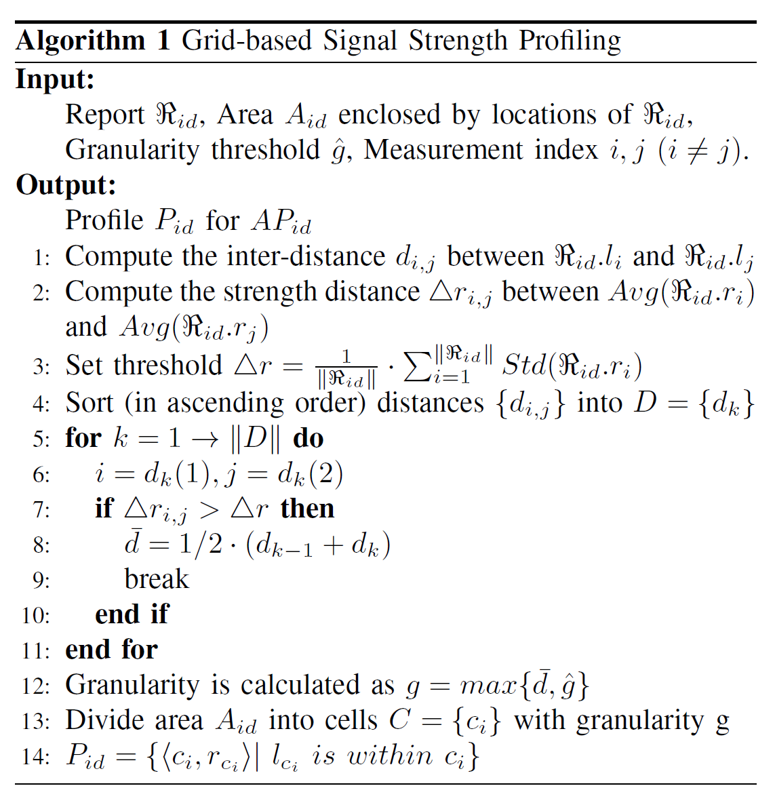
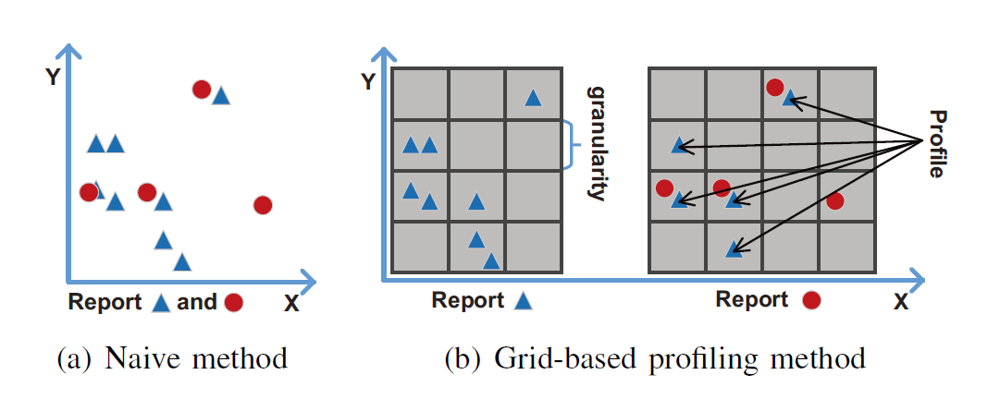

# Outline

## Detecting Rogue AP with the Crowd Wisdom - ICDCS 2017

Created by : Mr Dk.

2018 / 12 / 11 16:34

Nanjing, Jiangsu, China

---

### Introduction

在过去的几年里，见证了无线局域网（_Wireless Local Area Network, WLAN_）的大量普及

为了吸引消费者，很多公共场合（店铺、酒店、机场等）提供免费的 _Wi-Fi_ 热点服务

* 开放性
* 弱安全机制

使这些热点十分容易遭受流氓 _AP_ 攻击

* 流氓 _AP_ 与合法 _AP_ 使用相同的 _SSID_
* 发射更强的信号
* 引诱受害者连接到流氓 _AP_
* 操纵连接，从而危害受害者的隐私信息

现有的检测方式：

* 通过额外的硬件进行检测
* 基于时间域的检测
  * 仅适用于流氓 _AP_ 利用合法 _AP_ 上网的场景
  * 如果流氓 _AP_ 有自己的互联网接入，则无效

本文介绍了一种基于 __群体智慧__ 的流氓 _AP_ 检测方法 _CRAD_

基本背景：

>  位于不同地点的 _Received Signal Strength (RSS)_ 可用于定位一个无线信号发射器；因此，这种带有 __空间相关性__ 的特征可被用于流氓 _AP_ 的检测。

_CRAD_ 的基本步骤：

1. 采集 _RSS_ 测量值
2. 产生一个描绘合法 _AP_ 的模型
3. 发现可能的伪造 _AP_

_CRAD_ 的优势：

* 不需要额外硬件的参与
* 确保常用于访问的 _AP_ 的地点被模型描绘
* 减小了易于出错的无线信号测量带来的偏差

_CRAD_ 需要克服的挑战：

* 如何维护一个 _AP_ 的有效模型？
  * 论文提出了一个基于 __网格__ 的模型描绘方式，记录采集信息
* 如何设计一个合适的匹配规则，用于匹配模型和测量值？
  * 基于观察，在距离较近的观察点将会测量到相似的 _RSS_ 数值
  * 与模型中最近的邻居记录进行比较，并通过 __多数投票__ 的方式执行最终判断

_CRAD_ 被设计为一个后台服务，不需要用户干预

---

### Attack Model

为了绕开基于扫描的流氓 _AP_ 检测

流氓 _AP_ 将会克隆合法 _AP_ 的 _SSID_ 和 _MAC Address_

流氓 _AP_ 试图对受害者提供更强的信号强度

* 通过移动到离受害者更近的位置
* 通过增加自身的传输功率

假设流氓 _AP_ 只会在合法 _AP_ 开启后才会出现

流氓 _AP_ 的分类：

* 共存型
  * 流氓 _AP_ 和合法 _AP_ 同时存在
  * 依据流氓 _AP_ 是否使用合法 _AP_ 的互联网接入可细分为两种：
    * 使用合法 _AP_ 的互联网接入 - 很容易被基于时间的探测方法发现
    * 使用自己的互联网接入 - 不会被基于时间的探测方法发现
* 代替型
  * 攻击者试图将合法 _AP_ 关闭或对其进行 _DDoS_ 攻击
  * 物理空间中只存在流氓 _AP_

论文忽略恶意用户参与测量的场景（伪造测量信号进行干扰），即相信所有的测量结果

---

### Design of CRAD

概念：连接到某一个特定热点上的移动用户被称为 __群众（crowd）__

对于一个热点，所有群众的测量结果可以组成一个唯一的身份

通过获取群众的测量结果，就可以检测到伪造者的出现

工作步骤：

1. 基于 _RSS_ 测量，为合法 _AP_ 描绘一个模型（_fingerprint_），模型被维护在云端
2. 在群众设备本地实时进行 __无线群体感知__，提供网络的无线特征
3. 动态比较群众采集到的信息和模型，如果检测到流氓 _AP_ 则发出警报

#### Background

##### The incentives

移动设备用户有什么动机参与检测？

* 很多移动设备已经实现在系统后台自动进行无线扫描，产生的数据足够用于 _CRAD_ 的分析
* 流氓 _AP_ 的受害者是移动设备的持有者本人

##### Crowd VS individual

攻击者可以通过调整流氓 _AP_ 的传输功率，产生与合法 _AP_ 相似的 _RSS_ 行为

如果参与检测的只有一个个体，那么可能得不到正确的检测结果

而使用 __多个地点__ 的测量数据，能够产生一个较为健壮的模型，避免误导性的假数据

* _crowd_ 是一个虚拟概念
* 在一个特定时间段内，一个移动中的设备在不同地点采集到的测量值可被认为是独立个体

##### Location tag

##### Location discrepancy

论文的基础假设：合法 _AP_ 和流氓 _AP_ 之间存在距离

* 若流氓 _AP_ 与合法 _AP_ 离得过近，则很容易暴露
* 流氓 _AP_ 只有离受害者更近时，才能通过更强的信号诱使受害者连接

#### Signal Strength Profiling

_CRAD_ 采集到的信息形式：_<SSID, BSSID, l, r>_

* _l_ 是探测地点
* _r_ 是探测到的 _RSS_

对于某一个特定的 _AP_，在一段时间内对应的 _RSS_ 测量值构成了一个 _report_

表示为：R = { <l, r> | all locations }

_CRAD_ 试图基于 _R_ 来产生模型 _P_

一个简易方法：P = { <l, Avg(r)> }

* 由于使用一个正在移动的设备采集信号，地点 _l_ 带有空间连续性
* 难以匹配，因为模型和测量值在 _l_ 参数上不对齐

_CRAD_ 采用如下算法来进行 _AP_ 模型构建：

将探测区域分为一个个小格，将 _RSS_ 测量值映射到小格子中

由于在某一个距离内的 _RSS_ 测量值相当接近，因此不需要细粒度地划分格子

* 算法使用以下两者中的最大值作为粒度：
  * 预定义的粒度 _g_
  * 一个动态获取的值 _d_
    * 算法寻找一对测量值中，_RSS_ 差值大于阈值 _r_ 的最小距离
    * _d_ 设定为这个最小距离和小于该距离的近似距离的平均值
    * 阈值 _r_ 被设定为每一个地点的 _RSS_ 偏差的平均值
* 底层原理：如果两个相邻的 _RSS_ 信号是无法区分的，它们可被视为是来自同一个单元的测量结果
* 依旧有可能出现无线网卡不良导致信号偏差大，从而导致 _d_ 过小的问题
  * 预定义的粒度 _g_ 用于防止该种情况下粒度过细的问题

最终的模型由这些格子和每个格子中的 _RSS_ 测量值构成

每个格子中的特征会被新收到的 _report_ 校准，从而动态更新模型

#### Rouge AP Detection

_CRAD_ 使用得到的模型作为 _AP_ 的指纹，并检查到达的 _report R_ 是否与模型匹配

* 首先需要为 _report_ 中的每一个测量值，找到模型中对应的项
* 根据 _report_ 的整体匹配等级来决定是否出现异常

首先，_CRAD_ 将 _report_ 中的 _RSS_ 测量值 `{<l, r>}` 映射到模型中，获得样本 _S_ `{<c, r>}`

* `c.x = ⌈(R.l.x-x0) / g⌉`
* `c.y = ⌈(R.l.y-y0) / g⌉ `

（实际上就是映射到每一格中，`c.x` 和 `c.y` 分别为格子的横纵索引）

由此，可以为 _report_ 中的每一个元素找到模型中最近的邻居

* 且网格法提供了通过简单的变换就能够快速找到目标的能力
* 不需要互相计算距离并排序

_CRAD_ 通过比较样本 _S_ 和每个格子中的模型值，来进行检测（__这两个值理应是相似的__）

在每个格子中：

* 计算 __所有模型记录的平均值__ 和 __样本测量值__ 的差值
* 并与 __阈值__ 进行比较，阈值 = `ME * Std(c)`
  * _ME_ 是一个随空间和时间变化的因子
    * _ME_ 较小，则算法趋向于敏感，容易误报异常
    * _ME_ 较大，则算法趋向于粗糙，容易忽视异常
  * _Std(c)_ 是模型中该格子所有 _RSS_ 测量值的标准差

随后，_CRAD_ 使用 __多数投票__ 的方式，对每个格子里的判断进行汇总，并决定检测结果

如果检测结果为异常：

* 存在流氓 _AP_ 攻击
* _crowd_ 将会收到警告，被建议与恶意 _AP_ 解除连接

如果检测结果被认为是正常的：

* 样本被用于更新或完成模型

---

### Experiments

对于无法检测出的场景进行了分析：

* 测量位置位于合法 _AP_ 和流氓 _AP_ 位置的垂直平分线上
* 模型中的 _bad record_

影响因素：

* 参加测量的 _crowd_ 数量越多，检测效果越好
* 合法 _AP_ 与流氓 _AP_ 的距离越远，检测效果越好

攻击模型：

* 首先基于 __替代型__ 攻击进行
* 随后进行 __共存型__ 攻击测试

实验发现对于 __共存型__ 攻击，_CRAD_ 的检测能力略有下降

* 原因可能是共存型攻击中，_crowd_ 测量到的 _RSS_ 值是合法 _AP_ 和流氓 _AP_ 的混合

---

### Conclusion

_CRAD_ 不依赖特定的硬件

利用群众移动设备进行 _RSS_ 检测

使用一个基于网格的模型描述机制

和基于多数投票的匹配算法

进行流氓 _AP_ 检测

它的性能随着参与群众数量的增多而上升

---

### Summary

大约一个月以前还不太读得懂的论文

今天一读就通了

是不是科研水平有提高呢。。。。。。

---

